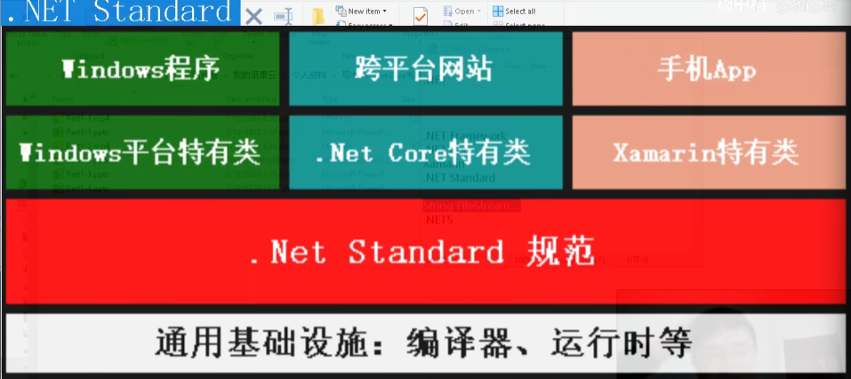
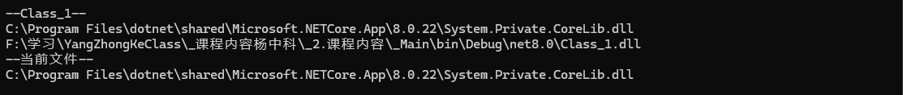
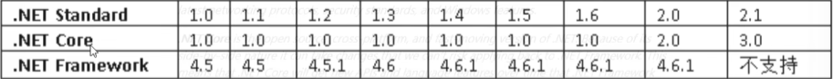
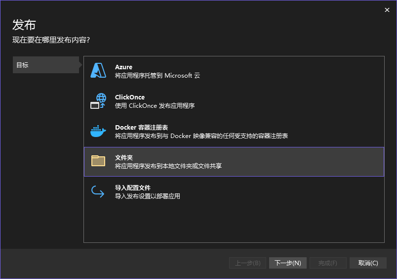
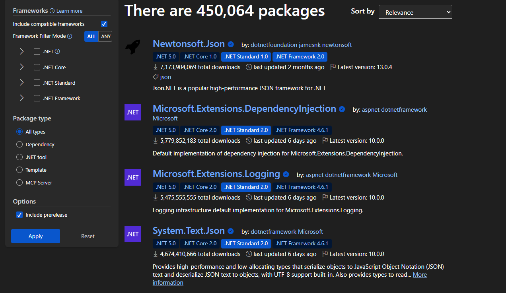
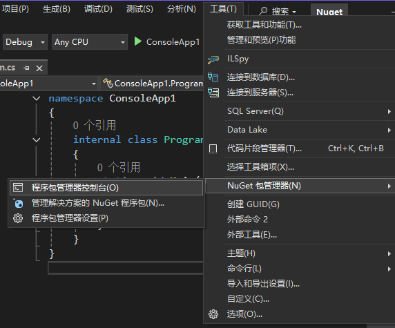
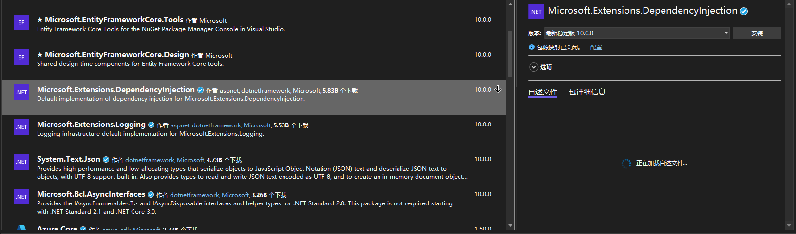

 
# .NET知识汇总

## NET Standard

作为一种跨平台语言，其由.NET Standard约束，不同标准之间可能无法直接引用代码，需要构建一个中间层。



下列程序通过查询不同程序的DLL文件，来查看其中使用了何种标准。

> DLL文件是：.Dynamic Link Library（动态链接库）文件的缩写，它是一种共享库文件，包含了程序所需的代码和数据。与静态链接库不同，动态链接库可以在程序运行时动态加载，使得程序的内存占用更小。
>
> 一般而言，只有类库才有DLL文件，DLL 文件主要是类库的产物，控制台程序通常没有可供引用的 DLL。

```c#
// 应用窗口程序
namespace _Main
{
    internal class Program
    {
        static void Main(string[] args)
        {
            Console.WriteLine("--Class_1--");
            TestClass3.TestMethod();

            Console.WriteLine("--当前文件--");
            Console.WriteLine(typeof(FileStream).Assembly.Location);

        }
    }
}
// 类库程序
public class TestClass3 {
    public static void TestMethod() 
    { 
        Console.WriteLine(typeof(FileStream).Assembly.Location); Console.WriteLine(typeof(TestClass3).Assembly.Location); 
    } 
}
```



标准高的类库可以引用低版本的类库，反之则不行。同时随着标准的变高，NETCore和NETFramework也会随着需求变高，具体的标准如下，在开源项目中最好使用低版本的标准。



## 配置环境

> [配置环境其它图文教程](https://www.bilibili.com/opus/692815432152776724)

可以使用Visual Studio，但是无法跨平台使用。这里使用vscode配置c#文件。在一个简单的c#程序中，会自然生成几个文件夹。当然，在创建程序时不会有文件夹出现。

```json
MyApp/
├── MyApp.csproj        ← 项目文件
├── Program.cs          ← 主程序（顶级语句）
```

编译之后，会生成如下的文件结构：

```json
MyApp/
├── bin/                ← 编译输出（包含 exe 或 dll）
│   └── Debug/
│       └── net8.0/     ← 按目标框架分文件夹
│           ├── MyApp.dll
│           ├── MyApp.exe
│           └── ...
└── obj/                ← 中间构建文件（编译缓存）
    └── Debug/
        └── net8.0/
            ├── MyApp.GeneratedMSBuildEditorConfig.editorconfig
            ├── MyApp.AssemblyInfo.cs
            └── ...
```

- `obj/` 文件夹 —— 中间构建文件

  存放**编译的中间产物与构建缓存**，帮助加快下一次编译速度。

- `bin/` 文件夹 —— 编译输出目录

  存放**编译完成后真正可执行的文件**

- `publish/` 文件夹 —— 发布产物（仅发布时生成）

  当你执行：`dotnet publish -c Release`时，生成用于**部署或分发**的最终文件。

vscode只能执行轻量级任务，在插件中下载c#以及c# Dev Kit即可


只需要按住`Ctrl + Shift + N`即可唤出控制台，在控制台中选中需要创建的项目即可。

## 项目结构

在上述中，说明了在生成程序时会生成的几种文件类型。其中的[csproj](https://blog.walterlv.com/post/understand-the-csproj.html)文件会叙述这个程序中项目信息的一个 XML 文件 https://zh.wikipedia.org/wiki/MSBuild

> ---- 这里之后再来补充 ---

项目中生成的文件存储着整合代码的信息，通过这些文件我们将程序进行打包编译，通过一些特定程序的注译就可以跨设备进行传输编译。在发布程序时，可以右键进行打包操作，在选定指定的平台之后，即可完成打包操作。



## NuGet共享代码库

nuget就是.NET的包管理器。相当于npm之于node、pip之于Python。

要使用NuGet程序包，在Visual Studio中打开项目，选择“工具”菜单下的“NuGet包管理器”，在弹出的窗口中搜索想要的程序包，点击“安装”按钮即可。NuGet会自动下载并引用程序包，并更新项目的配置文件。

此外可以通过访问网站的方式，来进行包的引入。以DI包作为例子。



在具体的页面中，复制代码。调用控制台



输入代码即可引入程序包，之后再包中即可看到引入的程序包。


## 异步编程

异步编程是在程序运行过程中，被异步关键词修饰的进程不会阻塞线程。在一个没有使用异步编程和多线程的程序中，代码按照调动顺序运行，编译过程中让每一个运行的程序压入到一个栈中，运行完成就弹出。如果使用异步，那么在顺序执行的过程中，会将需要异步的程序挂起等待完成。

但“Main 方法内部的后续语句”绝对不会在 await 完成前运行，await会在挂起任务(Task)。`Main` 的代码流程会等待任务完成后继续完成程序的执行流程。

> 具体使用

在执行异步过程中，会使用`async`修饰异步函数，使用await会挂起等待当前修饰的有返回值的代码，一般来说是`Task`，可以理解为一种任务。当程序执行到`await`中，会自动挂起一个任务，此时当前线程将会释放，并且暂停当前运行时。当这个任务完成了之后，才会回复暂停时，占用线程。

`await`主要作用是等待返回`Task`结果，异步的核心主要是逻辑挂起任务。

> 代码实现

使用github中的一个厨师做饭的例子：

同步代码：

```c#
namespace CSharpAsyncExample
{
    public class SynchronousChef
    {
        public int DelayMultiply { get; set; }

        public SynchronousChef()
        {
            DelayMultiply = 100;
        }

        public void MakeBreakfast()
        {
            // 同步就是按照一个一个函数顺序执行
            BoilWater();
            BoilEggs();
            FryBacon();
            ToastBread();
            ApplyButter();
            ApplyJam();
            PourCoffee();
            PourJuice();
        }

        public void PourCoffee()
        {
            Console.WriteLine("[厨师] 开始倒咖啡");
            Thread.Sleep(5 * DelayMultiply);
            Console.WriteLine("[厨师] 咖啡准备好了");
        }

        public void BoilEggs()
        {
            Console.WriteLine("[厨师] 把鸡蛋放入沸水中");
            Thread.Sleep(70 * DelayMultiply);
            Console.WriteLine("[厨师] 鸡蛋煮熟了");
        }

        public void FryBacon()
        {
            Console.WriteLine("[厨师] 把培根扔进平底锅");
            Thread.Sleep(40 * DelayMultiply);
            Console.WriteLine("[厨师] 培根煎好了");
        }

        public void ToastBread()
        {
            Console.WriteLine("[厨师] 把面包放进烤面包机");
            Thread.Sleep(20 * DelayMultiply);
            Console.WriteLine("[厨师] 面包烤好了");
        }

        public void ApplyButter()
        {
            Console.WriteLine("[厨师] 开始涂黄油");
            Thread.Sleep(15 * DelayMultiply);
            Console.WriteLine("[厨师] 黄油已涂好");
        }

        public void ApplyJam()
        {
            Console.WriteLine("[厨师] 开始涂果酱");
            Thread.Sleep(15 * DelayMultiply);
            Console.WriteLine("[厨师] 果酱已涂好");
        }

        public void PourJuice()
        {
            Console.WriteLine("[厨师] 开始倒果汁");
            Thread.Sleep(5 * DelayMultiply);
            Console.WriteLine("[厨师] 果汁准备好了");
        }

        public void BoilWater()
        {
            Console.WriteLine("[厨师] 开始烧咖啡用的水");
            Thread.Sleep(200 * DelayMultiply);
            Console.WriteLine("[厨师] 咖啡用的水已烧开");
        }
    }
}
```

异步代码：

```c#
namespace CSharpAsyncExample
{
    public class AsynchronousChef
    {
        public int DelayMultiply { get; set; }

        public AsynchronousChef()
        {
            DelayMultiply = 100;
        }

        public async Task MakeBreakfast()
        {
            var waterTask = BoilWater();
            var eggsTask = BoilEggs();
            var baconTask = FryBacon();
            var breadTask = ToastBread();

            await breadTask;
            await ApplyButter();
            await ApplyJam();

            await Task.WhenAll(eggsTask, baconTask, waterTask);
            await PourCoffee();
            await PourJuice();
        }

        public async Task PourCoffee()
        {
            Console.WriteLine("[厨师] 开始倒咖啡");
            await Task.Delay(5 * DelayMultiply);
            Console.WriteLine("[厨师] 咖啡准备好了");
        }

        public async Task BoilEggs()
        {
            Console.WriteLine("[厨师] 把鸡蛋放入水中");
            await Task.Delay(70 * DelayMultiply);
            Console.WriteLine("[厨师] 鸡蛋煮熟了");
        }

        public async Task FryBacon()
        {
            Console.WriteLine("[厨师] 把培根放进平底锅里");
            await Task.Delay(40 * DelayMultiply);
            Console.WriteLine("[厨师] 培根煎好了");
        }

        public async Task ToastBread()
        {
            Console.WriteLine("[厨师] 把面包放进烤面包机");
            await Task.Delay(20 * DelayMultiply);
            Console.WriteLine("[厨师] 面包烤好了");
        }

        public async Task ApplyButter()
        {
            Console.WriteLine("[厨师] 开始涂黄油");
            await Task.Delay(15 * DelayMultiply);
            Console.WriteLine("[厨师] 黄油已涂好");
        }

        public async Task ApplyJam()
        {
            Console.WriteLine("[厨师] 开始涂果酱");
            await Task.Delay(15 * DelayMultiply);
            Console.WriteLine("[厨师] 果酱已涂好");
        }

        public async Task PourJuice()
        {
            Console.WriteLine("[厨师] 开始倒果汁");
            await Task.Delay(5 * DelayMultiply);
            Console.WriteLine("[厨师] 果汁准备好了");
        }

        public async Task BoilWater()
        {
            Console.WriteLine("[厨师] 开始烧咖啡用的水");
            await Task.Delay(200 * DelayMultiply);
            Console.WriteLine("[厨师] 咖啡用的水已烧开");
        }

        public async Task<string> TellAJoke()
        {
            return "笑话";
        }
    }
}
```

最终输出的是：

```yaml
[厨房] 开始制作早餐 - 同步厨师
[厨师] 开始烧咖啡用的水
[厨师] 咖啡用的水已烧开
[厨师] 把鸡蛋放入沸水中
[厨师] 鸡蛋煮熟了
[厨师] 把培根扔进平底锅
[厨师] 培根煎好了
[厨师] 把面包放进烤面包机
[厨师] 面包烤好了
[厨师] 开始涂黄油
[厨师] 黄油已涂好
[厨师] 开始涂果酱
[厨师] 果酱已涂好
[厨师] 开始倒咖啡
[厨师] 咖啡准备好了
[厨师] 开始倒果汁
[厨师] 果汁准备好了
[厨房] 早餐完成，用时 '37'秒 '117'毫秒
---
[厨房] 开始制作早餐 - 异步厨师
[厨师] 开始烧咖啡用的水
[厨师] 把鸡蛋放入沸水中
[厨师] 把培根放进平底锅里
[厨师] 把面包放进烤面包机
[厨师] 面包烤好了
[厨师] 开始涂黄油
[厨师] 黄油已涂好
[厨师] 开始涂果酱
[厨师] 培根煎好了
[厨师] 果酱已涂好
```

同步的例子使用线程休眠来阻塞线程，模拟完成任务的所需时间。同时在执行程序中，加入了`Stopwatch`类来计时，在`Main`方法中将比较两者的耗费时常。异步方法，使用了`Task.Delay`来模拟程序执行的时间。

```c#
namespace CSharpAsyncExample
{
    public class Kitchen
    {
        // Stopwatch 测量代码执行的时间或者某个操作经过的时间
        private static Stopwatch Stopwatch { get; set; }

        static void Main(string[] args)
        {
            Stopwatch = new Stopwatch();
            Stopwatch.Start();
            Console.WriteLine($"[厨房] 开始制作早餐 - 同步厨师");

            MakeBreakfastWithSynchronousChef();

            Console.WriteLine($"[厨房] 早餐完成，用时 '{Stopwatch.Elapsed.Seconds}'秒 '{Stopwatch.Elapsed.Milliseconds}'毫秒");
            Stopwatch.Restart();

            Console.WriteLine("---");
            Console.WriteLine($"[厨房] 开始制作早餐 - 异步厨师");

            MakeBreakfastWithAsynchronousChef().Wait();

            Console.WriteLine($"[厨房] 早餐完成，用时 '{Stopwatch.Elapsed.Seconds}'秒 '{Stopwatch.Elapsed.Milliseconds}'毫秒");
        }

        static void MakeBreakfastWithSynchronousChef()
        {
            var chef = new SynchronousChef();
            chef.MakeBreakfast();
        }

        static async Task MakeBreakfastWithAsynchronousChef()
        {
            var chef = new AsynchronousChef();
            await chef.MakeBreakfast();
        }
}
```

在执行 `await` 时，它会生成一个挂起的 `Task`，并等待这个 `Task` 返回结果。挂起的方法会暂时释放当前线程，等到 `Task` 完成时，挂起的方法会重新被调度执行。在这个过程中，运行时会通过一个状态机来管理多个挂起任务的恢复顺序，从而实现异步操作的调度。

简单来说，异步操作的核心目的是**缓解等待时间造成的空闲**。可以把它比作餐厅里的服务员：如果每次下单都必须等厨师做完上一道菜才能处理下一份单子，效率就很低。而采用异步的方式，服务员可以一次性记录所有顾客的订单，然后在等待厨师完成菜品的过程中处理其他事情。关键就在于**等待由 `await` 修饰的任务完成，而不是占用线程去空转等待**

> C#中使用异步的常见命令

## [LINQ](https://www.cnblogs.com/SunSpring/p/16498439.html)

Language-Integrated 查询（LINQ）是基于将查询功能直接集成到 C# 语言的一组技术的名称。 传统上，针对数据的查询表示为简单字符串，无需在编译时进行类型检查或 IntelliSense 支持。

在编写程序的时候，可以使用类数据库查询的方法来筛选一些数据结构的选型。在官网中的例子如下：

```c#
int[] scores = [97, 92, 81, 60];

// 这些代码与 数据库的查询类似
// 从 scores 数组中 创建一个自由变量 score , 对于score需要满足
// where 后的条件
// 之后返回 select 满足这些条件的值
IEnumerable<int> scoreQuery =
    from score in scores
    where score > 80
    select score;

foreach (var i in scoreQuery)
{
    Console.Write(i + " ");
}
```

而且对于数据的处理，还有很多种方法，例如下面的例子：

```c#
List<int> list = new List<int> { 1, 1, 2, 2, 3, 3, 3, 5, 7, 8, 10, 12 };
var linqList = list.Where(t => t < 10)              //列表中值小于10
               .GroupBy(t => t)                     //分组
               .Where(t => t.Count() > 1)           //分组后出现次数大于1
               .OrderByDescending(t => t.Count())   //按照出现次数倒序
               .Select(t => t.Key);                 //选择值
Console.WriteLine(string.Join(' ', linqList));
```

通常LINQ需要搭配Lanbda表达式和委托让代码简洁，同时使用表达式也会在编写过程中使得代码逻辑清晰。为什么要使用这两者？

委托是一种安全的函数指针，可以理解为函数变成了一种变量，其是一种引用类型。在声明一个委托变量的时候，可以给它赋值，赋值之后这个委托会获得赋值的函数的能力。可以类似于如下代码来声明委托：

```c#
namespace ConsoleApp2
{
    internal class Program
    {

        static void Main()
        {
            // 给声明的委托赋值

            Comparison comparison = ComparisonMax;

            Console.WriteLine("谁比较大: {0}", comparison(10, 20));

        }
        
        public delegate int Comparison(int i, int n);
        // 委托只能赋值 静态方法
        public static int ComparisonMax(int x, int y)
        {
            if (x >= y)
            {
                return x;
            }
            else return y;
        }
    }
}
```

此外为了方便日常编写，c#中声明了两种类型，让我们快速创建委托：Action`和`Func。一个无返回值，一个有返回值，并且采用`泛型`定义了多个委托以满足我们日常使用。具体的声明是：

```c#
// 第一个int 是返回值 - 后面两个是形参的数据类型
// com 就是一个新建的委托
Func<int,int,int> com = ComparisonMax;

// 无返回值 这里的string 是形式参数的数据类型
Action<string> log = s => Console.WriteLine(s);
```

在使用委托的时候，可以使用Lambda表达式来优化委托的编写，有几个需要说明的关系表达式：

```c#
//1. =>（读作 goes to） ,作用是 输入参数 => 输出逻辑 左侧为参数 右侧为输出的返回值
x => x * x   // 等价于 
delegate(int x) { return x * x; } // 就是省略了一些单词

//2. 结合 lambda, 左侧是一个委托 右侧是lambda的匿名方法
Action line = /* () => Console.WriteLine(); */
// 所以这个 line 就被赋值了 () => Console.WriteLine(); 方法

//3. 匿名方法
(参数列表) => 表达式或语句块 // 无参数就留空
```

回到Linq，我们可以通过结合委托和Lambda表达式来实现这些查询操作：

```c#
public static class MyLinq
{
    public static List<T> MyLinqWhere<T>(this List<T> list, Func<T, bool> predicate)
    {
        List<T> tempList = new List<T>();
        foreach (var item in list)
        {
            if (predicate(item))
            {
                tempList.Add(item);
            }
        }
        return tempList;
    }
}
```

我们可以用Linq表达式类型来调用创建的Where方法：

```c#
namespace ConsoleApp4
{
    public static class MyLinq
    {
        public static List<T> MyLinqWhere<T>(this List<T> list, Func<T, bool> predicate)
        {
            List<T> tempList = new List<T>();
            foreach (var item in list)
            {
                if (predicate(item))
                {
                    tempList.Add(item);
                }
            }
            return tempList;
        }
    }

    internal class Program
    {
        static void Main(string[] args)
        {
            List<int> numbers = new List<int> { 1, 2, 3, 4, 5 };

            var result = numbers.MyLinqWhere(n => n > 3);

            foreach (var n in result)
            {
                Console.WriteLine(n);
            }
        }
    }
}
```

上述代码等价如下代码，无论任何在c#中的数据类型，只要是实现了IEnumerable<T>接口，其都会搭载LINQ中的查询筛选方法。（IEnumerable 简单来说，就是一个提供遍历集合的方法的接口）

```c#
namespace ConsoleApp4
{
    internal class Program
    {
        static void Main(string[] args)
        {
            List<int> numbers = new List<int> { 1, 2, 3, 4, 5 };

            var result = numbers.Where(n => n > 3);

            foreach (var n in result)
            {
                Console.WriteLine(n);
            }
        }
    }
}
```

https://learn.microsoft.com/en-us/dotnet/csharp/linq/standard-query-operators/

## 控制反转

一般而言，当A类需要B类的对象来实现某种方法或者某种变量的时候，则对B类的需求项称之为依赖。在如下类种，声明了`Write`方法：

```c#
public class MessageWriter
{
    public void Write(string message)
    {
        Console.WriteLine($"MessageWriter.Write(message: \"{message}\")");
    }
}
```

其它类可以创建这个类的对象，来调用这个方法，这个过程种可以说`MessageWriter` 类是 `Worker` 类的依赖项

```c#
public class Worker : BackgroundService
{
    // 在worker类中声明对象
    private readonly MessageWriter _messageWriter = new();

    protected override async Task ExecuteAsync(CancellationToken stoppingToken)
    {
        while (!stoppingToken.IsCancellationRequested)
        {
            _messageWriter.Write($"Worker running at: {DateTimeOffset.Now}");
            await Task.Delay(1_000, stoppingToken);
        }
    }
}
```

但是这种依赖是不好的：

- 若要用不同的实现替换 `MessageWriter`，必须修改 `Worker` 类。
- 如果 `MessageWriter` 具有依赖项，则 `Worker` 类还必须对其进行配置。 在具有多个依赖于 `MessageWriter` 的类的大型项目中，配置代码将分散在整个应用中。
- 这种实现很难进行单元测试。 应用需使用模拟或存根 `MessageWriter` 类，而该类不能使用此方法。

为了解决这些问题，就需要对依赖类进行抽象。也就是我们不需要知道依赖类的具体实现方法，只需要知道它有这个方法类。而具体实现这些有几种方法：

- 使用接口将依赖类抽象化
- 使用一个容器统一管理这些对象
- 使用一些方法注入依赖

```c#
//1. 接口
namespace DependencyInjection.Example;

public interface IMessageWriter
{
    void Write(string message);
}

//2. 接口实现
namespace DependencyInjection.Example;

public class MessageWriter : IMessageWriter
{
    public void Write(string message)
    {
        Console.WriteLine($"MessageWriter.Write(message: \"{message}\")");
    }
}
```

接着需要依据如上实现的接口以及实现接口类来注册服务：

```c#
// 伪代码
using DependencyInjection.Example;

// 创建容器
HostApplicationBuilder builder = Host.CreateApplicationBuilder(args);
// 在容器中注入 对象
builder.Services.AddHostedService<Worker>();
// 映射 注册
builder.Services.AddSingleton<IMessageWriter, MessageWriter>();

using IHost host = builder.Build();

host.Run();
```

于是，需要调用依赖的类既可以这样子声明：

```c#
namespace DependencyInjection.Example;
// 构造函数注入
public sealed class Worker(IMessageWriter messageWriter) : BackgroundService
{
    protected override async Task ExecuteAsync(CancellationToken stoppingToken)
    {
        while (!stoppingToken.IsCancellationRequested)
        {
            messageWriter.Write($"Worker running at: {DateTimeOffset.Now}");
            await Task.Delay(1_000, stoppingToken);
        }
    }
}
```

当然，上述实现依赖注入的演示效果并不是很明显，而且我们在执行一个其他类创建的函数时，要绕一个大弯子。即：要调用依赖项，需要创建一个容器，创建完一个容器之后需要对依赖的类创建一个接口约束来注册一个服务，之后通过构造函数注入的方式来调用这个方法。下列是执行一个打印`Hello world`的依赖注入实现过程：

1. 导入依赖注入包



2. 创建接口和实现接口类

```c#
// 1.创建接口
namespace ConsoleApp2
{
    internal interface IMessenger
    {
        public void SendMessage(string message);
    }
}


// 2. 实现接口
namespace ConsoleApp2
{
    internal class SayHello : IMessenger
    {
        public void SendMessage(string message)
        {
            Console.WriteLine("Hello, " + message);
        }
    }
}
```

3. 使用容器注册，获取对象调用

```c#
class Program
{    
    static void Main(string[] args)
    {
        // 1. 创建 ServiceCollection
        var services = new ServiceCollection();
        // 2. 注册接口与实现
        services.AddTransient<IMessenger, SayHello>();
        // 3. 构建服务提供程序（DI 容器）
        var provider = services.BuildServiceProvider();
        // 4. 获取实例
        var messenger = provider.GetRequiredService<IMessenger>();
        messenger.SendMessage("Hello DI");
    }
}
```

当然，看着还是有点臃肿。但是修改代码的时候，不需要对`Program`进行修改，只需要修改接口和实现接口的类即可。此外也可以调整声明对象的类型，单例之类就需要调整这个`AddTransient`改变对象的类型。具体还是需要看[文档](https://learn.microsoft.com/en-us/dotnet/core/extensions/dependency-injection)。

## [配置系统](https://www.cnblogs.com/cqpanda/p/16834832.html)

这两个系统看着都头大，先跳过吧。

## [日志系统](https://www.cnblogs.com/SunSpring/p/16875968.html)

## [EFCore](https://www.cnblogs.com/Mamba8-24/p/16098812.html)

对象关系映射程序 (O/RM)，它解决了对象和关系型数据库之间的数据交互问题，ORM的作用是在关系型数据库和业务实体对象之间作一个映射，这样我们在具体的操作业务对象的时候，就不需要再去和复杂的SQL语句打交道，只需简单的操作对象的属性和方法。

