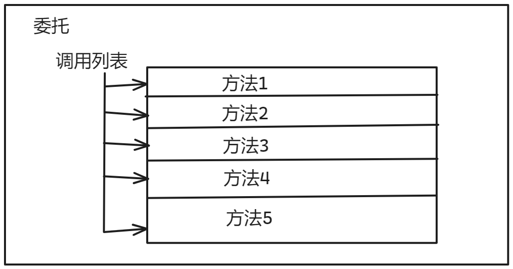
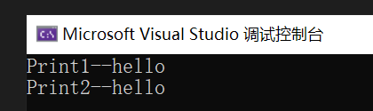
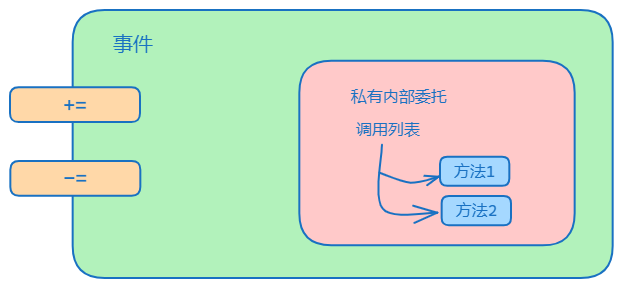

#  C#基础语法

`c#`语言是一种面向对象语言，在面向对象的程序设计方法中，程序由各种相互交互的对象组成。

## 基础

### 变量

一个变量可以被看作是程序中存储值的容器。在 C# 中，变量可以存储多种不同类型的数据，包括整数、浮点数、布尔值和字符串等。

一个变量的声明，一般由数据类型+变量名称构成。变量名必须以字母或下划线开头，并且不能包含空格或特殊字符

```c#
int num = 42;
```

在上面的代码中，我们定义了一个名为 `num` 的整数变量，并将其初始化为 42。在变量名后面的等号表示给变量赋值的操作。

我们还可以定义一个空的变量，如下所示：

```c#
int num;
```

`c#`中默认配置了一些变量类型，下面列出了一些常用的变量类型及其用途：

- `int`：用于存储整数值。
- `float`：用于存储浮点数值。
- `double`：用于存储双精度浮点数值。
- `bool`：用于存储布尔值（true 或 false）。
- `string`：用于存储字符串值。
- `char`：用于存储单个字符。

```c#
int num = 42;
float num2 = 3.14f;
double num3 = 2.71828;
bool flag = true;
string message = "Hello, world!";
char c = 'A';
```

### 作用域

在 C# 中，变量的作用域指的是变量在程序中可见的范围。在定义一个变量时，需要确定该变量的作用域。一般来说，变量的作用域可以分为以下几种：

- 局部变量：在一个代码块内定义的变量。它们只在该代码块内可见，不能被其他代码块访问。
- 全局变量：在程序的任何地方定义的变量。它们可以被程序中的所有代码块访问。

```c#
class MyClass {
    int num = 42; // 定义

    void MyMethod() {
        int num2 = 10; // 定义局部变量
    }
}
```

在上面的代码中，我们定义了一个名为 `num` 的类成员变量和一个名为 `num2` 的方法局部变量。`num` 是一个全局变量，可以被类中的任何方法访问。`num2` 是一个局部变量，只能在 `MyMethod` 方法中访问。

### 常量

常量是在程序中被定义并且在程序执行期间不会改变其值的标识符。常量在程序中用于存储不会改变的数据，例如Pi的值或其他常用的常数值。

如果在一个类中声明的常量，那么根据这个类创建的所有对象将会共享这一个常量。

常量的声明使用`const`关键字，声明语法如下：

```c#
const <数据类型> <常量名称> = <常量值>;
```

其中，`<数据类型>`表示常量的数据类型，`<常量名称>`表示常量的名称，`<常量值>`表示常量的值。

```c#
const double Pi = 3.14159;
```

常量具有以下特点：

- 常量必须在声明时进行初始化，且初始化后不可更改；
- 常量的作用域和生命周期与变量相同，但是常量只能在声明时进行赋值，不可以在方法内部或其它代码块内部进行赋值；
- 常量只能使用常量表达式进行初始化，即常量表达式的值在编译时就已经确定，并且只能使用常量、枚举常量、值类型常量和对它们的简单计算。

### 运算符

在 C# 中，运算符是用于执行各种操作的符号或符号组合。 C# 中的运算符包括算术运算符，比较运算符，逻辑运算符，位运算符等。

> 算数运算符

算术运算符用于执行算术操作，如加法，减法，乘法和除法。

| 运算符 | 描述           | 示例                 |
| ------ | -------------- | -------------------- |
| +      | 加法           | int result = 1 + 2;  |
| -      | 减法           | int result = 5 - 3;  |
| *      | 乘法           | int result = 2 * 3;  |
| /      | 除法           | int result = 10 / 2; |
| %      | 取模（取余数） | int result = 10 % 3; |

> 比较运算符

比较运算符用于比较两个值是否相等，大于或小于等关系。

| 运算符 | 描述     | 示例                    |
| ------ | -------- | ----------------------- |
| ==     | 相等     | bool result = (1 == 1); |
| !=     | 不相等   | bool result = (1 != 2); |
| >      | 大于     | bool result = (5 > 3);  |
| <      | 小于     | bool result = (3 < 5);  |
| >=     | 大于等于 | bool result = (5 >= 5); |
| <=     | 小于等于 | bool result = (3 <= 5); |

> 逻辑运算符

逻辑运算符用于组合和操作布尔值（`true/false`）。

| 运算符 | 描述   | 示例 |
| ------ | ------ | ---- |
| &&     | 逻辑与 | bool |
| \|\|   | 逻辑或 | bool |
| !      | 逻辑非 | bool |

> 位运算符

位运算符用于对二进制位进行操作。

| 运算符 | 描述     | 示例                  |
| ------ | -------- | --------------------- |
| &      | 按位与   | int result = 3 & 5;   |
| \|     | 按位或   | int result = 3        |
| ^      | 按位异或 | int result = 3 ^ 5;   |
| ~      | 按位取反 | int result = ~3;      |
| <<     | 左移     | int result = 3 << 2;  |
| >>     | 右移     | int result = 10 >> 1; |

> 赋值运算符

赋值运算符用于将一个值赋给变量。

| 运算符 | 描述           | 示例       |
| ------ | -------------- | ---------- |
| =      | 赋值           | int a = 5; |
| +=     | 加后赋值       | a += 3;    |
| -=     | 减后赋值       | a -= 2;    |
| *=     | 乘后赋值       | `a *= 4;`  |
| /=     | 除后赋值       | `a /= 2;`  |
| %=     | 取模后赋值     | `a %= 3;`  |
| <<=    | 左移后赋值     | `a <<= 2;` |
| >>=    | 右移后赋值     | `a >>= 1;` |
| &=     | 按位与后赋值   | `a &= 3;`  |
| \|=    | 按位或后赋值   | `a \|= 5;` |
| ^=     | 按位异或后赋值 | `a ^= 3;`  |

> 其他运算符

除了上述常见的运算符外，C# 还提供了一些其他的运算符，如条件运算符，类型转换运算符和空值运算符等。

**条件运算符**（?:）：是一种简洁的 if-else 语句的替代方式。

```c#
int a = 5;
int b = 3;
int max = (a > b) ? a : b;
```

**类型转换运算符**：用于将一个数据类型转换为另一个数据类型。

```c#
int a = 5;
double b = (double)a;
```

**空值运算符**：（??）用于检查一个值是否为 null，如果是，则返回一个默认值。

```c#
int? a = null;
int b = a ?? 0;
```

> 运算符优先级

在多个运算符复合使用的时候，运算符会根据优先级顺序决定执行顺序

以下是 C# 中运算符优先级的列表，按从高到低的顺序排列：

```c#
1. ()
2. ++, --（后缀）
3. ++, --（前缀）
4. !, ~, +, -, (类型), *(指针), &(取地址)
5. *, /, %
6. +, -
7. <<, >>
8. <, <=, >, >=
9. ==, !=
10. &
11. ^
12. |
13. &&
14. ||
15. ?:
16. =, +=, -=, *=, /=, %=, <<=, >>=, &=, ^=, |=
```

### 运算符重载

当你在C#中定义一个类时，可以通过运算符重载来定义该类的对象与其他对象进行运算的行为。运算符重载允许您定义操作符（例如+、-、*、/等）的行为，使您的自定义类更加灵活和易于使用。

运算符重载的语法如下：

```c#
public static 返回类型 operator 运算符(参数列表) {
    // 运算符重载的代码逻辑
}
```

其中，`public static`表示运算符重载方法是公共静态的；`返回类型`表示运算符重载方法的返回值类型；`operator`关键字用于告诉编译器这是一个运算符重载方法；`运算符`表示要重载的运算符（例如+、-、*、/等）；`参数列表`表示要重载的运算符的参数。

在C#中，运算符重载有以下限制：

- 只能重载现有的运算符。
- 不能创建新的运算符。
- 不能重载某些运算符，如`.`、`::`、`?:`等。

下面是一个示例，演示了如何在C#中使用运算符重载。

```c#
using System;

namespace OperatorOverloadingExample {
    class Vector {
        public double X { get; set; }
        public double Y { get; set; }

        public Vector(double x, double y) {
            X = x;
            Y = y;
        }

        public static Vector operator +(Vector a, Vector b) {
            return new Vector(a.X + b.X, a.Y + b.Y);
        }

        public static Vector operator -(Vector a, Vector b) {
            return new Vector(a.X - b.X, a.Y - b.Y);
        }

        public static Vector operator *(Vector a, double b) {
            return new Vector(a.X * b, a.Y * b);
        }

        public static Vector operator /(Vector a, double b) {
            return new Vector(a.X / b, a.Y / b);
        }

        public override string ToString() {
            return string.Format("({0},  {1})", X, Y);
        }
    }

    class Program {
        static void Main(string[] args) {
            Vector a = new Vector(1, 2);
            Vector b = new Vector(3, 4);

            Vector c = a + b;
            Console.WriteLine("a + b = " + c);

            Vector d = a - b;
            Console.WriteLine("a - b = " + d);

            Vector e = a * 2;
            Console.WriteLine("a * 2 = " + e);

            Vector f = a / 2;
            Console.WriteLine("a / 2 = " + f);

            Console.ReadKey();
        }
    }
}
```

在上面的示例中，定义了一个名为`Vector`的类，表示一个二维向量。使用运算符重载定义了`+`、`-`、`*`和`/`运算符的行为，以便Vector对象可以与其他Vector对象和double值进行运算。在`Main`方法中，创建了两个Vector对象并演示了如何使用运算符重载方法进行加、减、乘和除运算。最后，使用`Console.WriteLine`方法将结果输出到控制台。

### 控制语句

控制语句是控制逻辑的流向，常见的判断，循环语句就是控制语句。

#### 判断

> if 语句

if 语句是 C# 中最常见的判断语句。它的基本语法如下：

```c#
if (condition)
{
    // 当条件成立时执行的代码块
}
```

其中，condition 是一个布尔表达式，它的值为 true 或 false。如果 condition 的值为 true，则执行大括号内的代码块。否则，跳过代码块，继续执行后面的语句。

当判断有多种流向，则添加else设定未成立if条件的流向。它的基本语法如下：

```c#
if (condition)
{
    // 当条件成立时执行的代码块
}
else
{
    // 当条件不成立时执行的代码块
}
```

if-else if 语句是在 if-else 语句的基础上增加了多个 else if 代码块。它的基本语法如下：

```c#
if (condition1)
{
    // 当条件 1 成立时执行的代码块
}
else if (condition2)
{
    // 当条件 2 成立时执行的代码块
}
else if (condition3)
{
    // 当条件 3 成立时执行的代码块
}
...
else
{
    // 当所有条件都不成立时执行的代码块
}
```

> switch 语句

switch 语句是根据某个表达式的值来选择执行哪个代码块。它的基本语法如下：

```c#
switch (expression)
{
    case value1:
        // 当 expression 的值等于 value1 时执行的代码块
        break;
    case value2:
        // 当 expression 的值等于 value2 时执行的代码块
        break;
    ...
    default:
        // 当 expression 的值与任何 case 不匹配时执行的代码块
        break;
}
```

switch 语句中的 expression 是一个表达式，可以是整数、字符、字符串等类型。case 语句后面的值可以是常量或者常量表达式。如果 expression 的值等于某个 case 语句后面的值，则执行相应的代码块。如果没有匹配的 case 语句，则执行 default 代码块。

#### 循环

循环是编程中的重要概念之一，它可以帮助我们重复执行相同的代码块。在 C# 中，我们有几种循环结构可以使用，包括 for 循环、while 循环和 do-while 循环。

> for循环

for 循环是一种常用的循环结构，它可以指定循环变量的初始值、终止条件和每次迭代后的操作。下面是一个 for 循环的示例：

```c#
for (int i = 0; i < 10; i++)
{
    Console.WriteLine("当前数字为：" + i);
}
```

在这个示例中，我们初始化循环变量 i 为 0，然后指定循环条件为 i < 10，每次迭代后 i 的值增加 1。循环体内的代码将被执行 10 次，输出当前数字的值

> while 循环

while 循环是另一种常用的循环结构，它可以在满足条件的情况下重复执行相同的代码块。下面是一个 while 循环的示例：

```c#
int j = 0;
while (j < 10)
{
    Console.WriteLine("当前数字为：" + j);
    j++;
}
```

>  do-while 循环

do-while 循环是一种与 while 循环类似的循环结构，不同的是它会先执行一次循环体内的代码，然后再判断循环条件是否满足。下面是一个 do-while 循环的示例：

```c#
int k = 0;
do
{
    Console.WriteLine("当前数字为：" + k);
    k++;
} while (k < 10);
```

在这个示例中，我们初始化循环变量 k 为 0，然后执行一次循环体内的代码，输出当前数字的值。之后判断循环条件是否满足，如果满足则继续执行循环体内的代码，直到循环条件不满足为止。

> foreach 循环

foreach 循环**用于遍历一个集合或数组中的所有元素**。下面是一个 foreach 循环的示例：

```c#
int[] numbers = { 1, 2, 3, 4, 5 };
foreach (int num in numbers)
{
    Console.WriteLine("当前数字为：" + num);
}
```

在这个示例中，我们定义了一个整型数组 numbers，并初始化了其中的元素。然后使用 foreach 循环遍历数组中的所有元素，每次迭代后输出当前数字的值。

> 跳转语句

跳转语句会改变程序的执行流程。C# 中的跳转语句包括 `break`、`continue` 和 `return` 语句，例如：

```c#

while (true)
{
    if (condition)
    {
        break; // 跳出循环
    }
    if (otherCondition)
    {
        continue; // 继续循环下一次迭代
    }
}

public int MyMethod()
{
    return 0; // 返回一个整数值
}
```

#### 异常处理

异常处理是指在程序运行过程中发生错误时，采取一些措施来保证程序正常运行。C# 中的异常处理机制使用 `try`、`catch` 和 `finally` 语句来实现，例如：

```c#
try
{
    // 可能会抛出异常的代码
}
catch (Exception ex)
{
    // 处理异常的代码
}
finally
{
    // 无论是否抛出异常都会执行的代码
}
```

其中，`try` 语句包含可能会抛出异常的代码块；`catch` 语句用来捕获并处理异常，`Exception ex` 表示要捕获的异常类型，可以根据实际需要自定义；`finally` 语句包含无论是否抛出异常都会执行的代码块。

## 常见结构

值类型和引用类型是 C# 类型的两个主要类别。值类型包含数据，创建一个值类型会分配独立内存存储这个值。引用类型不包含变量的实际数据，但是包含对变量的引用。

换句话说，引用变量会指向内存中一个固定的地址，这个地址可以被多个变量**使用**，在改变一个引用变量的时候，其它赋予这个引用对象的变量都会被改变。引用类似于给变量取外号，给小明取外号叫小白，小明上学校了意味着小白也上学校了。


c#中的对象是所有数据类型的基类，也就是说对象类型可以被分配任何其它类型，但是在分配之前需要进行类型转换。值类型转为对象类型被称之为装箱，对象类型转化为值类型被称之为拆箱。

```c#
// 装箱
int i = 123;
object o = i;

// 拆箱
int i = 123;      
object o = i;     
int j = (int)o;   
```

### 结构体

结构体是值类型，使用`struct`语句声明。一个结构体中可以包含多个变量，使用`.`操作符可以调用结构体中的值。一个结构体的声明如下：

```c#
struct Books
{
   public string title;
   public string author;
   public string subject;
   public int book_id;
};  
```

声明一个结构体变量，类似于声明类的对象：

```c#
Books Book1;
```

声明的变量使用`.`操作符调用，即可对结构体变量的值进行修改。结构体和对象的区别就是值类型和引用类型的区别。不过结构体的使用比起对象更为轻便。

### 枚举

枚举类型是一种常量类型也就是值类型，一个枚举的声明如下

```c#
enum <enum_name>
{ 
    enumeration list 
};
```

枚举的数据是按照输入顺序严格定义的，枚举列表中的每一个符号代表一个整数值，一般而言第一个枚举符号的值是0。

```c#
 enum Day { Sun, Mon, Tue, Wed, Thu, Fri, Sat };
 int x = (int)Day.Sun; // 值是0
 Day[0]; // 内含值是Sun
```

### 命名空间

**命名空间**的设计目的是提供一种让一组名称与其他名称分隔开的方式。在一个命名空间中声明的类的名称与另一个命名空间中声明的**相同的类的名称不冲突**。

举一个计算机系统中的例子，一个文件夹(目录)中可以包含多个文件夹，每个文件夹中不能有相同的文件名，但不同文件夹中的文件可以重名。


命名空间的定义是以关键字 **namespace** 开始，后跟命名空间的名称，如下所示：

```c#
namespace namespace_name
{
   // 代码声明
}
```

为了调用支持命名空间版本的函数或变量，会把命名空间的名称置于前面，如下所示：

```c#
namespace_name.item_name;
```

下面的程序演示了命名空间的用法：

```c#
using System;
namespace first_space
{
   class namespace_cl
   {
      public void func()
      {
         Console.WriteLine("Inside first_space");
      }
   }
}
namespace second_space
{
   class namespace_cl
   {
      public void func()
      {
         Console.WriteLine("Inside second_space");
      }
   }
}   
class TestClass
{
   static void Main(string[] args)
   {
      first_space.namespace_cl fc = new first_space.namespace_cl();
      second_space.namespace_cl sc = new second_space.namespace_cl();
      fc.func();
      sc.func();
      Console.ReadKey();
   }
}
```

**using** 关键字表明程序使用的是给定命名空间中的名称。例如，我们在程序中使用 **System** 命名空间，其中定义了类 Console。我们可以只写：

```c#
Console.WriteLine ("Hello there");
```

我们可以写完全限定名称，如下：

```c#
System.Console.WriteLine("Hello there");
```

在编写代码的时候常调用类似于`using System`，这样在使用的时候就不用在前面加上命名空间名称。该指令告诉编译器随后的代码使用了指定命名空间中的名称。

### 元组与匿名

元组是由两个或多个不同类型的数据结构构成的一个组，一个简单的元组可声明如下：

```c#
(double, int) t1 = (4.5, 3);
```

如果需要访问其中的数据，元组使用`Item`关键字进行访问，只需要使用`.`操作符即可调用对应位置的元组数据。

```c#
t1.Item1; // 值为4.5
t2.Item2; // 值为3
```

此外也可以对元组中的数据类型声明变量，可以使用其变量名称来调用具体的数据，元组的作用是**为了替代ref和out实现多个返回值,同时提供简单的数据集合**。

```c#
(double Sum, int Count) t2 = (4.5, 3);
t2.Count; // 值为3
t2.Sum; // 值为4.5
```

一个方法会有它的名称，而匿名方法是没有其名称的。方法名称可以称之为签名，一个方法没有签名可以称之为匿名方法，匿名方法使用关键字`delegate`声明

```c#
delegate(变量) { 返回语句 - 也可能没有; }
```

但是没有方法签名，无法调用，这里也就引出了委托的概念。匿名方法将自己唯一拥有的方法主体交给委托，让委托代理执行。

```c#
Func<int, int> square = delegate (int x)
{
    return x * x;
};
```

但是这个方法体还是有些臃肿，于是就发明Lambda 表达式来优化这个方法体

```c#
Func<int, int> square = x => x * x;
```

### 委托

在 C# 中，委托是一种类型安全的函数指针。它允许你用特定的签名和返回类型封装方法，从而可以将方法作为参数传递或存储在变量中。声明一个委托的代码如下：

```c#
public delegate int Operation(int a, int b);
```

签名是由方法名和参数列表（参数的类型、数量、顺序）组成的，用来唯一标识一个方法。

可以把委托看做一个包含有序方法列表的对象，这些方法具有相同的签名。方法的列表称为调用列表。委托保存的方法可以来自任何类或结构，只要在下面两点匹配：

- **委托的返回类型**

- **委托的签名**

调用列表中的方法可以是实例方法也可以是静态方法。在调用委托时，会执行其调用列表中的所有方法，如下所示：



一个简单的示例，代码如下：

```c#
internal class Program
    {
        delegate void PrintString(string s);
        class A
        {
            public void Print1 (string s)
            { 
                Console.WriteLine ($"Print1--{s}");
            }
            public static void Print2(string s)
            {
                Console.WriteLine($"Print2--{s}");
            }
        }
        static void Main(string[] args)
        {           
            A a = new A();
            PrintString ps;
            ps = a.Print1; // 可以加入对象的函数
            ps += A.Print2; // 可以加入类的函数
            ps("hello");
        }
    }
}
```

结果如下，执行`ps`委托会按照添加顺序进行执行



### [事件](https://www.cnblogs.com/mingupupu/p/17946032)

事件是一个特殊的委托，它用于通知对象某个操作已经发生或即将发生。事件可以被其他对象订阅，以便在事件发生时被通知。当一个事件被触发时，它会调用所有已经订阅它的委托。



**C#**中的事件由以下三个部分组成：

- 事件发布者：该对象定义了事件，当事件发生时，它会通知所有已经订阅该事件的对象。
- 事件参数：事件发生时需要传递的信息，可以是任何类型的对象。如果事件不需要传递参数，则可以使用`EventArgs`。
- 事件订阅者：该对象订阅了事件，并在事件发生时执行相应的操作。

下面是一个示例代码，演示了如何在 C# 中使用事件。在该示例中，我们定义了一个简单的 Calculator 类，它可以对两个数进行加、减、乘、除操作，并在操作完成时触发一个事件。

```c#

using System;

public class Calculator
{
    // 定义一个事件
    public event EventHandler<CalculationEventArgs> CalculationPerformed;

    public int Add(int x, int y)
    {
        int result = x + y;
        OnCalculationPerformed(new CalculationEventArgs("add", x, y, result));
        return result;
    }

    public int Subtract(int x, int y)
    {
        int result = x - y;
        OnCalculationPerformed(new CalculationEventArgs("subtract", x, y, result));
        return result;
    }

    public int Multiply(int x, int y)
    {
        int result = x * y;
        OnCalculationPerformed(new CalculationEventArgs("multiply", x, y, result));
        return result;
    }

    public int Divide(int x, int y)
    {
        int result = x / y;
        OnCalculationPerformed(new CalculationEventArgs("divide", x, y, result));
        return result;
    }

    protected virtual void OnCalculationPerformed(CalculationEventArgs e)
    {
        // 调用事件委托
        CalculationPerformed?.Invoke(this, e);
    }
}

public class CalculationEventArgs : EventArgs
{
    public string Operation { get; set; }
    public int X { get; set; }
    public int Y { get; set; }
    public int Result { get; set; }

    public CalculationEventArgs(string operation, int x, int y, int result)
    {
        Operation = operation;
        X = x;
        Y = y;
        Result = result;
    }
}

public class Program
{
    static void Main(string[] args)
    {
        Calculator calculator = new Calculator();

        // 订阅事件
        calculator.CalculationPerformed += OnCalculationPerformed;

        int x = 10;
        int y = 5;

        int result = calculator.Add(x, y);
        Console.WriteLine("{0} + {1} = {2}", x, y, result);

        result = calculator.Subtract(x, y);
        Console.WriteLine("{0} - {1} = {2}", x, y, result);

        result = calculator.Multiply(x, y);
        Console.WriteLine("{0} * {1} = {2}", x, y, result);

        result = calculator.Divide(x, y);
        Console.WriteLine("{0} / {1} = {2}", x, y, result);

        // 取消订阅事件
        calculator.CalculationPerformed -= OnCalculationPerformed;

        Console.ReadLine();
    }

    static void OnCalculationPerformed(object sender, CalculationEventArgs e)
    {
        Console.WriteLine("{0} {1} {2} = {3}", e.X, e.Operation, e.Y, e.Result);
    }
}
```

在上面的示例代码中，我们定义了一个 Calculator 类，它包含四个计算方法：Add、Subtract、Multiply 和 Divide。每次调用这些方法时，它们都会触发`CalculationPerformed` 事件，并传递一个 `CalculationEventArgs` 对象作为事件参数。在示例中，我们订阅了 CalculationPerformed 事件，并在事件触发时打印出计算结果。最后，我们取消了对事件的订阅。

### 类

类`class`，是一种用于描写对象`Object`特征行为的模板。对象则是依靠类建立的实例。举例来说，类就像是建筑设计图，对象就是依据这个设计图造出的建筑。

在一个类中，常有以下几种要素：

- 变量：用于存储数据，一个类中的变量常常都是私有变量
- 属性：对当前类的一些变量提供封装，而对于私有变量来说常常保有一些修改私有变量数据的方法和一些筛选数据的方法。
- 方法：具有演算数据的功能，结合逻辑进行声明调用
- 构造方法：在创建对象的时候自动调用，常用于设定一些属性的基础值
- 析构函数：当对象被销毁的时候自动调用此函数，在net中交由垃圾回收机制管理

一个简单的类其结构如下：

```c#
public class Person
{
    // 变量
    private string name;
    private int age;

    // 属性
    public string Name
    {
        get { return name; }
        set { name = value; }
    }

    public int Age
    {
        get { return age; }
        set 
        { 
            if (value >= 0)
                age = value; 
        }
    }

    // 构造函数
    public Person(string name, int age)
    {
        this.name = name;
        this.age = age;
    }

    // 方法
    public void Introduce()
    {
        Console.WriteLine("Hello");
    }
    
    // 析构函数
    ~Person()
    {
        Console.WriteLine("对象已删除");
    }
}
```

在一个类中，有一些特殊的关键字，其语义如下

- `this`：这个关键字表述对当前类中变量的引用，例如`this.name`表述的是当前类中的`name`变量
- `get`：访问器(属于封装概念)，读取属性值的时候触发，筛选外界读到的值
- `set`：访问器，当给属性赋值的时候触发，校验赋值的行为是否合法

此外，在类中有一种静态关系成员。其由`static`关键字声明。当我们声明一个类成员为静态时，意味着无论有多少个类的对象被创建，只会有一个该静态成员的副本。

```c#
using System;
namespace StaticVarApplication
{
    class StaticVar
    {
       public static int num;
        public void count()
        {
            num++;
        }
        public int getNum()
        {
            return num;
        }
    }
    class StaticTester
    {
        static void Main(string[] args)
        {
            StaticVar s1 = new StaticVar();
            StaticVar s2 = new StaticVar();
            s1.count();
            s1.count();
            s1.count();
            s2.count();
            s2.count();
            s2.count();        
            Console.WriteLine("s1 的变量 num： {0}", s1.getNum());
            Console.WriteLine("s2 的变量 num： {0}", s2.getNum());
            Console.ReadKey();
        }
    }
}
```

#### 类的实例化

要使用类的成员，需要先创建类的实例。可以使用 `new` 关键字创建类的实例。例如：

```c#
Person p = new Person();
```

可以使用类的实例来访问和设置类的成员。下面是一个完整的 `Person` 类的示例代码：

```c#
class Person
{
    private string name;
    private int age;
    
    public string Name
    {
        get { return name; }
        set { name = value; }
    }
    
    public int Age
    {
        get { return age; }
        set { age = value; }
    }
    
    public void SayHello()
    {
        Console.WriteLine($"Hello, my name is {name} and I am {age} years old.");
    }
}
```

可以使用以下代码创建 `Person` 类的实例，设置类的属性并调用类的方法：

```c#
Person p = new Person();
p.Name = "John";
p.Age = 30;
p.SayHello();
```

#### 类的特殊成员

事件是类中定义的特殊成员，用于在类的内部或外部触发某些操作。事件通常包括一个事件处理程序和一个可选的参数。例如：

```c#
class Person
{
    public event EventHandler NameChanged;
    
    private string name;
    
    public string Name
    {
        get { return name; }
        set
        {
            if (name != value)
            {
                name = value;
                OnNameChanged();
            }
        }
    }
    
    protected virtual void OnNameChanged()
    {
        NameChanged?.Invoke(this, EventArgs.Empty);
    }
}
```

可以通过以下方式订阅事件

```csharp
Person p = new Person();
p.NameChanged += OnNameChanged;
```

补充关键字作用：`Invoke` 的作用是：调用（触发）委托，依次执行所有已订阅的方法。

### 可空类型

C# 可空类型（Nullable）是一种用于表示变量可以具有空（null）值的特殊类型。在 C# 中，如果一个变量没有被赋值，那么它将自动地被赋值为 null，这通常是一个不合法的值。然而，有时候我们需要表示一个变量可以为空值，这时候就需要使用可空类型。

C# 中的可空类型是通过在类型名称后面加上一个问号（?）来定义的，例如：

```csharp
int? nullableInt = null;
double? nullableDouble = 3.14;
bool? nullableBool = true;
```

在上面的例子中，`nullableInt` 被定义为一个可空的整数类型，它的值为 null。`nullableDouble` 被定义为一个可空的双精度浮点数类型，它的值为 3.14。`nullableBool` 被定义为一个可空的布尔类型，它的值为 true。

当我们使用可空类型时，需要注意一些操作的差异。例如，如果我们想要获取一个可空类型的值，需要使用 `.Value` 属性：

```c#
int? nullableInt = null;
if (nullableInt.HasValue)
{
    int value = nullableInt.Value;
    Console.WriteLine(value); // 这里不会输出任何内容，因为 nullableInt 的值为 null。
}
```

在上面的例子中，我们首先检查 `nullableInt` 是否有值，然后使用 `.Value` 属性获取其值。由于 `nullableInt` 的值为 null，所以我们不会在控制台输出任何内容。

另外，还可以使用 `??` 运算符来给可空类型一个默认值。例如：

```c#
int? nullableInt = null;
int value = nullableInt ?? 0;
Console.WriteLine(value); // 输出 0
```

在上面的例子中，由于 `nullableInt` 的值为 null，所以我们使用 `??` 运算符将其替换为默认值 0。

### 接口

接口本身不包含实现代码，而是定义了一组规范，实现接口的类或者结构体必须实现这些规范。在 C# 中，定义一个接口需要使用 `interface` 关键字，接口中包含一组方法、属性和事件的定义。下面是一个简单的接口定义示例：

```c#
interface IExampleInterface
{
    void ExampleMethod();
    int ExampleProperty { get; set; }
    event EventHandler ExampleEvent;
}
```

在上面的示例中，`IExampleInterface` 定义了一个方法 `ExampleMethod()`，一个属性 `ExampleProperty` 和一个事件 `ExampleEvent`。接口中的方法和属性可以有不同的访问修饰符，但是接口中的所有成员都默认为公共的。

实现接口的类或者结构体必须实现接口中定义的所有成员。在 C# 中，使用 `:` 符号实现接口：

```c#
class ExampleClass : IExampleInterface
{
    public void ExampleMethod()
    {
        // 实现接口中定义的方法
    }

    public int ExampleProperty { get; set; }

    public event EventHandler ExampleEvent;
}
```

在上面的示例中，`ExampleClass` 实现了 `IExampleInterface` 接口中定义的所有成员。

接口允许我们将实现代码与公共接口分离，这样我们可以在不改变公共接口的情况下更改实现代码。此外，使用接口可以使我们编写更加通用和可复用的代码，因为实现接口的类或者结构体可以在不同的场景中使用。

## 高级特性

### 面向对象

C# 是面向对象的编程语言。 面向对象的编程的四个基本原则是：

- 抽象化：将实体的相关属性和交互建模为类，以定义系统的抽象表示形式。
- 封装：隐藏对象的内部状态和功能，仅允许通过一组公共函数进行访问。
- 继承：能够基于现有抽象创建新的抽象。
- 多态性：能够在多个抽象中以不同方式实现继承的属性或方法。

#### 继承

继承是面向对象编程中的一个重要概念，它允许一个类（称为子类或派生类）继承另一个类（称为父类或基类）的属性和方法。在 C# 中，使用 `:` 符号来实现继承。

```c#  
class ChildClass : ParentClass
{
    // 子类的成员
}
```

在上面的代码中，`ChildClass` 继承自 `ParentClass`。子类可以访问父类中的公共和受保护的成员，但不能访问私有成员。

下面是一个简单的示例代码，演示了如何使用继承来创建一个基本的图形类：

```c#
using System;

class Shape
{
    protected int width;
    protected int height;

    public void SetWidth(int w)
    {
        width = w;
    }

    public void SetHeight(int h)
    {
        height = h;
    }
}

class Rectangle : Shape
{
    public int GetArea()
    {
        return (width * height);
    }
}

class Program
{
    static void Main(string[] args)
    {
        Rectangle rect = new Rectangle();

        rect.SetWidth(5);
        rect.SetHeight(7);

        // 输出矩形的面积
        Console.WriteLine("矩形的面积：{0}", rect.GetArea());
        Console.ReadKey();
    }
}
```

在上面的代码中，`Rectangle` 类继承自 `Shape` 类。`Shape` 类中定义了 `width` 和 `height` 两个受保护的成员变量以及 `SetWidth` 和 `SetHeight` 两个公共的方法，用于设置宽度和高度。`Rectangle` 类中定义了 `GetArea` 方法，用于计算矩形的面积。在 `Main` 方法中，我们创建了一个 `Rectangle` 对象，设置其宽度和高度，并输出矩形的面积。

> 继承关系的访问修饰符

C# 中有三种访问修饰符用于控制继承关系中成员的访问权限：

- `public`：可以在任何地方访问。
- `protected`：可以在派生类中访问，但不能在其他地方访问。
- `private`：只能在当前类中访问。

下面是一个示例代码，演示了不同访问修饰符在继承关系中的应用：

```c#
using System;

class BaseClass
{
    public int publicVar = 1;
    protected int protectedVar = 2;
    private int privateVar = 3;
}

class DerivedClass : BaseClass
{
    public void PrintVars()
    {
        Console.WriteLine("publicVar = {0}", publicVar);
        Console.WriteLine("protectedVar = {0}", protectedVar); 		   // 可以访问父类的受保护成员
        // Console.WriteLine
    }
}
```

在上面的代码中，`BaseClass` 类中定义了三个成员变量，分别使用了 `public`、`protected` 和 `private` 访问修饰符。`DerivedClass` 类继承自 `BaseClass` 类，并在其中定义了 `PrintVars` 方法，用于输出不同访问修饰符的成员变量。可以看到，公共成员变量可以在任何地方访问，受保护成员变量可以在派生类中访问，但不能在其他地方访问，私有成员变量只能在当前类中访问。

> 多重继承

C# 不支持多重继承，即一个类不能同时继承多个类。但是，可以通过接口来实现多重继承的效果。接口是一种只包含抽象成员的类型，它定义了一组行为，由实现该接口的类来提供具体的实现。

下面是一个示例代码，演示了如何使用接口来实现多重继承的效果：

```c#
using System;

interface I1
{
    void Method1();
}

interface I2
{
    void Method2();
}

class MyClass : I1, I2
{
    public void Method1()
    {
        Console.WriteLine("实现 I1 中的 Method1 方法");
    }

    public void Method2()
    {
        Console.WriteLine("实现 I2 中的 Method2 方法");
    }
}

class Program
{
    static void Main(string[] args)
    {
        MyClass obj = new MyClass();
        obj.Method1();
        obj.Method2();
        Console.ReadKey();
    }
}
```

在上面的代码中，`MyClass` 类实现了 `I1` 和 `I2` 两个接口，并分别实现了这两个接口中的方法。在 `Main` 方法中，我们创建了一个 `MyClass` 对象，并调用了其中的两个方法。可以看到，使用接口来实现多重继承的效果。

> 抽象类和虚方法

在 C# 中，可以使用抽象类和虚方法来实现多态性。抽象类是一种不能实例化的类，它的主要作用是作为其他类的基类，其中可以定义抽象方法、虚方法、属性等。**抽象方法是一种没有具体实现的方法，由继承它的子类来提供具体实现。**

下面是一个示例代码，演示了如何使用抽象类和抽象方法来实现多态性：

```c#
using System;

abstract class Shape
{
    public abstract void Draw(); // 抽象方法
}

class Circle : Shape
{
    public override void Draw() // 重写抽象方法
    {
        Console.WriteLine("画一个圆形");
    }
}

class Rectangle : Shape
{
    public override void Draw() // 重写抽象方法
    {
        Console.WriteLine("画一个矩形");
    }
}

class Program
{
    static void Main(string[] args)
    {
        Shape[] shapes = new Shape[2];
        shapes[0] = new Circle();
        shapes[1] = new Rectangle();

        foreach (Shape shape in shapes)
        {
            shape.Draw(); // 多态调用
        }

        Console.ReadKey();
    }
}
```

在上面的代码中，`Shape` 类是一个抽象类，其中定义了一个抽象方法 `Draw`。`Circle` 类和 `Rectangle` 类分别继承自 `Shape` 类，并重写了 `Draw` 方法。在 `Main` 方法中，我们创建了一个 `Shape` 类型的数组，并分别将 `Circle` 类和 `Rectangle` 类的对象赋值给其中的元素。然后，我们使用 `foreach` 循环遍历数组，并多态调用其中的 `Draw` 方法。可以看到，多态性使得我们可以在运行时根据对象的实际类型来调用相应的方法。

另一种实现**多态性**的方法是使用虚方法。虚方法是一种带有默认实现的方法，可以**在子类中被重写**。在 C# 中，可以使用 `virtual` 关键字来定义虚方法。

下面是一个示例代码，演示了如何使用虚方法来实现多态性：

```c#
using System;

class Shape
{
    public virtual void Draw() // 虚方法
    {
        Console.WriteLine("画一个形状");
    }
}

class Circle : Shape
{
    public override void Draw() // 重写虚方法
    {
        Console.WriteLine("画一个圆形");
    }
}

class Rectangle : Shape
{
    public override void Draw() // 重写虚方法
    {
        Console.WriteLine("画一个矩形");
    }
}

class Program
{
    static void Main(string[] args)
    {
        Shape[] shapes = new Shape[2];
        shapes[0] = new Circle();
        shapes[1] = new Rectangle();

        foreach (Shape shape in shapes)
        {
            shape.Draw(); // 多态调用
        }

        Console.ReadKey();
    }
}
```

在上面的代码中，`Shape` 类中定义了一个虚方法 `Draw`。`Circle` 类和 `Rectangle` 类分别继承自 `Shape` 类，并重写了 `Draw` 方法。在 `Main` 方法中，我们创建了一个 `Shape` 类型的数组，并分别将 `Circle` 类和 `Rectangle` 类的对象赋值给其中的元素。然后，我们使用 `foreach` 循环遍历数组，并多态调用其中的 `Draw` 方法。可以看到，虚方法也可以实现多态性，它使得子类可以重写父类中的方法，并根据需要进行自定义。

其中虚方法和抽象方法的区别是，虚方法必须要有实现部分。而抽象方法是需要子类实现的。也就是说，在继承虚方法时可以选择覆盖和不覆盖，而抽象方法是本身没有实现的，继承调用的时候需要实现抽象方法。

#### 多态

多态性是指同一种行为或方法在不同的对象上具有不同的实现方式或表现形式的能力。这意味着，一个对象的方法可以被多个对象使用，并且每个对象可以根据自己的特定情况来执行该方法。这使得代码更加灵活和可重用。

在 C# 中，有两种类型的多态性：静态多态性和动态多态性。

静态多态性又被称为编译时多态性或重载。它是指在编译时就能够确定要执行哪个方法，而不是在运行时才确定。在 C# 中，实现静态多态性的方法有方法重载和运算符重载。

>  静态多态

**方法重载**是指在一个类中定义多个具有相同名称但参数类型或数量不同的方法。编译器将根据调用方法时传递的参数类型和数量来确定要执行的方法。

例如，下面的代码演示了方法重载的实现：

```c#
class Calculator
{
    public int Add(int a, int b)
    {
        return a + b;
    }
    
    public double Add(double a, double b)
    {
        return a + b;
    }
}
```

在上面的示例中，`Calculator` 类中定义了两个名为 `Add` 的方法。一个方法接受 `int` 类型的参数，另一个方法接受 `double` 类型的参数。编译器会根据传递的参数类型和数量来确定要执行的方法。例如：

```c#
var calculator = new Calculator();

int result1 = calculator.Add(2, 3); // 调用第一个 Add 方法，返回 5
double result2 = calculator.Add(2.5, 3.5); // 调用第二个 Add 方法，返回 6.0
```

在前面已经提到过**运算符重载**的知识，这里简单举例：

```c#
class Point
{
    public int X { get; set; }
    public int Y { get; set; }
    
    public static Point operator +(Point p1, Point p2)
    {
        return new Point { X = p1.X + p2.X, Y = p1.Y + p2.Y };
    }
}

var p1 = new Point { X = 2, Y = 3 };
var p2 = new Point { X = 4, Y = 5 };
var p3 = p1 + p2; //
```

在上面的示例中，我们定义了 `Point` 类，并对 `+` 运算符进行了重载。重载方法采用静态方法的形式，并且必须以 `operator` 关键字开头，后面跟着要重载的运算符。在这个示例中，我们定义了 `+` 运算符的重载方法。这个方法接受两个 `Point` 类型的参数，并返回一个新的 `Point` 对象，表示两个点的和。

> 动态多态

动态多态性又被称为运行时多态性或覆盖。它是指在运行时才能够确定要执行哪个方法。在 C# 中，实现动态多态性的方法有虚方法和抽象方法。

**虚方法**是指在基类中定义的方法，它可以被子类重写。在基类中，我们可以使用 `virtual` 关键字来声明一个方法是虚方法。在子类中，我们可以使用 `override` 关键字来重写基类中的虚方法。

例如，下面的代码演示了如何使用虚方法：

```c#
class Shape
{
    public virtual double GetArea()
    {
        return 0;
    }
}

class Circle : Shape
{
    public double Radius { get; set; }
    
    public override double GetArea()
    {
        return Math.PI * Radius * Radius;
    }
}

class Square : Shape
{
    public double Side { get; set; }
    
    public override double GetArea()
    {
        return Side * Side;
    }
}
```

在上面的示例中，我们定义了一个 `Shape` 类，它包含一个虚方法 `GetArea`。`Circle` 和 `Square` 类都继承自 `Shape` 类，并重写了 `GetArea` 方法。这样，在我们调用 `GetArea` 方法时，具体执行哪个方法取决于对象的实际类型。例如：

```c#
var circle = new Circle { Radius = 5 };
var square = new Square { Side = 10 };

double circleArea = circle.GetArea(); // 返回 78.53981633974483
double squareArea = square.GetArea(); // 返回 100
```

**抽象方法**是指在基类中定义的没有实现体的方法，它必须在派生类中被实现。在基类中，我们可以使用 `abstract` 关键字来声明一个方法是抽象方法。在子类中，我们必须使用 `override` 关键字来实现基类中的抽象方法。

```c#
abstract class Shape
{
    public abstract double GetArea();
}

class Circle : Shape
{
    public double Radius { get; set; }
    
    public override double GetArea()
    {
        return Math.PI * Radius * Radius;
    }
}

class Square : Shape
{
    public double Side { get; set; }
    
    public override double GetArea()
    {
        return Side * Side;
    }
}
```

在上面的示例中，我们定义了一个抽象类`Shape`，它包含一个抽象方法 `GetArea`。`Circle` 和 `Square` 类都继承自 `Shape` 类，并实现了 `GetArea` 方法。这样，在我们调用 `GetArea` 方法时，具体执行哪个方法取决于对象的实际类型。例如：

```c#
Shape circle = new Circle { Radius = 5 };
Shape square = new Square { Side = 10 };

double circleArea = circle.GetArea(); // 返回 78.53981633974483
double squareArea = square.GetArea(); // 返回 100
```

在上面的示例中，我们将 `Circle` 和 `Square` 对象赋值给 `Shape` 类型的变量。这样做的好处是可以提高代码的灵活性，因为我们可以使用基类类型的变量来引用派生类对象。

#### 封装

有点深奥，不懂

### Lambda 表达式

Lambda表达式简化函数声明。常用于声明匿名函数，该表达式常与委托相关。一个简单的表达式如下声明：

```c#
// 访问修饰符 修饰符 返回值类型 方法名(参数列表) => 表达式;
public static int Add(int a, int b) => a + b;
```

这个表达式等价于`delegate(int a，int b) { return a + b; }`，在声明的时候省略类返回值和签名。其中：=>（读作 goes to） 。一个表达式的作用是**输入参数 => 输出逻辑**。

通常情况下，使用该表达式常会出现如下情况：

```c#
Action<string> log = s => Console.WriteLine(s);
```

可以将`=>`两边看作一个整体，这个函数赋值给了委托。

按照返回类型，常见的表达式如下：

```c#
// 隐式类型参数
Func<int, int> square = x => x * x;

// 显式类型参数
Func<double, double> sqrt = (double x) => Math.Sqrt(x);

// 无参数表达式
Func<string> greet = () => "Hello";
```

按照包含语句类型，常见的表达式如下：

```c#
Action<string> logMessage = message => 
{
    Console.WriteLine("Start");
    Console.WriteLine(message);
    Console.WriteLine("End");
};
```

总结如下：

```c#
using System;
using System.Linq;

class Program
{
    static void Main()
    {
        // 表达式Lambda
        Func<int, int> square = x => x * x;
        Console.WriteLine($"Square: {square(5)}");

        // 语句Lambda
        Action<string> greet = name => 
        {
            string message = $"Hello, {name}!";
            Console.WriteLine(message);
        };
        greet("World");

        // LINQ应用
        int[] numbers = { 1, 2, 3, 4, 5 };
        var evenNumbers = numbers.Where(n => n % 2 == 0);
        Console.WriteLine($"Even numbers: {string.Join(", ", evenNumbers)}");
    }
}
```

### [反射]()

### 特性

### 属性

## 额外内容

### 编译器功能介绍

使用`VS`创建一个控制台程序，其界面如下：


左侧是解决方案，右侧是代码输入框。下侧是控制台，可以输入命令来控制`VS`,例如可以输入`.NET run`启动`Vs`的编译功能。

> 什么是解决方案

解决方案是项目文件的一个集合，其内部可以创建多个项目。每一个项目只能有一个入口，对于控制台项目其主要表现形式是在控制台中可以输出。在当前页面中是一个顶级语句的`Hello World`，当我们执行时可以在控制台中输入`dotnet run`或者在图形化界面点击启动，其就会在控制台中输出：`Hello World`。其中，使用命令行启动程序需要找到目标路径的`.csproj`文件。


> 什么是`.csproj`文件

`.csproj`文件，是`XML`文件。`csproj`文件包括与目标`.NET Framework`，项目文件夹，`NuGet`程序包引用等相关的设置。接下来参考[这篇文章](https://blog.walterlv.com/post/understand-the-csproj.html)来进行学习


新版本的`.csproj`文件是旧版本文件的升级，旧版本的如下：


### 编译内容常规结构

C# 程序由一个或多个文件组成。 每个文件都包含零个或多个命名空间。 命名空间包含类、结构、接口、枚举和委托或其他命名空间等类型。 下面的示例是包含所有这些元素的 C# 程序的框架。其中命名空间是为了让**标识符**可重用，一个标识符可在多个命名空间中定义，它在不同命名空间中的含义是互不相干的。这样，在一个新的命名空间中可定义任何标识符，它们不会与任何已有的标识符发生冲突，因为已有的定义都处于其他命名空间中。常见的一个结构如下：

```c#
using System;

// 顶级语句
Console.WriteLine("Hello world!");

namespace YourNamespace
{
    class YourClass
    {
    }

    struct YourStruct
    {
    }

    interface IYourInterface
    {
    }

    delegate int YourDelegate();

    enum YourEnum
    {
    }

    namespace YourNestedNamespace
    {
        struct YourStruct
        {
        }
    }
}
```

其中需要注意的是，顶级语句的优先级高于定义的`Main`程序，当我们在一个项目中创建一个新的程序，在这个程序中写入一个`Main`入口，结果编译的结果还是顶级语句输出的结果。**此外`C# 9 `引入顶级语句是为了简化控制台程序，不需要再写模板代码**。所以使用顶级语句是为了测试


## [关键字](https://learn.microsoft.com/zh-cn/dotnet/csharp/language-reference/keywords/method-parameters)

关键字是预定义的保留标识符，对编译器具有特殊含义。 除非它们作为前缀包含 `@` ，否则它们不能用作程序中的标识符。 例如， `@if` 是有效的标识符，但 `if` 不是因为 `if` 关键字。

### abstract

`abstract` 修饰符指示被修改内容的实现已丢失或不完整。 abstract 修饰符可用于类、方法、属性、索引和事件。 在类声明中使用 `abstract` 修饰符来指示某个类仅用作其他类的基类，而不用于自行进行实例化。 标记为抽象的成员必须由派生自抽象类的非抽象类来实现。

```c#
namespace LanguageKeywords;

public abstract class Vehicle
{
    protected string _brand;
    
    // 构造函数 - 在抽象类中可以有已实现的方法
    public Vehicle(string brand) => _brand = brand;
    
    // 已实现的方法 - 提供所有交通工具共有的功能
    public string GetInfo() => $"This is a {_brand} vehicle.";
    
    // 另一个已实现的方法
    public virtual void StartEngine() => Console.WriteLine($"{_brand} engine is starting...");
    
    // 抽象方法 - 必须由派生类实现
    public abstract void Move();
    
    // 抽象属性 - 必须由派生类实现  
    public abstract int MaxSpeed { get; }
}

public class Car : Vehicle
{
    public Car(string brand) : base(brand) { }
    
    // 抽象方法的实现
    public override void Move() => Console.WriteLine($"{_brand} car is driving on the road.");
    
    // 抽象属性的实现
    public override int MaxSpeed => 200;
}

public class Boat : Vehicle
{
    public Boat(string brand) : base(brand) { }
    
    // 抽象方法的实现
    public override void Move() => Console.WriteLine($"{_brand} boat is sailing on the water.");
    
    // 抽象属性的实现
    public override int MaxSpeed => 50;
}

public class AbstractExample
{
    public static void Examples()
    {
        // 无法实例化抽象类: Vehicle v = new Vehicle("Generic"); // 错误!
        
        Car car = new Car("Toyota");
        Boat boat = new Boat("Yamaha");
        
        // 使用抽象类中已实现的方法
        Console.WriteLine(car.GetInfo());
        car.StartEngine();
        
        // 使用派生类中对抽象方法的实现
        car.Move();
        Console.WriteLine($"Max speed: {car.MaxSpeed} km/h");
        
        Console.WriteLine();
        
        Console.WriteLine(boat.GetInfo());
        boat.StartEngine();
        boat.Move();
        Console.WriteLine($"Max speed: {boat.MaxSpeed} km/h");
    }
}

class Program
{
    static void Main()
    {
        AbstractExample.Examples();
    }
}
```

### async

使用 `async` 修饰符可将方法、lambda 表达式或匿名方法指定为异步。 如果对方法或表达式使用此修饰符，则其称为**异步方法** 。 如下示例定义了一个名为 `ExampleMethodAsync` 的异步方法：

```c#
public async Task<int> ExampleMethodAsync()
{
    //...
}
```

异步方法同步运行，直至到达其第一个 `await` 表达式，此时会将方法挂起，直到等待的任务完成（把控制权交还给调用者。这个时候不会阻塞线程）。

### const

使用 `const` 关键字声明常量字段或本地常量。 常量字段和局部变量不是变量，不能修改。 常量可以是数字、布尔值、字符串或 null 引用。 不要创建一个常量来表示你期望随时更改的信息。

```c#
const int X = 0;
public const double GravitationalConstant = 6.673e-11;
private const string ProductName = "Visual C#";
```

常量表达式是在编译时可以完全计算的表达式。 因此，引用类型的常量的唯一可能值为字符串和 null 引用。

### event

修饰事件的关键字。

```c#
public event MyEventHandler SomethingHappened;
```

使用`+=`和`-=`来订阅或者取消事件

```c#
public class Subscriber
{
    public void HandleEvent(string msg)
    {
        Console.WriteLine($"收到消息: {msg}");
    }
}

class Program
{
    static void Main()
    {
        Publisher publisher = new Publisher();
        Subscriber subscriber = new Subscriber();

        // 订阅事件
        publisher.SomethingHappened += subscriber.HandleEvent;

        // 执行方法，触发事件
        publisher.DoSomething();

        // 取消订阅
        publisher.SomethingHappened -= subscriber.HandleEvent;
    }
}
```

### [ref和out](https://ithelp.ithome.com.tw/articles/10266748)

> ref

将指定参数的传值更改为传址，当我们在某处更改了这个ref修饰的变量，则全部的变量数据都会被修改。

```c#
using System.Linq;
using System.Text;
using System.Threading.Tasks;

namespace CsharpDemo
{

    class Program
    {
        static void Main(string[] args)
        {
            //宣告一隻雞
            string chicken = "一隻雞";
            Console.WriteLine("小時候 : " + chicken);

            //呼叫成長方法
            ChangAChicken(ref chicken);

            Console.WriteLine("漂泊完回家後的雞 : " + chicken);
            Console.ReadKey();
        }
        //宣告小雞長大的方法，這邊使用常數方法，不需要做return
        static void ChangAChicken(ref string newChicken)
        {
            //讓雞進化
            newChicken = "孤獨" + newChicken;
        }
    }
}
```

> out

Out修饰的变量可以返回多个值，但是在声明变量的时候Out变量无法被赋值

```c#
using System;
using System.Collections.Generic;
using System.Linq;
using System.Text;
using System.Threading.Tasks;

namespace CsharpDemo
{

    class Program
    {
        static void Main(string[] args)
        {
            //宣告圓半徑
            double x = 4;
            Console.WriteLine("圓半徑 : " + x);

            //宣告圓周長
            double y;

            //呼叫計算方法
            double area = GetArea(x, out y);

            Console.WriteLine("圓周長 = " + y);
            Console.WriteLine("圓面積 = " + area);
            Console.ReadKey();
        }
        //宣告方法來計算面積，要return 面積，out  圓周長
        //out 变量让函数体内的变量的值，可以带到外面来
        static double GetArea(double r, out double y)
        {
            //計算圓周長
            y = 2 * r * Math.PI;

            //計算圓面積
            double s = (r * r) * Math.PI;
            return s;
        }
    }
  }
```

### override

override需要配合virtual函数，可以让子类修改父类的虚方法

```c#
// 要覆寫的基底類別

class Creature
    {
        public string name;
        public virtual string attack(Creature target)
        {
            return name + "攻擊了" + target.name;
        }
    }

// 子类继承修改新方法
class Villager:Creature
    {
        public Villager(string name)
        {
            this.name = name;
        }

        public override string attack(Creature target)
        {
            return name + "不能攻擊其他人";
        }
    }
```

### readonly

只读修饰符，只能在构造函数中修改这个值，在参与程序的过程中，只读修饰的是无法修改的:

```c#
public class Program
{
    public class book
    {
        public int pages;

        public book(int p)
        {
            this.pages = p;
        }
    }

    public static readonly book a = new book(150); // 可以在初始化時、构造函数內指定數值

    public static void Main()
    {
        // a = new book(200); // 不能修改
        Console.WriteLine(a.pages);
    }
}
```

### [sealed](https://www.cnblogs.com/shadoll/p/14475288.html)

sealed应用于某个类后，可以阻止该类被其它类继承。sealed应用于方法后，不影响当前类的继承关系。它能够防止当前这个已经重写的方法被其子类去重写替换，也就是说sealed必须是与override搭配使用，对应虚方法或抽象方法。

```c#
public class A
{
    public virtual void Func()
    {
        Console.WriteLine("A");
    }
}

public class B : A
{
    public sealed override void Func()
    {
        Console.WriteLine("B");
    }
}

public class C : B
{
    //public override void Func()//编译器提示是密封的，无法重写。
    //{
    //    Console.WriteLine("C");
    //}
}

class program
    {
    public static void Main()
    {
        A a = new A();
        a.Func();
        B b = new B();
        b.Func();
    
    }
}
```

### [static](https://ad57475747.medium.com/c-%E9%9B%9C%E8%A8%98-static-%E7%9A%84%E5%AE%A3%E5%91%8A%E8%88%87%E9%87%8B%E6%94%BE-34f13e516959)

`static` 成员在类被加载（或首次使用）时分配并常驻内存，因而无需 `new` 就能通过类名直接访问；所有对象共享同一份 `static` 成员（即同一块内存），对它的修改被所有实例看到。

```c#
using System;

public static class StaticClass
{
    public static int price; // 静态类只能包含静态成员
    public static void GetPrice()
    {
        Console.WriteLine("StaticClass.GetPrice() 被调用");
    }
}

public class NotStaticClass
{
    public int price; // 普通实例字段

    public void GetPrice()
    {
        Console.WriteLine("NotStaticClass.GetPrice() 被调用");
    }

    public static void GetPriceStatic()
    {
        Console.WriteLine("NotStaticClass.GetPriceStatic() 被调用");
    }

    private static int price00; // 静态字段，所有对象共享

    // 用属性访问静态字段
    public int price1
    {
        get { return price00; }
        set { price00 = value; }
    }
}

class Static_Program
{
    static void Main(string[] args)
    {
        // 静态类：直接访问，不用 new
        int staticClassPrice = StaticClass.price;
        Console.WriteLine("StaticClass.price 初始值：" + staticClassPrice);

        // 普通类：必须 new
        NotStaticClass nStaticClass = new NotStaticClass();
        int notStaticClassPrice = nStaticClass.price;
        Console.WriteLine("NotStaticClass.price 初始值：" + notStaticClassPrice);
        nStaticClass.GetPrice();
        NotStaticClass.GetPriceStatic();

        // 虽然宣告了不同的物件，静态变数仍然是共用的
        NotStaticClass object1 = new NotStaticClass();
        NotStaticClass object2 = new NotStaticClass();

        object1.price1 = 10; // 把 object1 的 price1 设为 20
        object2.price1 = 20; // 把 object2 的 price1 设为 10

        Console.WriteLine("object1.price1 = " + object1.price1);
        Console.WriteLine("object2.price1 = " + object2.price1);

        Console.ReadKey();
    }
}
```

### 语句关键字

| 类别                                                         | C# 关键字                                                |
| :----------------------------------------------------------- | :------------------------------------------------------- |
| [选择语句](https://learn.microsoft.com/zh-cn/dotnet/csharp/language-reference/statements/selection-statements) | `if`、`switch`                                           |
| [迭代语句](https://learn.microsoft.com/zh-cn/dotnet/csharp/language-reference/statements/iteration-statements) | `do`、`for`、`foreach`、`while`                          |
| [Jump 语句](https://learn.microsoft.com/zh-cn/dotnet/csharp/language-reference/statements/jump-statements) | `break`、`continue`、`goto`、`return`                    |
| [异常处理语句](https://learn.microsoft.com/zh-cn/dotnet/csharp/language-reference/statements/exception-handling-statements) | `throw`、`try-catch`、`try-finally`、`try-catch-finally` |
| [checked 和 unchecked 语句](https://learn.microsoft.com/zh-cn/dotnet/csharp/language-reference/statements/checked-and-unchecked) | `checked`、`unchecked`                                   |
| [fixed 语句](https://learn.microsoft.com/zh-cn/dotnet/csharp/language-reference/statements/fixed) | `fixed`                                                  |
| [lock 语句](https://learn.microsoft.com/zh-cn/dotnet/csharp/language-reference/statements/lock) | `lock`                                                   |
| [yield 语句](https://learn.microsoft.com/zh-cn/dotnet/csharp/language-reference/statements/yield) | `yield`                                                  |


