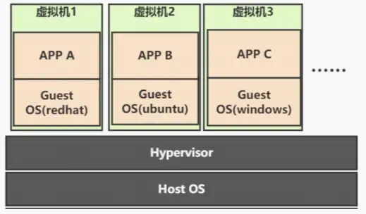

# Docker

## 虚拟化

虚拟化是一种能够更有效地利用物理计算机硬件的过程，具体点说。虚拟化解决了环境问题，一个服务器需要部署许多项目，但是具体依赖的技术版本可能不同，对于维护这些版本记录成本会增加。当前的云服务是基于虚拟化技术而产生的。

虚拟化会抽象硬件资源，让这些资源变得可分配。同时虚拟化为了完成资源的分配会将环境之间隔离让它们互不干扰。之后进一步的虚拟化硬件资源。

## 容器

虚拟化调整了系统资源的分配，容器是为了进一步解决**应用开发、测试和部署**的问题。容器具有以下特点：

1. **可移植性**：容器可以将代码与配置文件和相关依赖库进行打包，从而确保在任何环境下的运行都是一致的。
2. **高资源利用率**：容器提供进程级的隔离，因此可以更加精细地设置 CPU 和内存的使用率，进而更好地利用服务器的计算资源。
3. **快速扩展**：每个容器都可作为单独的进程予以运行，并且可以共享底层操作系统的系统资源，这样一来可以加快容器的启动和停止效率。

具体来说，每一个容器就是一个进程。这个进程有如下特点：

- **隔离**：与操作系统隔离，无法得知宿主机的其它进程
- **限制**：限制硬件资源，只是宿主机的一部分
- **寄生**：宿主机的某个文件夹系统根目录

同虚拟机相比，容器只虚拟化部分资源，因此容器会比虚拟机消耗资源少。

## 镜像

镜像是软件的拷贝，在

