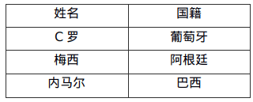
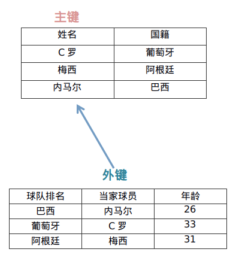

# 数据库

> 参考了[廖雪峰的博客](https://liaoxuefeng.com/books/sql/rdbms/index.html)，因为本人水平有限。

`sql`是控制数据库的语言，数据库是存储数据的中心。每一种数据都有自己的格式，例如一张班级的表，里面有描述学生的属性以及学生的学习成绩之类。当然在计算机中，我们可以使用不同的定义模式来归纳自己的数据。于是为了统一，数据库作为一种专门管理数据的软件就出现了。应用程序不需要自己管理数据，而是通过数据库软件提供的接口来读写数据。至于数据本身如何存储到文件，那是数据库软件的事情，应用程序自己并不关心。

## 概念

### 数据模型

数据需要一定的格式，这决定了存储难度和查询难度。数据库一般有三种模型：

- 层次模型
- 网状模型
- 关系模型

现如今，大部分数据库是使用关系数据库，也就是通过行号和列号来定义数据的位置。目前，主流的关系数据库主要分为以下几类：

1. 商用数据库，例如：[Oracle](https://www.oracle.com/)，[SQL Server](https://www.microsoft.com/sql-server/)，[DB2](https://www.ibm.com/db2/)等；
2. 开源数据库，例如：[MySQL](https://www.mysql.com/)，[PostgreSQL](https://www.postgresql.org/)等；
3. 桌面数据库，以微软[Access](https://products.office.com/access)为代表，适合桌面应用程序使用；
4. 嵌入式数据库，以[Sqlite](https://sqlite.org/)为代表，适合手机应用和桌面程序。

### 数据类型

数据类型是数据的单位，决定了数据的属性。

| 名称         | 类型           | 说明                                                         |
| ------------ | -------------- | ------------------------------------------------------------ |
| INT          | 整型           | 4字节整数类型，范围约+/-21亿                                 |
| BIGINT       | 长整型         | 8字节整数类型，范围约+/-922亿亿                              |
| REAL         | 浮点型         | 4字节浮点数，范围约+/-1038                                   |
| DOUBLE       | 浮点型         | 8字节浮点数，范围约+/-10308                                  |
| DECIMAL(M,N) | 高精度小数     | 由用户指定精度的小数，例如，DECIMAL(20,10)表示一共20位，其中小数10位，通常用于财务计算 |
| CHAR(N)      | 定长字符串     | 存储指定长度的字符串，例如，CHAR(100)总是存储100个字符的字符串 |
| VARCHAR(N)   | 变长字符串     | 存储可变长度的字符串，例如，VARCHAR(100)可以存储0~100个字符的字符串 |
| BOOLEAN      | 布尔类型       | 存储True或者False                                            |
| DATE         | 日期类型       | 存储日期，例如，2018-06-22                                   |
| TIME         | 时间类型       | 存储时间，例如，12:20:59                                     |
| DATETIME     | 日期和时间类型 | 存储日期+时间，例如，2018-06-22 12:20:59                     |

## 关系数据库

关系数据库中的关系是数据库中表之间的关系，表是在数据库下创建的存储数据的一种单元，这样可以按照一定的逻辑在不同的表中查询自己需要的信息。例如一个学校的管理表：

班级表中每一行表示一个班级的信息：

| ID   | 名称       | 班主任 |
| ---- | ---------- | ------ |
| 201  | 二年级一班 | 王老师 |
| 202  | 二年级二班 | 李老师 |

创建的学生表，表示一个班级的人员信息，这个学生表和班级表存在一定的关系

| ID   | 姓名 | 座位号 | 性别 | 年龄 |
| ---- | ---- | -----: | ---: | ---: |
| 1    | 小明 |    201 |    M |    9 |
| 2    | 小红 |    202 |    F |    8 |
| 3    | 小军 |    202 |    M |    8 |
| 4    | 小白 |    201 |    F |    9 |

可以看到一个班级中有许多学生，班级与学生的关系就是**一对多**。也就是说可以在一个班级中查询到许多学生。如果是一对一，也就是一个班级中只有一个学生，这样班级和学生就是一对一的关系。但是一般而言，数据表是不会这样设计的。

### 主键

在数据库中，有几种约束是需要强调的。一种是**主键**，主键的作用是标注一个独立的行，这个行中包括所有列在当前行的信息。确定了一个主键，就可以确定一个行的信息。所以，对于主键的要求其必须是一种完全不重复的字段。一般来说在本地主机中可以使用`BIGINT NOT NULL AUTO_INCREMENT`类型(一种自增的数据)来创建主键。

在这里使用一个数据表来描述主键，如果使用`name`这个字段来作为主键，通过检索**小明**，我们可以得到这个**小明行**的所有信息，但是这显然不是一个好的主键字段选择，因为名称通常会重复。

| id   | class_id | name | gender | score |
| ---- | -------- | ---- | ------ | ----- |
| 1    | 1        | 小明 | M      | 90    |
| 2    | 1        | 小红 | F      | 95    |

此外，主键也支持**联合主键**，就是通过两个列位的信息来确定唯一的一个行。这样说可能有点奇怪，举一个例子。在这个表中，我们可以结合`id_num`，`id_type`。来创建一个联合组件，可以发现`1A 2A 2B`都是独立唯一的一个字段，这样结合也可以成为一种主键。

| id_num | id_type | other columns... |
| ------ | ------- | ---------------- |
| 1      | A       | ...              |
| 2      | A       | ...              |
| 2      | B       | ...              |

主键的选取非常重要：主键不要带有业务含义，而应该使用`BIGINT`自增或者`GUID`类型。主键也不应该允许`NULL`。

### [外键](https://www.cnblogs.com/goldsunshine/p/9226903.html?utm_source=chatgpt.com)

> 参考了他人博客的例子

外键是链接两个表的一种约束，在声明的时候有一种主从关系。一个外键的定义如下：

1. 一张表的外键一定是关联到另一张表的主键
2. 外键可以是空值和重复，主键不可为空值且一定是唯一

外键需要两张表才可以体现出来，一个称之为主表。主表中的主键中的元素，会成为从表中的外键。简单来说，两个表中的一列是一样的。举一个例子：

在如下表中，称之为A表。A表中的姓名是作为这个表的主键



在如下表中，称之为B表，B表中的当家球员是外键，关联的是A表的主键。主键的值要求一定存在，并且是唯一的，**而外键的要求是：可以是空值，也可以重复。**


A表和B表通过这个外键联系起来，两张表的链接关系如下所示：



当删除主键的元素的时候，就会删除外键对应的数据。在上述表中，如果在A表中删除梅西的数据，那么B表中的梅西也就会被删除掉。

### 构造多对多

多对多关系需要构造一个中间表，下面用三个表演示如何构造多对多关系：

`teachers`表：

| id   | name   |
| ---- | ------ |
| 1    | 张老师 |
| 2    | 王老师 |
| 3    | 李老师 |
| 4    | 赵老师 |

`classes`表：

| id   | name |
| ---- | ---- |
| 1    | 一班 |
| 2    | 二班 |

中间表`teacher_class`关联两个一对多关系：

| id   | teacher_id(外键) | class_id(外键) |
| ---- | ---------------- | -------------- |
| 1    | 1                | 1              |
| 2    | 1                | 2              |
| 3    | 2                | 1              |
| 4    | 2                | 2              |
| 5    | 3                | 1              |
| 6    | 4                | 2              |

通过中间表`teacher_class`可知`teachers`到`classes`的关系：

- `id=1`的张老师对应`id=1,2`的一班和二班；
- `id=2`的王老师对应`id=1,2`的一班和二班；
- `id=3`的李老师对应`id=1`的一班；
- `id=4`的赵老师对应`id=2`的二班。

同理可知`classes`到`teachers`的关系：

- `id=1`的一班对应`id=1,2,3`的张老师、王老师和李老师；
- `id=2`的二班对应`id=1,2,4`的张老师、王老师和赵老师；

因此，通过中间表，我们就定义了一个“多对多”关系。

### 构造一对一

一对一关系是指，一个表的记录对应到另一个表的唯一一个记录。

例如，`students`表的每个学生可以有自己的联系方式，如果把联系方式存入另一个表`contacts`，我们就可以得到一个“一对一”关系：

| id   | student_id(外键) | mobile      |
| ---- | ---------------- | ----------- |
| 1    | 1                | 135xxxx6300 |
| 2    | 2                | 138xxxx2209 |
| 3    | 5                | 139xxxx8086 |

构造一对一关系的目的是把经常读取和不经常读取的字段分开，以获得更高的性能。例如，把一个大的用户表分拆为用户基本信息表`user_info`和用户详细信息表`user_profiles`，大部分时候，只需要查询`user_info`表，并不需要查询`user_profiles`表，这样就提高了查询速度。

### 索引

索引是关系数据库中对**某一列或多个列的值进行预排序**的数据结构。通过使用索引，可以让数据库系统不必扫描整个表，而是直接定位到符合条件的记录，这样就大大加快了查询速度。

例如，对于`students`表：

| id   | class_id | name | gender | score |
| ---- | -------- | ---- | ------ | ----- |
| 1    | 1        | 小明 | M      | 90    |
| 2    | 1        | 小红 | F      | 95    |
| 3    | 1        | 小军 | M      | 88    |

如果要经常根据`score`列进行查询，就可以对`score`列创建索引：

```sql
ALTER TABLE students
ADD INDEX idx_score (score);
```

使用`ADD INDEX idx_score (score)`就创建了一个名称为`idx_score`，使用列`score`的索引。索引名称是任意的，索引如果有多列，可以在括号里依次写上，例如：

```sql
ALTER TABLE students
ADD INDEX idx_name_score (name, score);
```

索引的效率取决于索引列的值是否散列，即该列的值如果越互不相同，那么索引效率越高。反过来，如果记录的列存在大量相同的值，例如`gender`列，大约一半的记录值是`M`，另一半是`F`，因此，对该列创建索引就没有意义。

对于主键，关系数据库会自动对其创建主键索引。使用主键索引的效率是最高的，因为主键会保证绝对唯一。

### 唯一索引

给一些独特的业务数据添加标记，例如身份证，邮箱这种类似于唯一的数据。但是，这些列根据业务要求，又具有唯一性约束：即不能出现两条记录存储了同一个身份证号。这个时候，就可以给该列添加一个唯一索引。例如，我们假设`students`表的`name`不能重复：

```sql
ALTER TABLE students
ADD UNIQUE INDEX uni_name (name);
```

通过`UNIQUE`关键字我们就添加了一个唯一索引。

也可以只对某一列添加一个唯一约束而不创建唯一索引：

```sql
ALTER TABLE students
ADD CONSTRAINT uni_name UNIQUE (name);
```

这种情况下，`name`列没有索引，但仍然具有唯一性保证。

索引只是优化查找速度，即使没有索引也不影响查找数据。


## 查询

要查询数据库表的数据，我们使用如下的`SQL`语句：

```sql
# 这个语句的意思是从一个表中查询其的所有行
SELECT * FROM <表名>
```

使用`SELECT * FROM students`时，`SELECT`是关键字，表示将要执行一个查询，`*`中填写你需要查询的列字段。如果是填写`*`，则会查询当前表中的所有列，将这些列全部析出。

`SELECT`语句其实并不要求一定要有`FROM`子句。不带`FROM`子句的`SELECT`语句有一个有用的用途，就是用来判断当前到数据库的连接是否有效。许多检测工具会执行一条`SELECT 1;`来测试数据库连接。

### 条件查询

SELECT语句可以通过`WHERE`条件来设定查询条件，查询结果是满足查询条件的记录。例如，要指定条件“分数在80分或以上的学生”，写成`WHERE`条件就是

```sql
`SELECT * FROM students WHERE score >= 80`
```

其中，`WHERE`关键字后面的`score >= 80`就是条件。`score`是列名，该列存储了学生的成绩，因此，`score >= 80`就筛选出了指定条件的记录。

条件表达式可以用`<条件1> AND <条件2>`表达满足条件1并且满足条件2。例如，符合条件“分数在80分或以上”，并且还符合条件“男生”，把这两个条件写出来：

- 条件1：根据score列的数据判断：`score >= 80`；
- 条件2：根据gender列的数据判断：`gender = 'M'`，注意`gender`列存储的是字符串，需要用单引号括起来。

就可以写出`WHERE`条件：`score >= 80 AND gender = 'M'`：

当然其中的AND可以替换为`or`，`and`，`NOT`，这些需要针对于需求进行修改。

### 投影查询

使用`SELECT * FROM <表名> WHERE <条件>`可以选出表中的若干条记录。我们注意到返回的二维表结构和原表是相同的，即结果集的所有列与原表的所有列都一一对应。

如果我们只希望返回某些列的数据，而不是所有列的数据，我们可以用`SELECT 列1, 列2, 列3 FROM ...`，让**结果集仅包含指定列。这种操作称为投影查询**。

例如，从`students`表中返回`id`、`score`和`name`这三列：

```sql
-- 使用投影查询
SELECT id, score, name FROM students;
```

例如，以下`SELECT`语句将列名`score`重命名为`points`，而`id`和`name`列名保持不变

```sql
-- 使用投影查询，并将列名重命名：
SELECT id, score points, name FROM students;
```

### 排序

我们使用SELECT查询时，查询结果集通常是按照`id`排序的，也就是**根据主键排序**。这也是大部分数据库的做法。如果我们要根据其他条件排序怎么办？可以加上`ORDER BY`子句。例如按照成绩从低到高进行排序：

```sql
-- 按score从低到高:
SELECT id, name, gender, score FROM students ORDER BY score;
```

如果要反过来，按照成绩从高到底排序，我们可以加上`DESC`表示“倒序”

```sql
-- 按score从高到低:
SELECT id, name, gender, score FROM students ORDER BY score DESC;
```

如果`score`列有相同的数据，要进一步排序，可以继续添加列名。例如，使用`ORDER BY score DESC, gender`表示先按`score`列倒序，如果有相同分数的，再按`gender`列排序：

```sql
-- 按score, gender排序:
SELECT id, name, gender, score FROM students ORDER BY score DESC, gender;
```

默认的排序规则是`ASC`：“升序”，即从小到大。`ASC`可以省略，即`ORDER BY score ASC`和`ORDER BY score`效果一样。

如果有`WHERE`子句，那么`ORDER BY`子句要放到`WHERE`子句后面。例如，查询一班的学生成绩，并按照倒序排序：

```sql
-- 带WHERE条件的ORDER BY:
SELECT id, name, gender, score
FROM students
WHERE class_id = 1
ORDER BY score DESC;
```

### 分页查询

分页实际上就是从结果集中“截取”出第M~N条记录。这个查询可以通过`LIMIT <N-M> OFFSET <M>`子句实现。我们先把所有学生按照成绩从高到低进行排序：

```sql
-- 按score从高到低:
SELECT id, name, gender, score FROM students ORDER BY score DESC;
```

现在，我们把结果集分页，每页3条记录。要获取第1页的记录，可以使用`LIMIT 3 OFFSET 0`：

```sql
-- 查询第1页:
SELECT id, name, gender, score
FROM students
ORDER BY score DESC
LIMIT 3 OFFSET 0;
```

上述查询`LIMIT 3 OFFSET 0`表示，对结果集从0号记录开始，最多取3条。注意SQL记录集的索引从0开始。

如果要查询第2页，那么我们只需要“跳过”头3条记录，也就是对结果集从3号记录开始查询，把`OFFSET`设定为3：

```sql
-- 查询第2页:
SELECT id, name, gender, score
FROM students
ORDER BY score DESC
LIMIT 3 OFFSET 3;
```

可见，分页查询的关键在于，首先要确定每页需要显示的结果数量`pageSize`（这里是3），然后根据当前页的索引`pageIndex`（从1开始），确定`LIMIT`和`OFFSET`应该设定的值：

- `LIMIT`总是设定为`pageSize`；
- `OFFSET`计算公式为`pageSize * (pageIndex - 1)`。

这样就能正确查询出第N页的记录集。

### 聚合查询*

聚合函数也就是`COUNT() `函数，用于返回表中由 `WHERE` 子句中指定的条件过滤的行数或列数。也就是说这个函数是返回一个数字。需要注意聚合的计算结果虽然是一个数字，但**查询的结果仍然是一个二维表**，只是这个二维表只有一行一列，并且列名是`COUNT(*)`。

通常，使用聚合查询时，我们应该给列名设置一个别名，便于处理结果。

```sql
-- 使用聚合查询并设置结果集的列名为num:
SELECT COUNT(*) num FROM students;

-- 等价于
COUNT( [ALL|DISTINCT] expression )
```

`COUNT(*)`和`COUNT(id)`实际上是一样的效果。另外注意，聚合查询同样可以使用`WHERE`条件，因此我们可以方便地统计出有多少男生、多少女生、多少80分以上的**学生数量**：

```sql
-- 使用聚合查询并设置WHERE条件:
SELECT COUNT(*) boys FROM students WHERE gender = 'M';
```

除了`COUNT()`函数外，`SQL`还提供了如下聚合函数：

| 函数 | 说明                                   |
| ---- | -------------------------------------- |
| SUM  | 计算某一列的合计值，该列必须为数值类型 |
| AVG  | 计算某一列的平均值，该列必须为数值类型 |
| MAX  | 计算某一列的最大值                     |
| MIN  | 计算某一列的最小值                     |

### 多表查询*

多表查询使用`JOIN`函数将多个表链接在一起，然后在使用`SELECT`函数来进行查询操作。

此外`SELECT`可以从多个表进行查询，查询的语法是：`SELECT * FROM <表1> <表2>`。例如，同时从`students`表和`classes`表的**乘积**，即查询数据，可以这么写：

```sql
-- FROM students, classes:
SELECT * FROM students, classes;
```

这种一次查询两个表的数据，查询的**结果也是一个二维表**，它是`students`表和`classes`表的“乘积”，即`students`表的每一行与`classes`表的每一行都两两拼在一起返回。结果集的列数是`students`表和`classes`表的列数之和，行数是`students`表和`classes`表的行数之积。

这种多表查询又称**笛卡尔查询**，使用笛卡尔查询时要非常小心，由于结果集是目标表的行数乘积，对两个各自有100行记录的表进行笛卡尔查询将返回1万条记录，对两个各自有1万行记录的表进行笛卡尔查询将返回1亿条记录。

你可能还注意到了，上述查询的结果集有两列`id`和两列`name`，两列`id`是因为其中一列是`students`表的`id`，而另一列是`classes`表的`id`，但是在结果集中，不好区分。两列`name`同理

要解决这个问题，我们仍然可以利用**投影查询**的“设置列的别名”来给两个表各自的`id`和`name`列起别名：

```sql
-- set alias:
SELECT
    students.id sid,
    students.name,
    students.gender,
    students.score,
    classes.id cid,
    classes.name cname
FROM students, classes;
```

注意，多表查询时，要使用`表名.列名`这样的方式来引用列和设置别名，这样就避免了结果集的列名重复问题。但是，用`表名.列名`这种方式列举两个表的所有列实在是很麻烦，所以` SQL`还允许给表设置一个别名，让我们在投影查询中引用起来稍微简洁一点：

```sql
-- set table alias:
SELECT
    s.id sid,
    s.name,
    s.gender,
    s.score,
    c.id cid,
    c.name cname
FROM students s, classes c;
```

注意到`FROM`子句给表设置别名的语法是`FROM <表名1> <别名1>, <表名2> <别名2>`。这样我们用别名`s`和`c`分别表示`students`表和`classes`表。

多表查询也是可以添加`WHERE`条件的，我们来试试：

```sql
-- set where clause:
SELECT
    s.id sid,
    s.name,
    s.gender,
    s.score,
    c.id cid,
    c.name cname
FROM students s, classes c
WHERE s.gender = 'M' AND c.id = 1;
```

### 连接查询*

连接查询是另一种类型的多表查询。连接查询对多个表进行JOIN运算，简单地说，就是先确定一个主表作为结果集，然后，把其他表的行**有选择性**地“连接”在主表结果集上。

例如，我们想要选出`students`表的所有学生信息，可以用一条简单的SELECT语句完成：

```sql
-- 选出所有学生:
SELECT s.id, s.name, s.class_id, s.gender, s.score FROM students s;
```

但是，假设我们希望结果集同时包含所在班级的名称，上面的结果集只有`class_id`列，缺少对应班级的`name`列。

现在问题来了，存放班级名称的`name`列存储在`classes`表中，只有根据`students`表的`class_id`，找到`classes`表对应的行，再取出`name`列，就可以获得班级名称。

这时，连接查询就派上了用场。我们先使用最常用的一种内连接——INNER JOIN来实现：

```sql
-- 选出所有学生，同时返回班级名称:
SELECT s.id, s.name, s.class_id, c.name class_name, s.gender, s.score
FROM students s
INNER JOIN classes c
ON s.class_id = c.id;
```

注意INNER JOIN查询的写法是：

1. 先确定主表，仍然使用`FROM <表1>`的语法；
2. 再确定需要连接的表，使用`INNER JOIN <表2>`的语法；
3. 然后确定连接条件，使用`ON <条件...>`，这里的条件是`s.class_id = c.id`，表示`students`表的`class_id`列与`classes`表的`id`列相同的行需要连接；
4. 可选：加上`WHERE`子句、`ORDER BY`等子句。

使用别名不是必须的，但可以更好地简化查询语句。

那什么是内连接（INNER JOIN）呢？先别着急，有内连接（INNER JOIN）就有外连接（OUTER JOIN）。我们把内连接查询改成外连接查询，看看效果：

```sql
-- 使用OUTER JOIN:
SELECT s.id, s.name, s.class_id, c.name class_name, s.gender, s.score
FROM students s
RIGHT OUTER JOIN classes c
ON s.class_id = c.id;
```

执行上述RIGHT OUTER JOIN可以看到，和INNER JOIN相比，RIGHT OUTER JOIN多了一行，多出来的一行是“四班”，但是，学生相关的列如`name`、`gender`、`score`都为`NULL`。

这也容易理解，因为根据`ON`条件`s.class_id = c.id`，`classes`表的`id=4`的行正是“四班”，但是，`students`表中并不存在`class_id=4`的行。

有RIGHT OUTER JOIN，就有LEFT OUTER JOIN，以及FULL OUTER JOIN。它们的区别是：

INNER JOIN只返回同时存在于两张表的行数据，由于`students`表的`class_id`包含1，2，3，`classes`表的`id`包含1，2，3，4，所以，INNER JOIN根据条件`s.class_id = c.id`返回的结果集仅包含1，2，3。

RIGHT OUTER JOIN返回右表都存在的行。如果某一行仅在右表存在，那么结果集就会以`NULL`填充剩下的字段。

LEFT OUTER JOIN则返回左表都存在的行。如果我们给students表增加一行，并添加`class_id=5`，由于classes表并不存在`id=5`的行，所以，LEFT OUTER JOIN的结果会增加一行，对应的`class_name`是`NULL`：


## 修改

## 事务

