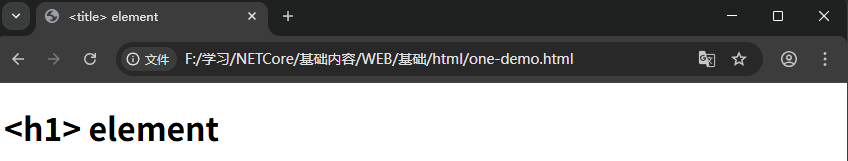

#  WEB

`web`全称是**World Wide Web**，也就是万维网。`web`的运行基于`C/S`模式，也就是客户端和服务器，服务器提供服务向外界展示图片以及网页，客户端可以通过浏览器进行浏览服务端的内容。


- 客户端是典型的 Web 用户入网设备（比如，你连接了 Wi-Fi 的电脑，或接入移动网络的手机）和设备上能访问 Web 的软件（通常是一个 Web 浏览器，如 Firefox 或者 Chrome）。
- 服务器是存储网页、站点或应用程序的计算机。当一个客户端设备想要获取一个网页时，一份网页副本将从服务器上下载到客户端机器上，在用户的 Web 浏览器上显示。

两个电脑可以组成服务端以及用户端，多个自然也可以。当你在浏览器里输入一个网址时：

1. 浏览器在域名系统服务器上找出存放网页的服务器的实际地址
2. 浏览器发送 `HTTP `请求信息到服务器，请求服务器发送一份网站的副本到客户端（你走到商店并下订单）。这条消息，包括其他所有在客户端和服务器之间传递的数据都是通过互联网使用 `TCP/IP `协议传输的。
3. 假设服务器同意客户端的请求，服务器会返回一个`200 OK`信息，意味着“你可以查看这个网页，给你～”，然后开始将网页的文件以数据包的形式传输到浏览器。
4. 浏览器将数据包聚集成完整的网页然后将网页呈现给你

## HTML

HTML是一种可以被浏览器渲染的文本，在通过一系列标签和属性的编排下，可以在互联网显示多种多样的文本。HTML 存在于扩展名为 `.html` 的文本文件中，这种文件被称为 **HTML 文档**，或简称**文档**。

HTML由一系列元素组合而成，元素是一个完整从开始标签到结束标签闭合的语句。


元素可以互相嵌套，通俗一些来说，我们开源在一个段落中，将这些段落的某些文字进行加粗。此外，加粗的行为可以使用代码如下表达：

```html
<p>我们的小猫脾气<strong>很</strong>暴躁。</p>
```

一个普通的HTML文档模板是由`xml`文本构成的，前半部分都是属于规范的内容

```html
<!DOCTYPE html>
<html lang="en">
<head>
    <meta charset="UTF-8">
    <meta name="viewport" content="width=device-width, initial-scale=1.0">
    <title>Document</title>
</head>
<body>
    
</body>
</html>
```

### 元素

从上面的叙述，我们知道了元素是由标签和内容构成的。标签也分为单标签和多标签。而对于整个文档而言，标签的数量是很多的。无法做到一一记录。需要用到的时候再查找比较好。

常见的元素标签由其不同的分类而划分，在创建一个默认`html`模板的时候，根据其文档结构划分如以下标签:

| 文档结构标签 | 作用                                           |
| :----------- | ---------------------------------------------- |
| `<!DOCTYPE>` | 文档类型声明                                   |
| `<html>`     | 根元素，一个文档中的其它标签为这个标签的后代。 |
| `<head>`     | 文档头部（包含元数据），给机器阅读的信息       |
| `<title>`    | 页面标题，浏览器标签页显示内容                 |
| `<body>`     | 文档主体内容                                   |

根据元数据进行划分，元一般翻译为**关于....的**，也就是说元数据就是**数据的数据**。一般而言，一个元数据可以分为两部分，元数据项目和元数据内容构成。例如在检索一本书的书名这个可以称之为元数据项目，有一定规则检索出来的例如书的作者，出版社，著作日期，这些称之为元数据内容。

如此说来，每一种数据都可以成为元数据，例如在我的认知里，香蕉可以映射为其状态，味道，以及翻译成为`banana`。这些元数据内容没有检索信息的必要，因此需要使用一定的规则去构造元数据。因此，就有了元数据标准。例如`MARC格式`，一种图书馆通用的计算机数字化书目数据交换标准，人话来说就是将一种书以一串编码的方式来检索。

而在`html`中，会使用`xml`格式来记录一些信息，这些信息就包含了一些元数据，例如`<meta>`就表示当前文档的信息。

| 元数据标签 | 作用                         |
| :--------- | ---------------------------- |
| `<meta>`   | 元信息（字符集、视口设置等） |
| `<link>`   | 引入外部资源（CSS、图标）    |
| `<style>`  | 内联 CSS                     |
| `<script>` | JavaScript 代码或引用        |

根据语义化标签进行分类，语义化标签就是标签内容可以简单的被读懂，`main`标签很简单就可以看出这个是主要标签，`h1-h6`这种是标题，如这样的标签就是语义化标签。

| 语义化标签     | 作用说明                                   |
| -------------- | ------------------------------------------ |
| `<header>`     | 页眉，通常包含标题、Logo、作者信息等       |
| `<footer>`     | 页脚，通常包含版权信息、相关链接、联系方式 |
| `<nav>`        | 导航栏，包含站点或页面的导航链接           |
| `<article>`    | 独立、完整的内容单元，如文章、帖子、评论   |
| `<section>`    | 内容区块，用于对页面内容进行主题分组       |
| `<aside>`      | 侧边栏内容，与主内容相关但非核心           |
| `<main>`       | 页面主体内容，每个页面只能有一个           |
| `<menu>`       | 交互式无序列表（如右键菜单、工具菜单）     |
| `<figure>`     | 图片、图表、代码块等独立媒体内容           |
| `<figcaption>` | `figure` 的标题或说明文字                  |

使用容器与布局进行分类，容器就是在网页渲染中的一块指定大小的区域。

| 标签     | 类型 | 说明                     |
| -------- | ---- | ------------------------ |
| `<div>`  | 块级 | 通用块级容器，无任何语义 |
| `<span>` | 行内 | 通用行内容器，无任何语义 |

使用文本与段落标签进行分类，对于文本内容有影响的标签如下：

| 标签           | 类型 | 说明                                                 |
| -------------- | ---- | ---------------------------------------------------- |
| `<h1>`–`<h6>`  | 块级 | 标题标签，`h1` 级别最高，`h6` 最低，用于页面结构层级 |
| `<p>`          | 块级 | 段落，用于包裹一段文本内容                           |
| `<span>`       | 行内 | 通用行内文本容器，本身无语义，常用于样式或脚本控制   |
| `<br>`         | 行内 | 强制换行（单标签），不产生新段落                     |
| `<hr>`         | 块级 | 水平分割线，表示内容主题的分隔                       |
| `<pre>`        | 块级 | 预格式化文本，保留空格、换行和缩进                   |
| `<strong>`     | 行内 | 语义化强调，表示“重要性”，默认加粗                   |
| `<em>`         | 行内 | 语义化强调，表示“语气强调”，默认斜体                 |
| `<blockquote>` | 块级 | 长引用，用于引用外部或其他来源的内容                 |

根据链接与媒体标签

| 标签       | 类型 | 说明                                                         |
| ---------- | ---- | ------------------------------------------------------------ |
| `<a>`      | 行内 | 超链接，用于页面之间或资源的跳转，可配合 `href`、`target` 等属性 |
| ``    | 行内 | 图片标签（单标签），用于在页面中嵌入图像                     |
| `<video>`  | 块级 | 视频容器，用于嵌入视频内容，支持播放控制                     |
| `<audio>`  | 块级 | 音频容器，用于嵌入音频内容                                   |
| `<source>` | —    | 媒体资源声明标签，配合 `<video>` / `<audio>` 使用，指定不同格式的媒体源 |

根据列表标签，用于在网页中显示表格数据

| 标签   | 类型 | 说明                                       |
| ------ | ---- | ------------------------------------------ |
| `<ul>` | 块级 | 无序列表，列表项通常以圆点等符号显示       |
| `<ol>` | 块级 | 有序列表，列表项按数字或字母顺序编号       |
| `<li>` | 块级 | 列表项，必须作为 `<ul>` 或 `<ol>` 的子元素 |
| `<dl>` | 块级 | 定义列表，用于术语与说明的成组展示         |
| `<dt>` | 块级 | 定义列表中的术语（definition term）        |
| `<dd>` | 块级 | 定义列表中对术语的解释或描述               |

根据表单与输入

| 标签         | 类型 | 说明                                                     |
| ------------ | ---- | -------------------------------------------------------- |
| `<form>`     | 块级 | 表单容器，用于收集和提交用户输入数据                     |
| `<input>`    | 行内 | 表单输入控件，支持文本、密码、单选、多选、按钮等多种类型 |
| `<textarea>` | 行内 | 多行文本输入框                                           |
| `<select>`   | 行内 | 下拉选择框容器                                           |
| `<option>`   | 行内 | 下拉列表中的选项                                         |
| `<label>`    | 行内 | 表单控件标签，用于提升可访问性，可通过 `for` 关联控件    |
| `<button>`   | 行内 | 按钮，可用于提交、重置或普通交互                         |
| `<fieldset>` | 块级 | 表单分组，用于对相关控件进行语义化分组                   |
| `<legend>`   | 块级 | 表单分组标题，作为 `<fieldset>` 的说明                   |

根据表格

| 标签      | 类型 | 说明                                         |
| --------- | ---- | -------------------------------------------- |
| `<table>` | 块级 | 表格容器，用于展示结构化数据                 |
| `<tr>`    | 块级 | 表格行（table row）                          |
| `<td>`    | 块级 | 普通单元格（table data）                     |
| `<th>`    | 块级 | 表头单元格，表示列或行的标题，默认加粗并居中 |
| `<thead>` | 块级 | 表格头部区域，通常包含表头行                 |
| `<tbody>` | 块级 | 表格主体区域，包含主要数据行                 |
| `<tfoot>` | 块级 | 表格底部区域，常用于汇总信息                 |

实际上常用的标签大约就20-30个，以上的其实已经超出了。这里参考了[博客](https://www.cnblogs.com/linx/p/18754279)内容，有兴趣可以点击。

### 属性

属性在`html`是一种标识，这种标识可以帮助`css`和`js`来锁定多标签的渲染区域。当然，在文档中也有一些特殊标注的方法，例如下面的a标签，标注了一个其它主页的链接。

```html
<p>
  我创建了一个指向
  <a href="https://www.mozilla.org/zh-CN/">Mozilla 主页</a>的链接。
</p>
```

属性一般在开始标签中定义，根据属性的用法大致分为几类

- 标识特定的元素 ：例如`id`，`class`
- 提供语义和状态信息：例如`type`,`name`,`value`, `disabled`,`checked`
- 作为`css`和`js`的选择器：例如`class,id` `date-`

属性非常多，而且一大部分应该归类为`css`，因为这些属性的作用通常是改变文本和页面布局。例如改变当前段落文本的大小，以及改变背景颜色或者背景画面

```css
/* 举例 - 改版文本大小 */
<style>
  .big-text {
    font-size: 20px;
  }
</style>

<p class="big-text">
  这是一个字体大小为 20px 的段落
</p>
```

如果一个属性，全部元素都可以使用，这种属性就叫作全局属性，一般全局属性如下:

| 属性              | 说明                                                         |
| ----------------- | ------------------------------------------------------------ |
| `accesskey`       | 设置聚焦元素的快捷键。                                       |
| `class`           | 指定一个或多个样式类名，多个类名使用空格分隔。               |
| `contenteditable` | 指定元素内容是否可编辑，可设置 true（可编辑）或 false（默认，不可编辑）。 |
| `data-*`          | 自定义数据属性，星号可替换为自定义的名称。                   |
| `dir`             | 设置元素中文本的显示方向，可设置 ltr（从左到右）、rtl（从右到左）或 auto（默认）。 |
| `draggable`       | 设置元素是否可拖动，可设置 true（可拖动）或 false（默认，不可拖动）。 |
| `hidden`          | 设置元素是否隐藏，主要提供给 CSS 或 JavaScript 判断使用。    |
| `id`              | 设置元素的 id。一个元素只能有一个 id，同一个 id 在一份 HTML 中只能出现一次；如果出现多次，以最后一次为准。 |
| `lang`            | 设置元素内容的语言，例如 en。                                |
| `spellcheck`      | 检查元素的拼写和语法，可设置 true（检查）或 false（默认，不检查）。 |
| `style`           | 设置元素的样式，写法使用 CSS 语法。                          |
| `tabindex`        | 设置元素在按下 Tab 键时的跳转顺序。                          |
| `title`           | 设置元素的标题。                                             |
| `translate`       | 设置元素内容是否可以被自动翻译，可设置 true（默认，可翻译）或 false（不翻译）。 |

在使用属性时，通常而言在开始标签中以键值对的方式使用，如下的a标签`href`属性描述的是一个网页：

```html
<a href="https://www.runoob.com">Link</a>
```

在属性中使用单引号和双引号的效果是一样的，在标准中最好把属性写为小写。

### 头部

一个文档的模板，会出现一个头部内容，其中有一些需要注意的属性以及标签，默认模板如下：

```html
<!DOCTYPE html>
<html lang="en-US">
  <head>
    <meta charset="utf-8">
    <meta name="viewport" content="width=device-width">
    <title>&lt;title&gt; element</title>
  </head>
  <body>
    <h1>&lt;h1&gt; element</h1>
  </body>
</html>
```

其中的几个标签这里简要的介绍一下：

- `html`，这个标签是一种根部标签，当前文档中的所有标签都是这个标签的子标签。

- `<title>`：`title`元素。它设置了页面的标题，这个标题会出现在加载该页面的浏览器标签页中。当页面被收藏为书签时，页面标题也用于描述该页面。

- `<body>`：`body`元素。它包含了在页面上显示的所有内容，包括文本、图像、视频、游戏、可播放的音轨或其他任何东西

- `<base>` ：标签描述了基本的链接地址/链接目标，该标签作为`HTML`文档中所有链接标签的默认链接
- `<meta>`：是元标签，包含了当前网页的信息。例如解释当前网页使用什么字符编码以及网页的格式信息。 例如

在`head`中的`title`标签和文本内容中的h标签是不同的，`h`标签在网页中是当前文本的标题，`title`是网页介绍端的标题，如下所示



此外`title `在浏览器收藏的时候会被标注为当前网页的默认名称


## CSS

层叠样式表也就是`css`，可以用来构建漂亮的网页。在`html`中的文本会在浏览器中被渲染成为一种默认的样式，这种样式与文档无关。


实际上开始的时候，在`html`中可以使用引入的标签来实现`css`的内容，但是如果一个一个对每一个页面中的标签进行编辑，那工作量是十分巨大的，因此引入了`css`而在`html`中删除了样式格式。

在一个文档中，可以在`head`标签使用`link`标签来引入`css`文件，也可以在`html`中直接使用(适用于调试)，如下代码所示:

```html
<!DOCTYPE html>
<html>
<body>

<h1 style="color:blue;text-align:center;">This is a heading</h1>
<p style="color:red;">This is a paragraph.</p>

</body>
</html>
```

行内样式失去了样式表的许多优点（通过将内容与呈现混合在一起）。因此还是创建一个独立的css文件来进行渲染较为稳妥.


### 规则集

规则集规范了css的语法结构，一个简单的规则集如下所示：


- 选择器指向您需要设置样式的 HTML 元素。
- 声明块包含一条或多条用分号分隔的声明。
- 多条 CSS 声明用分号分隔，声明块用花括号括起来。

 这里对一个段落进行css修饰，声明了一个简单的规则集

```css
p {
  color: red; /* color 是属性 */
  text-align: center;
}
```

效果是将一个段落进行标红，同时把这个段落居中 


### 选择器

选择器是用来锁定渲染区域的工具，例如鼠标右键会出现框，可以多开应用。

**简单选择器**，直接根据特征进行选择，包括`id`，名称，`class`。需要注意的是`id `名称不能以数字开头。

```css
p {
  text-align: center;
  color: red;
}

/*这条 CSS 规则将应用于 id="para1" 的 HTML 元/这条 CSS 规则将应用于 id="para1" 的 HTML 元：*/
#para1 {
  text-align: center;
  color: red;
}
```

类选择器需要增加一个**.**来进行调用，还可以指定特定的`html`元素

```css
/*类选择器*/
.center {
  text-align: center;
  color: red;
}

/*指定html元素 - 这里带有class = "center"的才会变成红色*/
p.center {
  text-align: center;
  color: red;
}
```

通用选择器，使用一个`*`标识所有的HTML元素

```css
* {
  text-align: center;
  color: blue;
}
```

还有几种少用的选择器，简介如下：

- **关系选择器**，依照两个标签的关系进行选择，例如`div p`，就是选择`div`中的所有`p`

- 子元素选择器，例如`div > p`，选择`div`的子`p`，也就是路径与`div`直接链接
- 伪类选择器，在某个状态下才会生效，例如`:hover`，在鼠标移上去之后才显示状态

- 属性选择器，选择带有某属性的元素，例如`a[target]`表示选择带有`target`标签的`a`标签元素.

## JS

> 参考廖雪峰的[博客](https://liaoxuefeng.com/books/javascript/quick-start/basic-syntax/index.html)

### 基础说明

使用`js`进行赋值操作，一个简单的变量赋值如下：

```js
var x = 1;
```

同时为了防止变量名称重复以及限制代码区域，提出了作用域的概念，在作用域中的代码被称之为语句块。而为了服务于语句块中的变量，将`js`中的变量分为了几种

> **var**

当 `var` 变量在函数外部声明时，作用域是全局的。这意味着在函数体外用 `var` 声明的任何变量都可以在整个窗口中使用。

`var` 在函数中声明时，它的作用域是在函数体内。这意味着它只能在该函数中被访问。

在这里，`greeter` 是全局作用域的，因为它存在于函数之外，而 `hello` 是函数作用域，所以我们不能在函数之外访问变量 `hello`。

```js
  var greeter = "hey hi";
    
  function newFunction() {
        var hello = "hello";
    }
```

所以如果我们这样做，我们会得到一个错误，这是由于 `hello` 在函数之外不可用。

```js
    var tester = "hey hi";
    
    function newFunction() {
        var hello = "hello";
    }
    console.log(hello); // error: hello is not defined
```

`var`还有一个特点，其声明的变量可以重新声明和更新，这意味着我们可以在相同的作用域内执行此操作，并且不会出错。

```js
    var greeter = "hey hi";
    var greeter = "say Hello instead";
	console.log(greeter);
// 输出了 say Hello instead
```

var 的提升是一种 JavaScript 机制，其中变量和函数声明在代码执行之前被移动到其作用域的顶部。这意味着，如果我们这样做：

```js
console.log (greeter);
    var greeter = "say hello"
```

代码会被解释为

```js
    var greeter;
    console.log(greeter); // greeter is undefined
    greeter = "say hello"
```

因此 `var` 变量被提升到其作用域的顶部，并使用 `undefined` 值进行初始化。

但是使用`var`会导致变量覆盖问题，来看下面例子：

```js
    var greeter = "hey hi";
    var times = 4;

    if (times > 3) {
        var greeter = "say Hello instead"; 
    }
    
    console.log(greeter) // "say Hello instead"
```

因此，由于 `times > 3` 返回 `true`，`greeter` 被重新定义为 `"say Hello instead"`。如果你有意要重新定义 `greeter`，这不是问题，但当你没有意识到之前已经定义了一个变量 `greeter` 时，它就会成为问题。

>  **Let**

`let` 现在是变量声明的首选。解决了我们刚刚介绍的 `var` 的问题。它还解决了我们刚刚介绍的 `var` 的问题。让我们考虑一下为什么会这样。

块是由 `{}` 界定的代码块。一个块存在于花括号中。花括号内的任何内容都是一个块。而对于`Let`变量，其被定义为在带有 `let` 的块中声明的变量只能在该块中使用。让我用一个例子来解释一下：

```js
   let greeting = "say Hi";
   let times = 4;

   if (times > 3) {
        let hello = "say Hello instead";
        console.log(hello);// "say Hello instead"
    }
   console.log(hello) // hello is not defined
```

我们看到在它的块（定义它的花括号）之外使用 `hello` 会返回一个错误。这是因为 `let` 变量是块作用域的。

就像 `var` 一样，使用 `let` 声明的变量可以在其作用域内更新。但与 `var` 不同，`let` 变量不能在其作用域内重新声明。如果执行下面的代码将返回一个错误

```js
    let greeting = "say Hi";
    greeting = "say Hello instead";
// error: Identifier 'greeting' has already been declared
```

但是，如果同一个变量定义在不同的作用域，就不会报错：

```js
    let greeting = "say Hi";
    if (true) {
        let greeting = "say Hello instead";
        console.log(greeting); // "say Hello instead"
    }
    console.log(greeting); // "say Hi"
```


#### 数据类型及变量

在JS中定义了以下几种数据类型：

> Number

JS不区分整数和浮点数，统一用Number表示

```js
255; // 二百五十五
255.0; // 相同的数字
255 === 255.0; // true
255 === 0xff; // true（十六进制表示）
255 === 0b11111111; // true（二进制表示）
255 === 0.255e3; // true（十进制指数记数法）
```

以下都是合法的Number类型：

```js
123; // 整数123
0.456; // 浮点数0.456
1.2345e3; // 科学计数法表示1.2345x1000，等同于1234.5
-99; // 负数
NaN; // NaN表示Not a Number，当无法计算结果时用NaN表示
Infinity; // Infinity表示无限大，当数值超过了JavaScript的Number所能表示的最大值时，就表示为Infinity
```

> 字符串

字符串是以**单引号`'`或双引号`"`**括起来的任意文本，比如`'abc'`，`"xyz"`等等。请注意，`''`或`""`本身只是一种表示方式，不是字符串的一部分，因此，字符串`'abc'`只有`a`，`b`，`c`这3个字符。

此外对于一个普通的字符串，可以单独作为一行语句使用，就是没有什么作用罢了。

```js
"hello world";
```

>布尔值

布尔值和布尔代数的表示完全一致，一个布尔值只有`true`、`false`两种值，表达式可以使用`与，或，异或`这些关系表达式。

其中`&&`是与关系，`||`是或关系，`!`是非关系。

```js
true; // 这是一个true值
false; // 这是一个false值
2 > 1; // 这是一个true值
2 >= 3; // 这是一个false值

--------------------------

true && true; // 这个&&语句计算结果为true
true && false; // 这个&&语句计算结果为false
false && true && false; // 这个&&语句计算结果为false
```

> 比较运算符

比较运算符是数学上比较大小的运算符，如下：

```js
2 > 5; // false
5 >= 2; // true
7 == 7; // true

// 实际上，JavaScript允许对任意数据类型做比较
false == 0; // true
false === 0; // false
```

要特别注意相等运算符`==`。`JavaScript`在设计时，有两种比较运算符：

- `==`比较，它会自动转换数据类型再比较，很多时候，会得到非常诡异的结果；

- `===`比较，它不会自动转换数据类型，如果数据类型不一致，返回`false`，如果一致，再比较。

所以在之后编写的代码中**使用`===`较为稳妥**

#### 字符串

JS的字符串就是用`''`或`""`括起来的字符表示。

如果需要让`'`表示一个字符，那就可以用`""`括起来，比如`"I'm OK"`包含的字符是`I`，`'`，`m`，空格，`O`，`K`这6个字符。

如果包含单引号和双引号，则可以用**转义字符`\`来标识**，比如：

```js
'I\'m \"OK\"!'; // I'm "OK"!
```

多个字符串可以使用`+`将其组合起来，组合的字符串会按照从左到右的顺序拼接起来：

```js
// 获取字符串的长度 
let s = 'Hello, world!';
s.length; // 13

// 取得字符串的n+1的数据, 索引从0
let s = 'Hello, world!';

s[0]; // 'H'
s[6]; // ' '
s[7]; // 'w'
s[12]; // '!'
s[13]; // undefined 超出范围的索引不会报错，但一律返回undefined
```

*需要特别注意的是*，字符串是不可变的，如果对字符串的某个索引赋值，不会有任何错误，但是，也没有任何效果：

```js
let s = 'Test';
s[0] = 'X';
console.log(s); // s仍然为'Test'
```

对于字符串中，有一些自带的方法可以使用`.`操作符调用，这些调用的方法会改变字符串的信息。

> toUpperCase

`toUpperCase()`把一个字符串全部变为大写：

```js
let s = 'Hello';
s.toUpperCase(); // 返回'HELLO'
```

> toLowerCase

`toLowerCase()`把一个字符串全部变为小写：

```js
let s = 'Hello';
let lower = s.toLowerCase(); // 返回'hello'并赋值给变量lower
lower; // 'hello'
```

> indexOf

`indexOf()`会搜索指定字符串出现的位置：

```js
let s = 'hello, world';
s.indexOf('world'); // 返回7
s.indexOf('World'); // 没有找到指定的子串，返回-1
```

> substring

`substring()`返回指定索引区间的子串：

```js
let s = 'hello, world'
s.substring(0, 5); // 从索引0开始到5（不包括5），返回'hello'
s.substring(7); // 从索引7开始到结束，返回'world'
```

#### 数组

数组是同类型变量的组合，通过索引来访问数组中的每一个元素，在`js`中声明一个数组的代码如下：

```js
let arr = [1, 2, 3.14, 'Hello', null, true];
```

对于一个数组，可以使用`.`操作符来获取这个数组的信息，以下是常见的数组信息：

> `length`属性

这个属性可以输出调用数组的长度，此外改变长度的值会改变当前数组大小。如果索引长度超过了原本数组的长度，则当前数组的长度会变长。

```js
// Array.length:
let arr = [1, 2, 3.14, 'Hello', null, true];
console.log(arr.length); // 6
```

> `indexOf`

这个属性可以搜索在数组中的一个指定元素的位置，并返回该元素的索引值

```js
let arr = [10, 20, '30', 'xyz'];
arr.indexOf(10); // 元素10的索引为0
arr.indexOf(20); // 元素20的索引为1
arr.indexOf(30); // 元素30没有找到，返回-1
arr.indexOf('30'); // 元素'30'的索引为2
```

> slice

这个属性截取`array`的部分元素，然后返回一个新的`array`

```js
let arr = ['A', 'B', 'C', 'D', 'E', 'F', 'G'];
arr.slice(0, 3); // 从索引0开始，到索引3结束，但不包括索引3: ['A', 'B', 'C']
arr.slice(3); // 从索引3开始到结束: ['D', 'E', 'F', 'G']
```

注意到`slice()`的起止参数包括开始索引，不包括结束索引。如果不给`slice()`传递任何参数，它就会从头到尾截取所有元素。利用这一点，我们可以很容易地复制一个`Array`：

```js
let arr = ['A', 'B', 'C', 'D', 'E', 'F', 'G'];
let aCopy = arr.slice();
aCopy; // ['A', 'B', 'C', 'D', 'E', 'F', 'G']
aCopy === arr; // false
```

> `push`和`pop`

`push()`向`Array`的末尾添加若干元素，`pop()`则把`Array`的最后一个元素删除掉：

```js
let arr = [1, 2];
arr.push('A', 'B'); // 返回Array新的长度: 4
arr; // [1, 2, 'A', 'B']
arr.pop(); // pop()返回'B'
arr; // [1, 2, 'A']
arr.pop(); arr.pop(); arr.pop(); // 连续pop 3次
arr; // []
arr.pop(); // 空数组继续pop不会报错，而是返回undefined
arr; // []
```

> `unshift`和`shift`

如果要往`Array`的头部添加若干元素，使用`unshift()`方法，`shift()`方法则把`Array`的第一个元素删掉：

```js
let arr = [1, 2];
arr.unshift('A', 'B'); // 返回Array新的长度: 4
arr; // ['A', 'B', 1, 2]
arr.shift(); // 'A'
arr; // ['B', 1, 2]
arr.shift(); arr.shift(); arr.shift(); // 连续shift 3次
arr; // []
arr.shift(); // 空数组继续shift不会报错，而是返回undefined
arr; // []
```

> sort

`sort()`可以对当前`Array`进行排序，它会直接修改当前`Array`的元素位置，直接调用时，按照默认顺序排序：

```js
let arr = ['B', 'C', 'A'];
arr.sort();
arr; // ['A', 'B', 'C']
```

> reverse

调用`reverse()`会把整个`Array`的元素反转：

```js
let arr = ['one', 'two', 'three'];
arr.reverse(); 
arr; // ['three', 'two', 'one']
```

> splice

`splice()`方法是修改`Array`的“万能方法”，它可以从指定的索引开始删除若干元素，然后再从该位置添加若干元素：

```js
let arr = ['Microsoft', 'Apple', 'Yahoo', 'AOL', 'Excite', 'Oracle'];
// 从索引2开始删除3个元素,然后再添加两个元素:
arr.splice(2, 3, 'Google', 'Facebook'); // 返回删除的元素 ['Yahoo', 'AOL', 'Excite']
arr; // ['Microsoft', 'Apple', 'Google', 'Facebook', 'Oracle']
// 只删除,不添加:
arr.splice(2, 2); // ['Google', 'Facebook']
arr; // ['Microsoft', 'Apple', 'Oracle']
// 只添加,不删除:
arr.splice(2, 0, 'Google', 'Facebook'); // 返回[],因为没有删除任何元素
arr; // ['Microsoft', 'Apple', 'Google', 'Facebook', 'Oracle']
```

> concat

`concat()`方法把当前的`Array`和另一个`Array`连接起来，并返回一个新的`Array`：

```js
let arr = ['A', 'B', 'C'];
let added = arr.concat([1, 2, 3]);
added; // ['A', 'B', 'C', 1, 2, 3]
arr; // ['A', 'B', 'C']
```

`concat()`方法并没有修改当前`Array`，而是返回了一个新的`Array`。实际上，`concat()`方法可以接收任意个元素和`Array`，并且自动把`Array`拆开，然后全部添加到新的`Array`里：

```js
let arr = ['A', 'B', 'C'];
arr.concat(1, 2, [3, 4]); // ['A', 'B', 'C', 1, 2, 3, 4]
```

> join

`join()`方法是一个非常实用的方法，它把当前`Array`的每个元素都用指定的字符串连接起来，然后返回连接后的字符串：

```js
let arr = ['A', 'B', 'C', 1, 2, 3];
arr.join('-'); // 'A-B-C-1-2-3'
```

> 多维数组

如果数组的某个元素又是一个`Array`，则可以形成多维数组，例如：

```js
let arr = [[1, 2, 3], [400, 500, 600], '-'];
```

#### 对象

JavaScript的对象是一种无序的集合数据类型，它由若干键值对组成。

JavaScript的对象用于描述现实世界中的某个对象。例如，为了描述“小明”这个淘气的小朋友，我们可以用若干键值对来描述他：

```js
let xiaoming = {
    name: '小明',
    birth: 1990,
    school: 'No.1 Middle School',
    height: 1.70,
    weight: 65,
    score: null
};
```

JavaScript用一个`{...}`表示一个对象，键值对以`xxx: xxx`形式申明，用`,`隔开。注意，最后一个键值对不需要在末尾加`,`，如果加了，有的浏览器（如低版本的IE）将报错。

上述对象申明了一个`name`属性，值是`'小明'`，`birth`属性，值是`1990`，以及其他一些属性。最后，把这个对象赋值给变量`xiaoming`后，就可以通过变量`xiaoming`来获取小明的属性了：

```js
xiaoming.name; // '小明'
xiaoming.birth; // 1990
```

访问属性是通过`.`操作符完成的，但这要求属性名必须是一个有效的变量名。如果属性名包含特殊字符，就必须用`''`括起来：

```js
let xiaohong = {
    name: '小红',
    'middle-school': 'No.1 Middle School'
};
```

`xiaohong`的属性名`middle-school`不是一个有效的变量，就需要用`''`括起来。访问这个属性也无法使用`.`操作符，必须用`['xxx']`来访问：

```js
xiaohong['middle-school']; // 'No.1 Middle School'
xiaohong['name']; // '小红'
xiaohong.name; // '小红'
```

也可以用`xiaohong['name']`来访问`xiaohong`的`name`属性，不过`xiaohong.name`的写法更简洁。我们在编写JavaScript代码的时候，属性名尽量使用标准的变量名，这样就可以直接通过`object.prop`的形式访问一个属性了。

实际上JavaScript对象的所有属性都是字符串，不过属性对应的值可以是任意数据类型。如果访问一个不存在的属性会返回什么呢？JavaScript规定，访问不存在的属性不报错，而是返回`undefined`：

```js
'use strict';

let xiaoming = {
    name: '小明'
};

console.log(xiaoming.name);
console.log(xiaoming.age); // undefined
```

由于JavaScript的对象是动态类型，你可以自由地给一个对象添加或删除属性

```JS
let xiaoming = {
    name: '小明'
};
xiaoming.age; // undefined
xiaoming.age = 18; // 新增一个age属性
xiaoming.age; // 18
delete xiaoming.age; // 删除age属性
xiaoming.age; // undefined
delete xiaoming['name']; // 删除name属性
xiaoming.name; // undefined
delete xiaoming.school; // 删除一个不存在的school属性也不会报错
```

如果我们要检测`xiaoming`是否拥有某一属性，可以用`in`操作符：

```JS
let xiaoming = {
    name: '小明',
    birth: 1990,
    school: 'No.1 Middle School',
    height: 1.70,
    weight: 65,
    score: null
};
'name' in xiaoming; // true
'grade' in xiaoming; // false
```

不过要小心，如果`in`判断一个属性存在，这个属性不一定是`xiaoming`的，它可能是`xiaoming`继承得到的：

```javascript
'toString' in xiaoming; // true
```

因为`toString`定义在`object`对象中，而所有对象最终都会在原型链上指向`object`，所以`xiaoming`也拥有`toString`属性。

要判断一个属性是否是`xiaoming`自身拥有的，而不是继承得到的，可以用`hasOwnProperty()`方法：

```javascript
let xiaoming = {
    name: '小明'
};
xiaoming.hasOwnProperty('name'); // true
xiaoming.hasOwnProperty('toString'); // false
```

#### 条件判断

JavaScript使用`if () { ... } else { ... }`来进行条件判断。例如，根据年龄显示不同内容，可以用`if`语句实现如下：

```js
let age = 20;
if (age >= 18) { // 如果age >= 18为true，则执行if语句块
    console.log('adult');
} else { // 否则执行else语句块
    console.log('teenager');
}
```

#### 循环

JavaScript的循环有两种，一种是`for`循环，通过初始条件、结束条件和递增条件来循环执行语句块：

```js
let x = 0;
let i;
for (i=1; i<=10000; i++) {
    x = x + i;
}
x; // 50005000
```

> for循环

`for`循环的一个变体是`for ... in`循环，它可以把一个对象的所有属性依次循环出来：

```js
let o = {
    name: 'Jack',
    age: 20,
    city: 'Beijing'
};
for (let key in o) {
    console.log(key); // 'name', 'age', 'city'
}
```

要过滤掉对象继承的属性，用`hasOwnProperty()`来实现：

```js
let o = {
    name: 'Jack',
    age: 20,
    city: 'Beijing'
};
for (let key in o) {
    if (o.hasOwnProperty(key)) {
        console.log(key); // 'name', 'age', 'city'
    }
}
```

由于`Array`也是对象，而它的每个元素的索引被视为对象的属性，因此，`for ... in`循环可以直接循环出`Array`的索引：

```js
let a = ['A', 'B', 'C'];
for (let i in a) {
    console.log(i); // '0', '1', '2'
    console.log(a[i]); // 'A', 'B', 'C'
}
```

> while循环

`for`循环在已知循环的初始和结束条件时非常有用。而上述忽略了条件的`for`循环容易让人看不清循环的逻辑，此时用`while`循环更佳。

`while`循环只有一个判断条件，条件满足，就不断循环，条件不满足时则退出循环。

> do ... while

最后一种循环是`do { ... } while()`循环，它和`while`循环的唯一区别在于，不是在每次循环开始的时候判断条件，而是在**每次循环完成的时候判断条件**：

```js
let n = 0;
do {
    n = n + 1;
} while (n < 100);
n; // 100
```

用`do { ... } while()`循环要小心，循环体会至少执行1次，而`for`和`while`循环则可能一次都不执行。

#### 键值对

JavaScript的默认对象表示方式`{}`可以视为其他语言中的`Map`或`Dictionary`的数据结构，即一组键值对。

但是JavaScript的对象有个小问题，就是键必须是字符串。但实际上Number或者其他数据类型作为键也是非常合理的。

为了解决这个问题，最新的ES6规范引入了新的数据类型`Map`。要测试你的浏览器是否支持ES6规范，请执行以下代码，如果浏览器报ReferenceError错误，那么你需要换一个支持ES6的浏览器：

```js
let m = new Map();
let s = new Set();
console.log('你的浏览器支持Map和Set！');
// 直接运行测试
```

> Map

`Map`是一组键值对的结构，具有极快的查找速度。

举个例子，假设要根据同学的名字查找对应的成绩，如果用`Array`实现，需要两个`Array`：

```js
let names = ['Michael', 'Bob', 'Tracy'];
let scores = [95, 75, 85];
```

给定一个名字，要查找对应的成绩，就先要在names中找到对应的位置，再从scores取出对应的成绩，Array越长，耗时越长。

如果用Map实现，只需要一个“名字”-“成绩”的对照表，直接根据名字查找成绩，无论这个表有多大，查找速度都不会变慢。用JavaScript写一个Map如下：

```js
let m = new Map([['Michael', 95], ['Bob', 75], ['Tracy', 85]]);
m.get('Michael'); // 95
```

初始化`Map`需要一个二维数组，或者直接初始化一个空`Map`。`Map`具有以下方法：

```js
let m = new Map(); // 空Map
m.set('Adam', 67); // 添加新的key-value
m.set('Bob', 59);
m.has('Adam'); // 是否存在key 'Adam': true
m.get('Adam'); // 67
m.delete('Adam'); // 删除key 'Adam'
m.get('Adam'); // undefined
```

由于一个key只能对应一个value，所以，多次对一个key放入value，后面的值会把前面的值冲掉：

```js
let m = new Map();
m.set('Adam', 67);
m.set('Adam', 88);
m.get('Adam'); // 88
```

> Set

`Set`和`Map`类似，也是一组key的集合，但不存储value。由于key不能重复，所以，在`Set`中，没有重复的key。

要创建一个`Set`，需要提供一个`Array`作为输入，或者直接创建一个空`Set`：

```js
let s1 = new Set(); // 空Set
let s2 = new Set([1, 2, 3]); // 含1, 2, 3
```

重复元素在`Set`中自动被过滤：

```js
let s = new Set([1, 2, 3, 3, '3']);
s; // Set {1, 2, 3, "3"}
```

注意数字`3`和字符串`'3'`是不同的元素。

通过`add(key)`方法可以添加元素到`Set`中，可以重复添加，但不会有效果：

```js
s.add(4);
s; // Set {1, 2, 3, 4}
s.add(4);
s; // 仍然是 Set {1, 2, 3, 4}
```

#### iterable

遍历`Array`可以采用下标循环，遍历`Map`和`Set`就无法使用下标。为了统一集合类型，ES6标准引入了新的`iterable`类型，`Array`、`Map`和`Set`都属于`iterable`类型。

具有`iterable`类型的集合可以通过新的`for ... of`循环来遍历。

`for ... of`循环是ES6引入的新的语法，请测试你的浏览器是否支持：

```js
let a = [1, 2, 3];
for (let x of a) {
}
console.log('你的浏览器支持for ... of');
// 请直接运行测试
```

用`for ... of`循环遍历集合，用法如下：

```js
let a = ['A', 'B', 'C'];
let s = new Set(['A', 'B', 'C']);
let m = new Map([[1, 'x'], [2, 'y'], [3, 'z']]);
for (let x of a) { // 遍历Array
    console.log(x);
}
for (let x of s) { // 遍历Set
    console.log(x);
}
for (let x of m) { // 遍历Map
    console.log(x[0] + '=' + x[1]);
}
```

你可能会有疑问，`for ... of`循环和`for ... in`循环有何区别？

`for ... in`循环由于历史遗留问题，它遍历的实际上是对象的属性名称。一个`Array`数组实际上也是一个对象，它的每个元素的索引被视为一个属性。

当我们手动给`Array`对象添加了额外的属性后，`for ... in`循环将带来意想不到的意外效果：

```js
let a = ['A', 'B', 'C'];
a.name = 'Hello';
for (let x in a) {
    console.log(x); // '0', '1', '2', 'name'
}
```

`for ... in`循环将把`name`包括在内，但`Array`的`length`属性却不包括在内。

`for ... of`循环则完全修复了这些问题，它只循环集合本身的元素：

```js
let a = ['A', 'B', 'C'];
a.name = 'Hello';
for (let x of a) {
    console.log(x); // 'A', 'B', 'C'
}
```

这就是为什么要引入新的`for ... of`循环。

然而，更好的方式是直接使用`iterable`内置的`forEach`方法，它接收一个函数，每次迭代就自动回调该函数。以`Array`为例：

```js
let a = ['A', 'B', 'C'];
a.forEach(function (element, index, array) {
    // element: 指向当前元素的值
    // index: 指向当前索引
    // array: 指向Array对象本身
    console.log(`${element}, index = ${index}`);
});
```

### 函数

在`js`中定义一个函数如下所示:

```js
function abs(x) {
    if (x >= 0) {
        return x;
    } else {
        return -x;
    }
}
```

函数分为有返回值和无返回值，有返回值的函数一般而言输入一些数据然后返回一些数据，无返回值大部分是输入一些语句或者是与链接有关的函数。

函数体内部的语句在执行时，一旦执行到`return`时，函数就执行完毕，并将结果返回。因此，函数内部通过条件判断和循环可以实现非常复杂的逻辑。

由于JavaScript的函数也是一个对象，上述定义的`abs()`函数实际上是一个函数对象，而函数名`abs`可以视为指向该函数的变量。

因此，第二种定义函数的方式如下：

```js
let abs = function (x) {
    if (x >= 0) {
        return x;
    } else {
        return -x;
    }
};
```

在这种方式下，`function (x) { ... }`是一个匿名函数，它没有函数名。但是，这个匿名函数赋值给了变量`abs`，所以，通过变量`abs`就可以调用该函数。这种赋值方式称之为委托，声明的对象可以承载目标函数。

上述两种定义*完全等价*，注意第二种方式按照完整语法需要在函数体末尾加一个`;`，表示赋值语句结束。

> 使用函数

调用函数的时候，根据函数的说明输入需要计算或者需求的参数，例如:

```js
abs(10); // 返回10
abs(-9); // 返回9
```

由于JavaScript允许传入任意个参数而不影响调用，因此传入的参数比定义的参数多也没有问题，虽然函数内部并不需要这些参数：

```js
abs(10, 'blablabla'); // 返回10
abs(-9, 'haha', 'hehe', null); // 返回9
```

传入的参数比定义的少也没有问题：

```js
abs(); // 返回NaN
```

此时`abs(x)`函数的参数`x`将收到`undefined`，计算结果为`NaN`。要避免收到`undefined`，可以对参数进行检查：

```js
function abs(x) {
    if (typeof x !== 'number') {
        throw 'Not a number';
    }
    if (x >= 0) {
        return x;
    } else {
        return -x;
    }
}
```

> arguments

`js`还有一个免费赠送的关键字`arguments`，它只在函数内部起作用，并且永远指向当前函数的调用者传入的所有参数。`arguments`类似`Array`但它不是一个`Array`：

```js
function foo(x) {
    console.log('x = ' + x); // 10
    for (let i=0; i<arguments.length; i++) {
        console.log('arg ' + i + ' = ' + arguments[i]); // 10, 20, 30
    }
}
foo(10, 20, 30);
```

利用`arguments`，你可以获得调用者传入的所有参数。也就是说，即使函数不定义任何参数，还是可以拿到参数的值：

```js
function abs() {
    if (arguments.length === 0) {
        return 0;
    }
    let x = arguments[0];
    return x >= 0 ? x : -x;
}

abs(); // 0
abs(10); // 10
abs(-9); // 9
```

实际上`arguments`最常用于判断传入参数的个数。你可能会看到这样的写法：

```js
// foo(a[, b], c)
// 接收2~3个参数，b是可选参数，如果只传2个参数，b默认为null：
function foo(a, b, c) {
    if (arguments.length === 2) {
        // 实际拿到的参数是a和b，c为undefined
        c = b; // 把b赋给c
        b = null; // b变为默认值
    }
    // ...
}
```

要把中间的参数`b`变为“可选”参数，就只能通过`arguments`判断，然后重新调整参数并赋值。

> rest参数

由于JavaScript函数允许接收任意个参数，于是我们就不得不用`arguments`来获取所有参数：

```js
function foo(a, b) {
    let i, rest = [];
    if (arguments.length > 2) {
        for (i = 2; i<arguments.length; i++) {
            rest.push(arguments[i]);
        }
    }
    console.log('a = ' + a);
    console.log('b = ' + b);
    console.log(rest);
}
```

为了获取除了已定义参数`a`、`b`之外的参数，我们不得不用`arguments`，并且循环要从索引`2`开始以便排除前两个参数，这种写法很别扭，只是为了获得额外的`rest`参数，有没有更好的方法？

ES6标准引入了rest参数，上面的函数可以改写为：

```js
function foo(a, b, ...rest) {
    console.log('a = ' + a);
    console.log('b = ' + b);
    console.log(rest);
}

foo(1, 2, 3, 4, 5);
// 结果:
// a = 1
// b = 2
// Array [ 3, 4, 5 ]

foo(1);
// 结果:
// a = 1
// b = undefined
// Array []
```

rest参数只能写在最后，前面用`...`标识，从运行结果可知，传入的参数先绑定`a`、`b`，多余的参数以数组形式交给变量`rest`，所以，不再需要`arguments`我们就获取了全部参数。

如果传入的参数连正常定义的参数都没填满，也不要紧，rest参数会接收一个空数组（注意不是`undefined`）。

因为rest参数是ES6新标准，所以你需要测试一下浏览器是否支持。请用rest参数编写一个`sum()`函数，接收任意个参数并返回它们的和：

```js
function sum(...rest) {
   ???
}

// 测试:
let i, args = [];
for (i=1; i<=100; i++) {
    args.push(i);
}
if (sum() !== 0) {
    console.log('测试失败: sum() = ' + sum());
} else if (sum(1) !== 1) {
    console.log('测试失败: sum(1) = ' + sum(1));
} else if (sum(2, 3) !== 5) {
    console.log('测试失败: sum(2, 3) = ' + sum(2, 3));
} else if (sum.apply(null, args) !== 5050) {
    console.log('测试失败: sum(1, 2, 3, ..., 100) = ' + sum.apply(null, args));
} else {
    console.log('测试通过!');
}
```

#### 方法

在一个类中，有一个函数，这种函数称之为方法。方法可以使用声明的对象进行使用，使用的过程中使用`.`操作符来进行调用：

```js
let xiaoming = {
    name: '小明',
    birth: 1990,
    age: function () {
        let y = new Date().getFullYear();
        return y - this.birth;
    }
};

xiaoming.age; // function xiaoming.age()
xiaoming.age(); // 今年调用是25,明年调用就变成26了
```

绑定到对象上的函数称为方法，和普通函数也没啥区别，但是它在内部使用了一个`this`关键字，这个东东是什么？

在一个方法内部，**`this`是一个特殊变量，它始终指向当前对象**，也就是`xiaoming`这个变量。所以，`this.birth`可以拿到`xiaoming`的`birth`属性。

```js
function getAge() {
    let y = new Date().getFullYear();
    return y - this.birth;
}

let xiaoming = {
    name: '小明',
    birth: 1990,
    age: getAge
};

xiaoming.age(); // 25, 正常结果
getAge(); // NaN
```

单独调用函数`getAge()`怎么返回了`NaN`？*请注意*，我们已经进入到了JavaScript的一个大坑里。

JavaScript的函数内部如果调用了`this`，那么这个`this`到底指向谁？

答案是，视情况而定！

如果以对象的方法形式调用，比如`xiaoming.age()`，该函数的`this`指向被调用的对象，也就是`xiaoming`，这是符合我们预期的。

如果单独调用函数，比如`getAge()`，此时，该函数的`this`指向全局对象，也就是`window`。

坑爹啊！

更坑爹的是，如果这么写：

```js
let fn = xiaoming.age; // 先拿到xiaoming的age函数
fn(); // NaN
```

也是不行的！要保证`this`指向正确，必须用`obj.xxx()`的形式调用！

由于这是一个巨大的设计错误，要想纠正可没那么简单。ECMA决定，在strict模式下让函数的`this`指向`undefined`，因此，在strict模式下，你会得到一个错误：

```js
'use strict';

let xiaoming = {
    name: '小明',
    birth: 1990,
    age: function () {
        let y = new Date().getFullYear();
        return y - this.birth;
    }
};

let fn = xiaoming.age;
fn(); // Uncaught TypeError: Cannot read property 'birth' of undefined
```

这个决定只是让错误及时暴露出来，并没有解决`this`应该指向的正确位置。

有些时候，喜欢重构的你把方法重构了一下：

```js
'use strict';

let xiaoming = {
    name: '小明',
    birth: 1990,
    age: function () {
        function getAgeFromBirth() {
            let y = new Date().getFullYear();
            return y - this.birth;
        }
        return getAgeFromBirth();
    }
};

xiaoming.age(); // Uncaught TypeError: Cannot read property 'birth' of undefined
```

> apply

虽然在一个独立的函数调用中，根据是否是strict模式，`this`指向`undefined`或`window`，不过，我们还是可以控制`this`的指向的！

要指定函数的`this`指向哪个对象，可以用函数本身的`apply`方法，它接收两个参数，第一个参数就是需要绑定的`this`变量，第二个参数是`Array`，表示函数本身的参数。

用`apply`修复`getAge()`调用：

```js
function getAge() {
    let y = new Date().getFullYear();
    return y - this.birth;
}

let xiaoming = {
    name: '小明',
    birth: 1990,
    age: getAge
};

xiaoming.age(); // 25
getAge.apply(xiaoming, []); // 25, this指向xiaoming, 参数为空
```

另一个与`apply()`类似的方法是`call()`，唯一区别是：

- `apply()`把参数打包成`Array`再传入；
- `call()`把参数按顺序传入。

比如调用`Math.max(3, 5, 4)`，分别用`apply()`和`call()`实现如下：

```javascript
Math.max.apply(null, [3, 5, 4]); // 5
Math.max.call(null, 3, 5, 4); // 5
```

对普通函数调用，我们通常把`this`绑定为`null`。

> 装饰器

利用`apply()`，我们还可以动态改变函数的行为。

JavaScript的所有对象都是动态的，即使内置的函数，我们也可以重新指向新的函数。

现在假定我们想统计一下代码一共调用了多少次`parseInt()`，可以把所有的调用都找出来，然后手动加上`count += 1`，不过这样做太傻了。最佳方案是用我们自己的函数替换掉默认的`parseInt()`：

```js
'use strict';

let count = 0;
let oldParseInt = parseInt; // 保存原函数

window.parseInt = function () {
    count += 1;
    return oldParseInt.apply(null, arguments); // 调用原函数
};

// 测试:
parseInt('10');
parseInt('20');
parseInt('30');
console.log('count = ' + count); // 3
```

#### 高阶函数

JavaScript的函数其实都指向某个变量。既然变量可以指向函数，函数的参数能接收变量，那么一个函数就可以接收另一个函数作为参数，这种函数就称之为高阶函数。

一个最简单的高阶函数：

```javascript
function add(x, y, f) {
    return f(x) + f(y);
}
```

当我们调用`add(-5, 6, Math.abs)`时，参数`x`，`y`和`f`分别接收`-5`，`6`和函数`Math.abs`，根据函数定义，我们可以推导计算过程为：

```js
x = -5;
y = 6;
f = Math.abs;
f(x) + f(y) ==> Math.abs(-5) + Math.abs(6) ==> 11;
return 11;
```

> map

举例说明，比如我们有一个函数`f(x)=x*x`，要把这个函数作用在一个数组`[1, 2, 3, 4, 5, 6, 7, 8, 9]`上，就可以用`map`实现如下：

```js
            f(x) = x * x

                  │
                  │
  ┌───┬───┬───┬───┼───┬───┬───┬───┐
  │   │   │   │   │   │   │   │   │
  ▼   ▼   ▼   ▼   ▼   ▼   ▼   ▼   ▼

[ 1   2   3   4   5   6   7   8   9 ]

  │   │   │   │   │   │   │   │   │
  │   │   │   │   │   │   │   │   │
  ▼   ▼   ▼   ▼   ▼   ▼   ▼   ▼   ▼

[ 1   4   9  16  25  36  49  64  81 ]
```

由于`map()`方法定义在`JavaScript`的`Array`中，我们调用`Array`的`map()`方法，传入我们自己的函数，就得到了一个新的`Array`作为结果：

```js
function pow(x) {
    return x * x;
}

let arr = [1, 2, 3, 4, 5, 6, 7, 8, 9];
let results = arr.map(pow); // [1, 4, 9, 16, 25, 36, 49, 64, 81]
console.log(results);
```

注意：`map()`传入的参数是`pow`，即函数对象本身。

你可能会想，不需要`map()`，写一个循环，也可以计算出结果：

```js
let f = function (x) {
    return x * x;
};

let arr = [1, 2, 3, 4, 5, 6, 7, 8, 9];
let result = [];
for (let i=0; i<arr.length; i++) {
    result.push(f(arr[i]));
}
```

的确可以，但是，从上面的循环代码，我们无法一眼看明白“把f(x)作用在Array的每一个元素并把结果生成一个新的Array”。

所以，`map()`作为高阶函数，事实上它把运算规则抽象了，因此，我们不但可以计算简单的`f(x)=x2`，还可以计算任意复杂的函数，比如，把`Array`的所有数字转为字符串：

```js
let arr = [1, 2, 3, 4, 5, 6, 7, 8, 9];
arr.map(String); // ['1', '2', '3', '4', '5', '6', '7', '8', '9']
```

> reduce

Array的`reduce()`把一个函数作用在这个`Array`的`[x1, x2, x3...]`上，这个函数必须接收两个参数，`reduce()`把结果继续和序列的下一个元素做**累积计算**，其效果就是：

```js
[x1, x2, x3, x4].reduce(f) = f(f(f(x1, x2), x3), x4)
```

比方说对一个`Array`求和，就可以用`reduce`实现：

```js
let arr = [1, 3, 5, 7, 9];
arr.reduce(function (x, y) {
    return x + y;
}); // 25
```

如果数组元素只有1个，那么还需要提供一个额外的初始参数以便至少凑够两：

```js
let arr = [123];
arr.reduce(function (x, y) {
    return x + y;
}, 0); // 123
```

要把`[1, 3, 5, 7, 9]`变换成整数13579，`reduce()`也能派上用场：

```js
let arr = [1, 3, 5, 7, 9];
arr.reduce(function (x, y) {
    return x * 10 + y;
}); // 13579
```

如果我们继续改进这个例子，想办法把一个字符串`13579`先变成`Array`——`[1, 3, 5, 7, 9]`，再利用`reduce()`就可以写出一个把字符串转换为Number的函数。

> filter

`filter`也是一个常用的操作，它用于把`Array`的某些元素过滤掉，然后返回剩下的元素。

和`map()`类似，`Array`的`filter()`也接收一个函数。和`map()`不同的是，`filter()`把传入的函数依次作用于每个元素，然后根据返回值是`true`还是`false`决定保留还是丢弃该元素。

例如，在一个`Array`中，删掉偶数，只保留奇数，可以这么写：

```js
let arr = [1, 2, 4, 5, 6, 9, 10, 15];
let r = arr.filter(function (x) {
    return x % 2 !== 0;
});
r; // [1, 5, 9, 15]
```

> 回调函数

`filter()`接收的回调函数，其实可以有多个参数。通常我们仅使用第一个参数，表示`Array`的某个元素。回调函数还可以接收另外两个参数，表示元素的位置和数组本身：

```js
let arr = ['A', 'B', 'C'];
let r = arr.filter(function (element, index, self) {
    console.log(element); // 依次打印'A', 'B', 'C'
    console.log(index); // 依次打印0, 1, 2
    console.log(self); // self就是变量arr
    return true;
});
```

去除重复元素依靠的是`indexOf`总是返回第一个元素的位置，后续的重复元素位置与`indexOf`返回的位置不相等，因此被`filter`滤掉了。

> sort

排序也是在程序中经常用到的算法。无论使用冒泡排序还是快速排序，排序的核心是比较两个元素的大小。如果是数字，我们可以直接比较，但如果是字符串或者两个对象呢？直接比较数学上的大小是没有意义的，因此，比较的过程必须通过函数抽象出来。通常规定，对于两个元素`x`和`y`，如果认为`x < y`，则返回`-1`，如果认为`x == y`，则返回`0`，如果认为`x > y`，则返回`1`，这样，排序算法就不用关心具体的比较过程，而是根据比较结果直接排序。

JavaScript的`Array`的`sort()`方法就是用于排序的，但是排序结果可能让你大吃一惊：

```js
// 看上去正常的结果:
['Google', 'Apple', 'Microsoft'].sort(); // ['Apple', 'Google', 'Microsoft'];

// apple排在了最后:
['Google', 'apple', 'Microsoft'].sort(); // ['Google', 'Microsoft", 'apple']

// 无法理解的结果:
[10, 20, 1, 2].sort(); // [1, 10, 2, 20]
```

第二个排序把`apple`排在了最后，是因为字符串根据ASCII码进行排序，而小写字母`a`的ASCII码在大写字母之后。

第三个排序结果是什么鬼？简单的数字排序都能错？

这是因为`Array`的`sort()`方法默认把所有元素先转换为String再排序，结果`'10'`排在了`'2'`的前面，因为字符`'1'`比字符`'2'`的ASCII码小。

如果不知道`sort()`方法的默认排序规则，直接对数字排序，绝对栽进坑里！

幸运的是，`sort()`方法也是一个高阶函数，它还可以接收一个比较函数来实现自定义的排序。

要按数字大小排序，我们可以这么写：

```js
let arr = [10, 20, 1, 2];

arr.sort(function (x, y) {
    if (x < y) {
        return -1;
    }
    if (x > y) {
        return 1;
    }
    return 0;
});

console.log(arr); // [1, 2, 10, 20]
```

如果要倒序排序，我们可以把大的数放前面：

```js
let arr = [10, 20, 1, 2];
arr.sort(function (x, y) {
    return y - x;
}); // [20, 10, 2, 1]
```

给`sort()`传入的比较函数接受`x`和`y`两个参数，如果`x<y`，应返回负数，如果`x>y`，应返回正数，如果`x=y`，应返回0。

默认情况下，对字符串排序，是按照ASCII的大小比较的，现在，我们提出排序应该忽略大小写，按照字母序排序。要实现这个算法，不必对现有代码大加改动，只要我们能定义出忽略大小写的比较算法就可以：

```js
let arr = ['Google', 'apple', 'Microsoft'];
arr.sort(function (s1, s2) {
    x1 = s1.toUpperCase();
    x2 = s2.toUpperCase();
    if (x1 < x2) {
        return -1;
    }
    if (x1 > x2) {
        return 1;
    }
    return 0;
}); // ['apple', 'Google', 'Microsoft']
```

忽略大小写来比较两个字符串，实际上就是先把字符串都变成大写（或者都变成小写），再比较。

从上述例子可以看出，高阶函数的抽象能力是非常强大的，而且，核心代码可以保持得非常简洁。

最后友情提示，`sort()`方法会直接对`Array`进行修改，它返回的结果仍是当前`Array`：

```js
let a1 = ['B', 'A', 'C'];
let a2 = a1.sort();
a1; // ['A', 'B', 'C']
a2; // ['A', 'B', 'C']
a1 === a2; // true, a1和a2是同一对象
```

> Array

对于数组，除了`map()`、`reduce`、`filter()`、`sort()`这些方法可以传入一个函数外，`Array`对象还提供了很多非常实用的高阶函数。

`every()`方法可以判断数组的所有元素是否满足测试条件。

例如，给定一个包含若干字符串的数组，判断所有字符串是否满足指定的测试条件：

```js
let arr = ['Apple', 'pear', 'orange'];
console.log(arr.every(function (s) {
    return s.length > 0;
})); // true, 因为每个元素都满足s.length>0

console.log(arr.every(function (s) {
    return s.toLowerCase() === s;
})); // false, 因为不是每个元素都全部是小写
```

`find()`方法用于查找符合条件的第一个元素，如果找到了，返回这个元素，否则，返回`undefined`：

```js
let arr = ['Apple', 'pear', 'orange'];
console.log(arr.find(function (s) {
    return s.toLowerCase() === s;
})); // 'pear', 因为pear全部是小写

console.log(arr.find(function (s) {
    return s.toUpperCase() === s;
})); // undefined, 因为没有全部是大写的元素
```

`findIndex()`和`find()`类似，也是查找符合条件的第一个元素，不同之处在于`findIndex()`会返回这个元素的索引，如果没有找到，返回`-1`：

```js
let arr = ['Apple', 'pear', 'orange'];
console.log(arr.findIndex(function (s) {
    return s.toLowerCase() === s;
})); // 1, 因为'pear'的索引是1

console.log(arr.findIndex(function (s) {
    return s.toUpperCase() === s;
})); // -1
```

`forEach()`和`map()`类似，它也把每个元素依次作用于传入的函数，但不会返回新的数组。`forEach()`常用于遍历数组，因此，传入的函数不需要返回值：

```js
let arr = ['Apple', 'pear', 'orange'];
arr.forEach(x=>console.log(x)); // 依次打印每个元素
```

#### 闭包

高阶函数除了可以接受函数作为参数外，还可以把函数作为结果值返回。我们来实现一个对`Array`的求和。通常情况下，求和的函数是这样定义的：

```js
function sum(arr) {
    return arr.reduce(function (x, y) {
        return x + y;
    });
}

sum([1, 2, 3, 4, 5]); // 15
```

但是，如果不需要立刻求和，而是在后面的代码中，根据需要再计算怎么办？可以不返回求和的结果，而是返回求和的函数！

```js
function lazy_sum(arr) {
    let sum = function () {
        return arr.reduce(function (x, y) {
            return x + y;
        });
    }
    return sum;
}
```

当我们调用`lazy_sum()`时，返回的并不是求和结果，而是求和函数：

```js
let f = lazy_sum([1, 2, 3, 4, 5]); // function sum()
```

调用函数`f`时，才真正计算求和的结果：

```js
f(); // 15
```

在这个例子中，我们在函数`lazy_sum`中又定义了函数`sum`，并且，内部函数`sum`可以引用外部函数`lazy_sum`的参数和局部变量，当`lazy_sum`返回函数`sum`时，相关参数和变量都保存在返回的函数中，这种称为“闭包（Closure）”的程序结构拥有极大的威力。

请再注意一点，当我们调用`lazy_sum()`时，每次调用都会返回一个**新的函数**，即使传入相同的参数：

```js
let f1 = lazy_sum([1, 2, 3, 4, 5]);
let f2 = lazy_sum([1, 2, 3, 4, 5]);
f1 === f2; // false
```

`f1()`和`f2()`的调用结果互不影响。

> 闭包

注意到返回的函数在其定义内部引用了局部变量`arr`，所以，当一个函数返回了一个函数后，其内部的局部变量还被新函数引用，所以，闭包用起来简单，实现起来可不容易。

另一个需要注意的问题是，返回的函数并没有立刻执行，而是直到调用了`f()`才执行。我们来看一个例子：

```js
function count() {
    let arr = [];
    for (var i=1; i<=3; i++) {
        arr.push(function () {
            return i * i;
        });
    }
    return arr;
}

let results = count();
let [f1, f2, f3] = results;
```

在上面的例子中，每次循环，都创建了一个新的函数，然后，把创建的3个函数都添加到一个`Array`中返回了。

你可能认为调用`f1()`，`f2()`和`f3()`结果应该是`1`，`4`，`9`，但实际结果是：

```js
f1(); // 16
f2(); // 16
f3(); // 16
```

全部都是`16`！原因就在于返回的函数引用了用`var`定义的变量`i`，但它并非立刻执行。等到3个函数都返回时，它们所引用的变量`i`已经变成了`4`，因此最终结果为`16`。

返回闭包时牢记的一点就是：返回函数不要引用任何循环变量，或者后续会发生变化的变量。

如果一定要引用循环变量怎么办？方法是再创建一个函数，用该函数的参数绑定循环变量当前的值，无论该循环变量后续如何更改，已绑定到函数参数的值不变：

```js
function count() {
    let arr = [];
    for (var i=1; i<=3; i++) {
        arr.push((function (n) {
            return function () {
                return n * n;
            }
        })(i));
    }
    return arr;
}

let [f1, f2, f3] = count();

f1(); // 1
f2(); // 4
f3(); // 9
```

说了这么多，难道闭包就是为了返回一个函数然后延迟执行吗？

当然不是！闭包有非常强大的功能。举个栗子：

在面向对象的程序设计语言里，比如Java和C++，要在对象内部封装一个私有变量，可以用`private`修饰一个成员变量。

在没有`class`机制，只有函数的语言里，借助闭包，同样可以封装一个私有变量。我们用JavaScript创建一个计数器：

```js
function create_counter(initial) {
    let x = initial || 0;
    return {
        inc: function () {
            x += 1;
            return x;
        }
    }
}
```

它用起来像这样：

```js
let c1 = create_counter();
c1.inc(); // 1
c1.inc(); // 2
c1.inc(); // 3

let c2 = create_counter(10);
c2.inc(); // 11
c2.inc(); // 12
c2.inc(); // 13
```

在返回的对象中，实现了一个闭包，该闭包携带了局部变量`x`，并且，从外部代码根本无法访问到变量`x`。换句话说，闭包就是携带状态的函数，并且它的状态可以完全对外隐藏起来。

闭包还可以把多参数的函数变成单参数的函数。例如，要计算xy可以用`Math.pow(x, y)`函数，不过考虑到经常计算`x^2`或`x^3`，我们可以利用闭包创建新的函数`pow2`和`pow3`：

```js
function make_pow(n) {
    return function (x) {
        return Math.pow(x, n);
    }
}

// 创建两个新函数:
let pow2 = make_pow(2);
let pow3 = make_pow(3);

console.log(pow2(5)); // 25
console.log(pow3(7)); // 343
```

#### 箭头函数

为什么叫箭头函数？因为它的定义用的就是一个箭头：

```js
x => x * x
```

上面的箭头函数相当于：

```js
function (x) {
    return x * x;
}
```

箭头函数相当于匿名函数，并且简化了函数定义。箭头函数有两种格式，一种像上面的，只包含一个表达式，连`{ ... }`和`return`都省略掉了。还有一种可以**包含多条语句，这时候就不能省略**`{ ... }`和`return`：

```js
x => {
    if (x > 0) {
        return x * x;
    }
    else {
        return - x * x;
    }
}
```

如果参数不是一个，就需要用括号`()`括起来：

```js
// 两个参数:
(x, y) => x * x + y * y

// 无参数:
() => 3.14

// 可变参数:
(x, y, ...rest) => {
    let i, sum = x + y;
    for (i=0; i<rest.length; i++) {
        sum += rest[i];
    }
    return sum;
}
```

如果要返回一个对象，就要注意，如果是单表达式，这么写的话会报错：

```js
// SyntaxError:
x => { foo: x }
```

因为和函数体的`{ ... }`有语法冲突，所以要改为：

```js
// ok:
x => ({ foo: x })
```

> this

箭头函数看上去是匿名函数的一种简写，但实际上，箭头函数和匿名函数有个明显的区别：箭头函数内部的`this`是词法作用域，由上下文确定。

回顾前面的例子，由于JavaScript函数对`this`绑定的错误处理，下面的例子无法得到预期结果：

```js
let obj = {
    birth: 1990,
    getAge: function () {
        let b = this.birth; // 1990
        let fn = function () {
            return new Date().getFullYear() - this.birth; // this指向window或undefined
        };
        return fn();
    }
};
```

现在，箭头函数完全修复了`this`的指向，`this`总是指向词法作用域，也就是外层调用者`obj`：

```js
let obj = {
    birth: 1990,
    getAge: function () {
        let b = this.birth; // 1990
        let fn = () => new Date().getFullYear() - this.birth; // this指向obj对象
        return fn();
    }
};
obj.getAge(); // 25
```

如果使用箭头函数，以前的那种hack写法：

```javascript
let that = this;
```

就不再需要了。

由于`this`在箭头函数中已经按照词法作用域绑定了，所以，用`call()`或者`apply()`调用箭头函数时，无法对`this`进行绑定，即传入的第一个参数被忽略：

```javascript
let obj = {
    birth: 1990,
    getAge: function (year) {
        let b = this.birth; // 1990
        let fn = (y) => y - this.birth; // this.birth仍是1990
        return fn.call({birth:2000}, year);
    }
};
obj.getAge(2015); // 25
```

#### 标签函数

对于模板字符串，除了方便引用变量构造字符串外，还有一种更强大的功能，即可以使用标签函数（Tag Function）。

什么是标签函数？让我们看一个例子：

```js
const email = "test@example.com";
const password = 'hello123';

function sql(strings, ...exps) {
    console.log(`SQL: ${strings.join('?')}`);
    console.log(`SQL parameters: ${JSON.stringify(exps)}`);
    return {
        name: '小明',
        age: 20
    };
}

const result = sql`SELECT * FROM users WHERE email=${email} AND password=${password}`;

console.log(JSON.stringify(result));
```

模板字符串前面以`sql`开头，实际上这是一个标签函数，上述语法会自动转换为对`sql()`函数的调用。我们关注的是，传入`sql()`函数的参数是什么。

`sql()`函数实际上接收两个参数：

第一个参数`strings`是一个字符串数组，它是`["SELECT * FROM users WHERE email=", " AND password=", ""]`，即除去`${xxx}`剩下的字符组成的数组；

第二个参数`...exps`是一个可变参数，它接收的也是一个数组，但数组的内容是由模板字符串里所有的`${xxx}`的实际值组成，即`["test@example.com", "hello123"]`，因为解析`${email}`得到`"test@example.com"`，解析`${password}`得到`"hello123"`。

标签函数`sql()`实际上是一个普通函数，我们在内部把`strings`拼接成一个SQL字符串，把`...exps`作为参数，就可以实现一个安全的SQL查询，并返回查询结果。此处并没有真正的数据库连接，因此返回一个固定的Object。

标签函数和普通函数的定义区别仅仅在于参数，如果我们想对数据库进行修改，完全可以定义一个标签函数如下：

```js
function update(strings, ...exps) {
    let sql = strings.join('?');
    // 执行数据库更新
    // TODO:
}
```

函数调用可以简化为带标签的模板字符串：

```js
let id = 123;
let age = 21;
let score = 'A';

update`UPDATE users SET age=${age}, score=${score} WHERE id=${id}`;
```

#### 生成器

一个生成器看上去像一个函数，但可以返回多次。

一个函数是一段完整的代码，调用一个函数就是传入参数，然后返回结果：

```js
function foo(x) {
    return x + x;
}

let r = foo(1); // 调用foo函数
```

函数在执行过程中，如果没有遇到`return`语句（函数末尾如果没有`return`，就是隐含的`return undefined;`），控制权无法交回被调用的代码。

generator跟函数很像，定义如下：

```js
function* foo(x) {
    yield x + 1;
    yield x + 2;
    return x + 3;
}
```

generator和函数不同的是，generator由`function*`定义（注意多出的`*`号），并且，除了`return`语句，还可以用`yield`返回多次。

大多数同学立刻就晕了，generator就是能够返回多次的“函数”？返回多次有啥用？

还是举个栗子吧。

我们以一个著名的斐波那契数列为例，它由`0`，`1`开头：

```javascript
0 1 1 2 3 5 8 13 21 34 ...
```

要编写一个产生斐波那契数列的函数，可以这么写：

```js
function fib(max) {
    let
        t,
        a = 0,
        b = 1,
        arr = [0, 1];
    while (arr.length < max) {
        [a, b] = [b, a + b];
        arr.push(b);
    }
    return arr;
}

// 测试:
fib(5); // [0, 1, 1, 2, 3]
fib(10); // [0, 1, 1, 2, 3, 5, 8, 13, 21, 34]
```

函数只能返回一次，所以必须返回一个`Array`。但是，如果换成generator，就可以一次返回一个数，不断返回多次。用generator改写如下：

```js
function* fib(max) {
    let
        t,
        a = 0,
        b = 1,
        n = 0;
    while (n < max) {
        yield a;
        [a, b] = [b, a + b];
        n ++;
    }
    return;
}
```

直接调用试试：

```javascript
fib(5); // fib {[[GeneratorStatus]]: "suspended", [[GeneratorReceiver]]: Window}
```

直接调用一个generator和调用函数不一样，`fib(5)`仅仅是创建了一个generator对象，还没有去执行它。

调用generator对象有两个方法，一是不断地调用generator对象的`next()`方法：

```javascript
let f = fib(5);
f.next(); // {value: 0, done: false}
f.next(); // {value: 1, done: false}
f.next(); // {value: 1, done: false}
f.next(); // {value: 2, done: false}
f.next(); // {value: 3, done: false}
f.next(); // {value: undefined, done: true}
```

`next()`方法会执行generator的代码，然后，每次遇到`yield x;`就返回一个对象`{value: x, done: true/false}`，然后“暂停”。返回的`value`就是`yield`的返回值，`done`表示这个generator是否已经执行结束了。如果`done`为`true`，则`value`就是`return`的返回值。

当执行到`done`为`true`时，这个generator对象就已经全部执行完毕，不要再继续调用`next()`了。

第二个方法是直接用`for ... of`循环迭代generator对象，这种方式不需要我们自己判断`done`：

```js
function* fib(max) {
    let
        a = 0,
        b = 1,
        n = 0;
    while (n < max) {
        yield a;
        [a, b] = [b, a + b];
        n ++;
    }
    return;
}

for (let x of fib(10)) {
    console.log(x); // 依次输出0, 1, 1, 2, 3, ...
}
```

generator和普通函数相比，有什么用？

因为generator可以在执行过程中多次返回，所以它看上去就像一个可以记住执行状态的函数，利用这一点，写一个generator就可以实现需要用面向对象才能实现的功能。例如，用一个对象来保存状态，得这么写：

```javascript
let fib = {
    a: 0,
    b: 1,
    n: 0,
    max: 5,
    next: function () {
        let
            r = this.a,
            t = this.a + this.b;
        this.a = this.b;
        this.b = t;
        if (this.n < this.max) {
            this.n ++;
            return r;
        } else {
            return undefined;
        }
    }
};
```

用对象的属性来保存状态，相当繁琐。

generator还有另一个巨大的好处，就是把异步回调代码变成“同步”代码。这个好处要等到后面学了AJAX以后才能体会到。

没有generator之前的黑暗时代，用AJAX时需要这么写代码：

```javascript
ajax('http://url-1', data1, function (err, result) {
    if (err) {
        return handle(err);
    }
    ajax('http://url-2', data2, function (err, result) {
        if (err) {
            return handle(err);
        }
        ajax('http://url-3', data3, function (err, result) {
            if (err) {
                return handle(err);
            }
            return success(result);
        });
    });
});
```

回调越多，代码越难看。

有了generator的美好时代，用AJAX时可以这么写：

```javascript
try {
    r1 = yield ajax('http://url-1', data1);
    r2 = yield ajax('http://url-2', data2);
    r3 = yield ajax('http://url-3', data3);
    success(r3);
}
catch (err) {
    handle(err);
}
```

看上去是同步的代码，实际执行是异步的。

### 对象

JavaScript的所有数据都可以看成对象，那是不是我们已经在使用面向对象编程了呢？

当然不是。如果我们只使用`Number`、`Array`、`string`以及基本的`{...}`定义的对象，还无法发挥出面向对象编程的威力。

JavaScript的面向对象编程和大多数其他语言如Java、C#的面向对象编程都不太一样。如果你熟悉Java或C#，很好，你一定明白面向对象的两个基本概念：

1. 类：类是对象的类型模板，例如，定义`Student`类来表示学生，类本身是一种类型，`Student`表示学生类型，但不表示任何具体的某个学生；
2. 实例：实例是根据类创建的对象，例如，根据`Student`类可以创建出`xiaoming`、`xiaohong`、`xiaojun`等多个实例，每个实例表示一个具体的学生，他们全都属于`Student`类型。

所以，类和实例是大多数面向对象编程语言的基本概念。

不过，在JavaScript中，这个概念需要改一改。JavaScript不区分类和实例的概念，而是通过原型（prototype）来实现面向对象编程。

原型是指当我们想要创建`xiaoming`这个具体的学生时，我们并没有一个`Student`类型可用。那怎么办？恰好有这么一个现成的对象：

```js
let robot = {
    name: 'Robot',
    height: 1.6,
    run: function () {
        console.log(this.name + ' is running...');
    }
};
```

我们看这个`robot`对象有名字，有身高，还会跑，有点像小明，干脆就根据它来“创建”小明得了！

于是我们把它改名为`Student`，然后创建出`xiaoming`：

```js
let Student = {
    name: 'Robot',
    height: 1.2,
    run: function () {
        console.log(this.name + ' is running...');
    }
};

let xiaoming = {
    name: '小明'
};

xiaoming.__proto__ = Student;
```

注意最后一行代码把`xiaoming`的原型指向了对象`Student`，看上去`xiaoming`仿佛是从`Student`继承下来的:

```js
xiaoming.name; // '小明'
xiaoming.run(); // 小明 is running...
```

`xiaoming`有自己的`name`属性，但并没有定义`run()`方法。不过，由于小明是从`Student`继承而来，只要`Student`有`run()`方法，`xiaoming`也可以调用：


JavaScript的原型链和Java的Class区别就在，它没有“Class”的概念，所有对象都是实例，所谓继承关系不过是把一个对象的原型指向另一个对象而已。

如果你把`xiaoming`的原型指向其他对象：

```js
let Bird = {
    fly: function () {
        console.log(this.name + ' is flying...');
    }
};

xiaoming.__proto__ = Bird;
```

现在`xiaoming`已经无法`run()`了，他已经变成了一只鸟：

```js
xiaoming.fly(); // 小明 is flying...
```

在JavaScrip代码运行时期，你可以把`xiaoming`从`Student`变成`Bird`，或者变成任何对象。

*请注意*，上述代码仅用于演示目的。在编写JavaScript代码时，不要直接用`obj.__proto__`去改变一个对象的原型，并且，低版本的IE也无法使用`__proto__`。`Object.create()`方法可以传入一个原型对象，并创建一个基于该原型的新对象，但是新对象什么属性都没有，因此，我们可以编写一个函数来创建`xiaoming`：

```js
// 原型对象:
let Student = {
    name: 'Robot',
    height: 1.2,
    run: function () {
        console.log(this.name + ' is running...');
    }
};

function createStudent(name) {
    // 基于Student原型创建一个新对象:
    let s = Object.create(Student);
    // 初始化新对象:
    s.name = name;
    return s;
}

let xiaoming = createStudent('小明');
xiaoming.run(); // 小明 is running...
xiaoming.__proto__ === Student; // true
```

#### 创建对象

JavaScript对每个创建的对象都会设置一个原型，指向它的原型对象。

当我们用`obj.xxx`访问一个对象的属性时，JavaScript引擎先在当前对象上查找该属性，如果没有找到，就到其原型对象上找，如果还没有找到，就一直上溯到`Object.prototype`对象，最后，如果还没有找到，就只能返回`undefined`。

例如，创建一个`Array`对象：

```js
let arr = [1, 2, 3];
```

其原型链是：

```
       null
         ▲
         │
┌─────────────────┐
│Object.prototype │
└─────────────────┘
         ▲
         │
┌─────────────────┐
│ Array.prototype │
└─────────────────┘
         ▲
         │
┌─────────────────┐
│       arr       │
└─────────────────┘
```

`Array.prototype`定义了`indexOf()`、`shift()`等方法，因此你可以在所有的`Array`对象上直接调用这些方法。

当我们创建一个函数时：

```js
function foo() {
    return 0;
}
```

函数也是一个对象，它的原型链是：

```
        null
          ▲
          │
┌───────────────────┐
│ Object.prototype  │
└───────────────────┘
          ▲
          │
┌───────────────────┐
│Function.prototype │
└───────────────────┘
          ▲
          │
┌───────────────────┐
│        foo        │
└───────────────────┘
```

由于`Function.prototype`定义了`apply()`等方法，因此，所有函数都可以调用`apply()`方法。

很容易想到，如果原型链很长，那么访问一个对象的属性就会因为花更多的时间查找而变得更慢，因此要注意不要把原型链搞得太长。

> 构造函数

除了直接用`{ ... }`创建一个对象外，JavaScript还可以用一种构造函数的方法来创建对象。它的用法是，先定义一个构造函数：

```javascript
function Student(name) {
    this.name = name;
    this.hello = function () {
        alert('Hello, ' + this.name + '!');
    }
}
```

你会问，咦，这不是一个普通函数吗？

这确实是一个普通函数，但是在JavaScript中，可以用关键字`new`来调用这个函数，并返回一个对象：

```js
let xiaoming = new Student('小明');
xiaoming.name; // '小明'
xiaoming.hello(); // Hello, 小明!
```

*注意*，如果不写`new`，这就是一个普通函数，它返回`undefined`。但是，如果写了`new`，它就变成了一个构造函数，它绑定的`this`指向新创建的对象，并默认返回`this`，也就是说，不需要在最后写`return this;`

新创建的`xiaoming`的原型链是：

```
       null
         ▲
         │
┌─────────────────┐
│Object.prototype │
└─────────────────┘
         ▲
         │
┌─────────────────┐
│Student.prototype│
└─────────────────┘
         ▲
         │
┌─────────────────┐
│    xiaoming     │
└─────────────────┘
```

也就是说，`xiaoming`的原型指向函数`Student`的原型。如果你又创建了`xiaohong`、`xiaojun`，那么这些对象的原型与`xiaoming`是一样的：

```js
 			 null
                ▲
                │
       ┌─────────────────┐
       │Object.prototype │
       └─────────────────┘
                ▲
                │
       ┌─────────────────┐
       │Student.prototype│
       └─────────────────┘
         ▲      ▲      ▲
         │      │      │
┌─────────┐┌─────────┐┌─────────┐
│xiaoming ││xiaohong ││ xiaojun │
└─────────┘└─────────┘└─────────┘
```

用`new Student()`创建的对象还从原型上获得了一个`constructor`属性，它指向函数`Student`本身：

```javascript
xiaoming.constructor === Student.prototype.constructor; // true
Student.prototype.constructor === Student; // true

Object.getPrototypeOf(xiaoming) === Student.prototype; // true

xiaoming instanceof Student; // true
```

看晕了吧？用一张图来表示这些乱七八糟的关系就是：


红色箭头是原型链。注意，`Student.prototype`指向的对象就是`xiaoming`、`xiaohong`的原型对象，这个原型对象自己还有个属性`constructor`，指向`Student`函数本身。

另外，函数`Student`恰好有个属性`prototype`指向`xiaoming`、`xiaohong`的原型对象，但是`xiaoming`、`xiaohong`这些对象可没有`prototype`这个属性，不过可以用`__proto__`这个非标准用法来查看。

现在我们就认为`xiaoming`、`xiaohong`这些对象“继承”自`Student`。

不过还有一个小问题，注意观察：

```javascript
xiaoming.name; // '小明'
xiaohong.name; // '小红'
xiaoming.hello; // function: Student.hello()
xiaohong.hello; // function: Student.hello()
xiaoming.hello === xiaohong.hello; // false
```

`xiaoming`和`xiaohong`各自的`name`不同，这是对的，否则我们无法区分谁是谁了。

`xiaoming`和`xiaohong`各自的`hello`是一个函数，但它们是两个不同的函数，虽然函数名称和代码都是相同的！

如果我们通过`new Student()`创建了很多对象，这些对象的`hello`函数实际上只需要共享同一个函数就可以了，这样可以节省很多内存。

要让创建的对象共享一个`hello`函数，根据对象的属性查找原则，我们只要把`hello`函数移动到`xiaoming`、`xiaohong`这些对象共同的原型上就可以了，也就是`Student.prototype`：


修改代码如下：

```javascript
function Student(name) {
    this.name = name;
}

Student.prototype.hello = function () {
    alert('Hello, ' + this.name + '!');
};
```

用`new`创建基于原型的JavaScript的对象就是这么简单！

> 忘记写new怎么办

如果一个函数被定义为用于创建对象的构造函数，但是调用时忘记了写`new`怎么办？

在strict模式下，`this.name = name`将报错，因为`this`绑定为`undefined`，在非strict模式下，`this.name = name`不报错，因为`this`绑定为`window`，于是无意间创建了全局变量`name`，并且返回`undefined`，这个结果更糟糕。

所以，调用构造函数千万不要忘记写`new`。为了区分普通函数和构造函数，按照约定，构造函数首字母应当大写，而普通函数首字母应当小写，这样，一些语法检查工具如[jslint](https://www.jslint.com/)将可以帮你检测到漏写的`new`。

最后，我们还可以编写一个`createStudent()`函数，在内部封装所有的`new`操作。一个常用的编程模式像这样：

```javascript
function Student(props) {
    this.name = props.name || '匿名'; // 默认值为'匿名'
    this.grade = props.grade || 1; // 默认值为1
}

Student.prototype.hello = function () {
    alert('Hello, ' + this.name + '!');
};

function createStudent(props) {
    return new Student(props || {})
}
```

这个`createStudent()`函数有几个巨大的优点：一是不需要`new`来调用，二是参数非常灵活，可以不传，也可以这么传：

```javascript
let xiaoming = createStudent({
    name: '小明'
});

xiaoming.grade; // 1
```

如果创建的对象有很多属性，我们只需要传递需要的某些属性，剩下的属性可以用默认值。由于参数是一个Object，我们无需记忆参数的顺序。如果恰好从`JSON`拿到了一个对象，就可以直接创建出`xiaoming`。
