# [MVC](https://blog.talllkai.com/ASPNETCoreMVC/2023/02/24/environment)

mvc是一种设计模式，这里介绍的是`.NETCore`中的MVC

## 架构介绍

.NETCore中有很多架构，MVC只是其中之一。比较老的有.NET Framework，这个技术的缺点就是前后端无法分离，但是相对而言使用控件来控制前后端的链接会相对方便。

而现代架构更新为了.NETCore有很多核心架构，例如ASP.NET Core MVC、ASP.NET Core Razor Page、Blazor。一般而言现如今的架构都使用.NETCore.

如果使用老版本的WebForms结构一般如下：

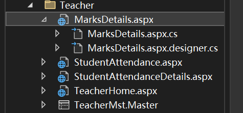

到了.NET Core時代，已經沒有WebForms了，所以ASP.NET Core MVC就是開發網站的首選了

## 开发环境

在一个新建立的Helloworld项目中，一般而言的结构如下：

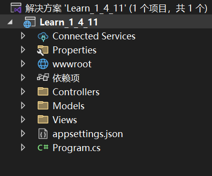

其中比较需要提到的文件信息：

- `Properties`文件夹

内部文件中的`launchSettings.json`文件配置了一些网页的基本信息，例如网页地址的转发端口，以及有关的http协议的设置，常见的如下运行的网页地址：

```json
"applicationUrl": "https://localhost:7091;http://localhost:5106",
```

在开发环境中运行而成的就是如下的页面：

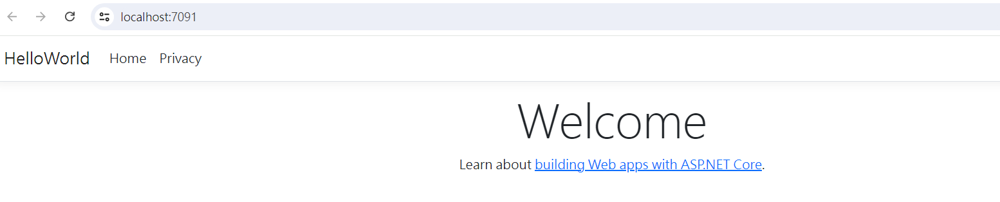

- `wwwroot`資料夾

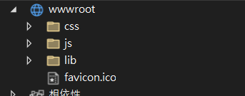

内部放置一些网络的静态资料，图片以及基础的css代码，还有一些前端框架模板代码都可以放在这个文件夹中

- 依赖

这个文件主要是存储安装的Nuget包，在这里右键会显示所有已安装的包

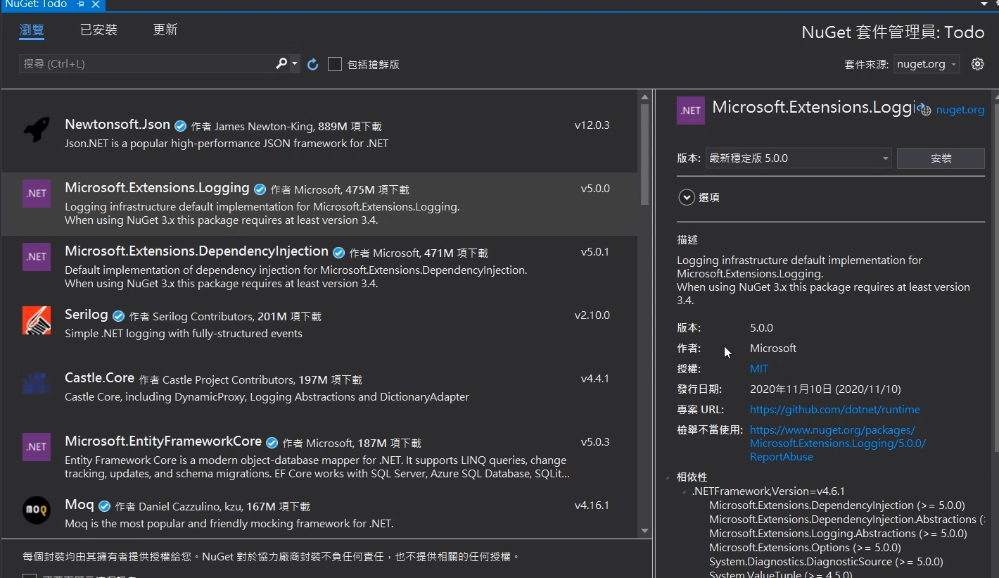

- MVC文件夹

这个文件夹是MVC构造的核心

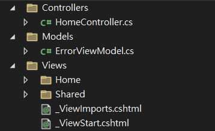

- appsettings.json

```json
{
  "Logging": {
    "LogLevel": {
      "Default": "Information",
      "Microsoft.AspNetCore": "Warning"
    }
  },
  "AllowedHosts": "*"
}
```

## 第一个程序

在默认创建完成时，编译器中会有两个默认前端代码文件

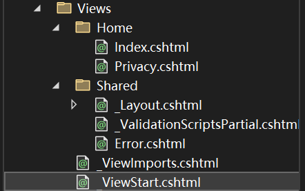

在运行的时候可以通过点击Home中的按钮实现网页的转跳，这些转跳的功能一般由Controller文件来控制

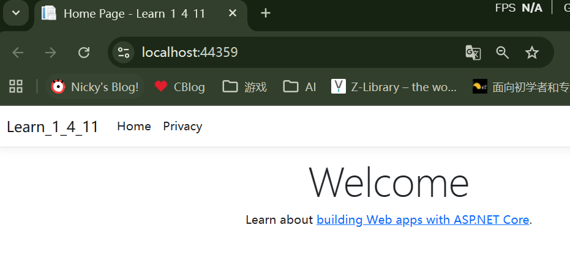

例如下面的控制Home的网页控制器的构造，其中的`return View();`负责控制页面的转跳

```c#
namespace Learn_1_4_11.Controllers
{
    public class HomeController : Controller
    {
        private readonly ILogger<HomeController> _logger;

        public HomeController(ILogger<HomeController> logger)
        {
            _logger = logger;
        }

        public IActionResult Index()
        {
            // 跳转页面
            return View();
        }

        public IActionResult Privacy()
        {
            return View();
        }

        [ResponseCache(Duration = 0, Location = ResponseCacheLocation.None, NoStore = true)]
        public IActionResult Error()
        {
            return View(new ErrorViewModel { RequestId = Activity.Current?.Id ?? HttpContext.TraceIdentifier });
        }
    }
}
```

接下来创建一个新的页面，`HelloWorld`页面。在Home控制器中添加有关于`HelloWorld`的一个函数

```c#
namespace HelloWorld.Controllers
{
    public class HomeController : Controller
    {
        private readonly ILogger<HomeController> _logger;

        public HomeController(ILogger<HomeController> logger)
        {
            _logger = logger;
        }

        public IActionResult Index()
        {
            return View();
        }

        public IActionResult Privacy()
        {
            return View();
        }
        
        //這邊
        public IActionResult HelloWorld()
        {
            return View();
        }


        [ResponseCache(Duration = 0, Location = ResponseCacheLocation.None, NoStore = true)]
        public IActionResult Error()
        {
            return View(new ErrorViewModel { RequestId = Activity.Current?.Id ?? HttpContext.TraceIdentifier });
        }
    }
}
```

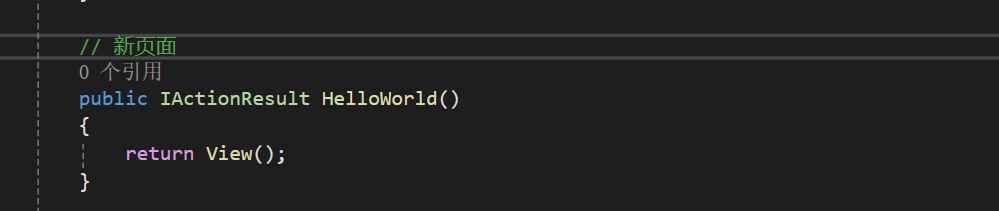

输入对应的链接构造，就会出现如下报错，提示我们缺少对应的cshtml，与WebFrom中类似，会在页面中检测相同名称的文件，一般来说一个控制器中所构造的函数会对应一个前端页面

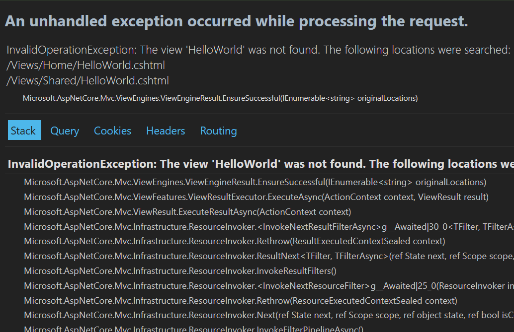

这里报错的信息是我们没有`HelloWorld`页面，因此创建一个前端文件就可以实现正常访问，其中的前端页面名称要相同，并且内容如下：

```
@{
    ViewData["Title"] = "HelloWorld";
}
<h1>@ViewData["Title"]</h1>

<p>HelloWorld.</p>
```

构造的结构就可以访问对应的URL，构造完成的页面如下：

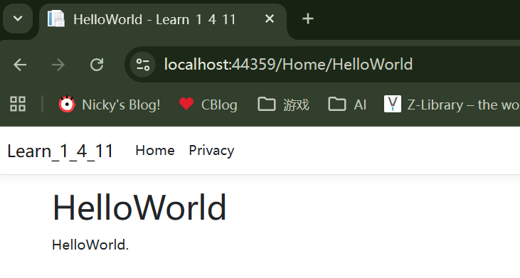

但是在表头中没有索引链接，需要在对应的HTML中构造链接，在_Layout文件中我们添加链接代码，实际上layout文件就是首页文件

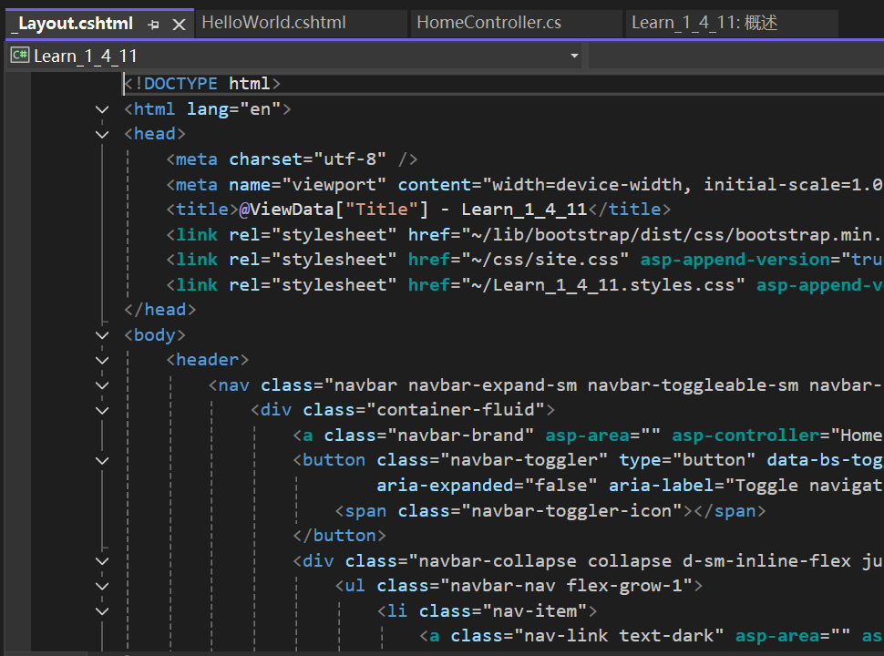

```html
<li class="nav-item">
    <a class="nav-link text-dark" asp-area="" asp-controller="Home" asp-action="HelloWorld">HelloWorld</a>
</li>
```

## 链接数据库

使用插件可以帮助我们快速链接数据库，当前使用EFcore

- Microsoft.EntityFrameworkCore.SqlServer
- Microsoft.EntityFrameworkCore.Tools

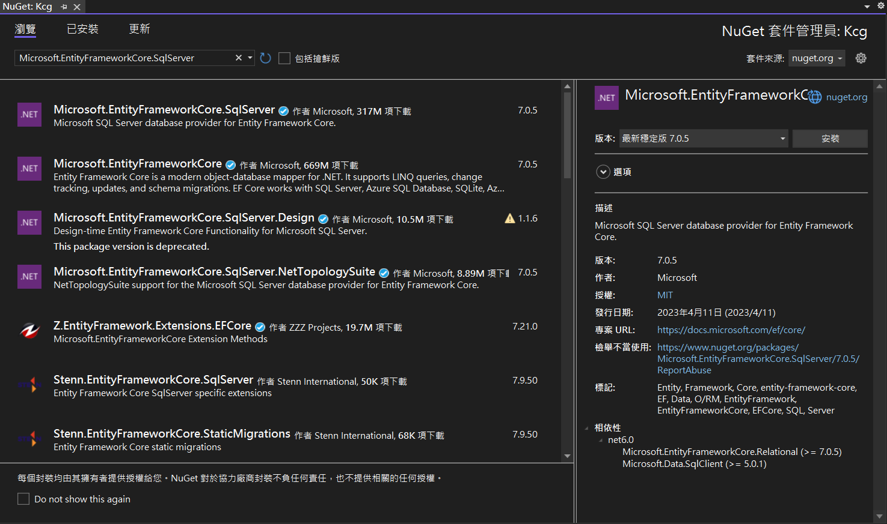

在PM中，输入这个，当然需要根据数据库进行具体调整

```
Scaffold-DbContext "Server=(localdb)\MSSQLLocalDB;Database=Kcg;Integrated Security=True;TrustServerCertificate=True" Microsoft.EntityFrameworkCore.SqlServer -OutputDir Models -NoOnConfiguring -UseDatabaseNames -NoPluralize -Force
```

会自动在文件夹中生成一个新的文件`KcgContext.cs`

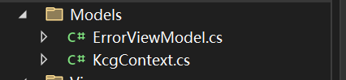

在HomeController.cs写下如下代码：

```c#
private readonly KcgContext _kcgContext; //先在全域宣告資料庫物件

public HomeController(KcgContext kcgContext) //這邊是依賴注入使用我們剛設定好的資料庫物件的寫法
{
    _kcgContext = kcgContext;
}
```

将对应的字符串填写到`appsettings`中，这个是配合DI使用的

```json
{
    "Logging": {
        "LogLevel": {
            "Default": "Information",
            "Microsoft.AspNetCore": "Warning"
        }
    },
    "AllowedHosts": "*",
    "ConnectionStrings": {
        "KcgDatabase": "Server=(localdb)\\MSSQLLocalDB;Database=Kcg;Trusted_Connection=True;TrustServerCertificate=True"
    }
}

```

然後我們在`Program.cs`中加入資料庫物件的DI注入，，它的作用是告诉你的应用程序：**“嘿，以后如果代码里有人想要操作数据库（用到 `KcgContext`），请统一去 `appsettings.json` 找那个叫 `KcgDatabase` 的连接字符串，并使用 SQL Server 驱动来创建它。”**

```c#
builder.Services.AddDbContext<KcgContext>(options =>
options.UseSqlServer(builder.Configuration.GetConnectionString("KcgDatabase")));
```

日後如果在SQL Server上有資料表行進新增或更新時，只要在重下一次`Scaffold-DbContext`指令即可。那其中要特別注意的是，在下`Scaffold-DbContext`指令時，程式不能存有任何編譯上的錯誤，否則將會失敗，如圖。

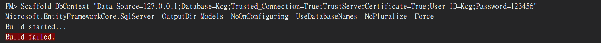

为了测试在`HomeController`中填写

```c#
        public string Index()
        {
            // 获取数据库中 Departments 表的第一条记录
            var dept = _kcgContext.Departments.FirstOrDefault();

            if (dept != null)
            {
                return $"连接成功！部门名称是: {dept.DeptName}，地点在: {dept.Location}";
            }
            else
            {
                return "连接成功，但数据库里没有部门数据。";
            }
        }
```

结果可以看到：


## Code First 和 Datebase First

之前连接数据库的是否使用的是从数据库中建完表了，ORM从中获取其中的

表来构造对象。现在我们反过来，在C#中构造对象来转化为数据库的报表。首先在一个新的项目中创建两个代码文件：

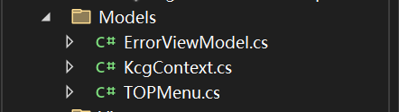

在其中构建了一些属性，来做为其中表的列，之后在`Program.cs`中加入資料庫物件的DI注入

```c#
builder.Services.AddDbContext<KcgContext>(options =>
options.UseSqlServer(builder.Configuration.GetConnectionString("KcgDatabase")));
```

然后再PM中运行下面的代码：

```
Add-Migration InitialCreate
```

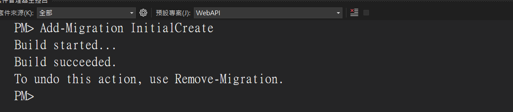

執行完後就會多一個Migrations資料夾，裡面放的就是準備回寫至資料的程式碼，跟以後修改的歷程記錄

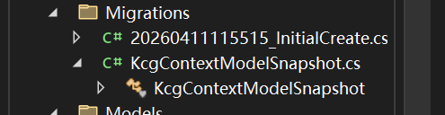

接著我們在下一個指令`Update-Database`,将将构造完成的文件提交到数据库中：

```c#
Update-Database
```

结果可以在数据库中查看，成功创建出来的表了

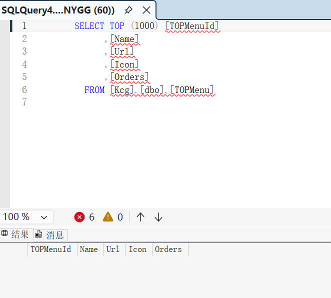

如果之后还需要调整，就可以通过在KcgContext.cs增加一些東西，演示添加下面的代码：

```c#
protected override void OnModelCreating(ModelBuilder modelBuilder)
{
    modelBuilder.Entity<TOPMenu>(entity =>
    {
        entity.Property(e => e.TOPMenuId).HasDefaultValueSql("(newid())");
        entity.Property(e => e.Icon).IsRequired().HasMaxLength(50);
        entity.Property(e => e.Name).IsRequired().HasMaxLength(50);
        entity.Property(e => e.Url).IsRequired().HasMaxLength(50);
        entity.Property(e => e.Orders).IsRequired();
    });
}
```

之后在做提交，這邊Add-Migration後面的英文式自己取的一個紀錄名稱，那我這邊要更新TOPMenu所以叫TOPMenuUp

```
Add-Migration TOPMenuUp
```

成功之後就會多一個紀錄檔
